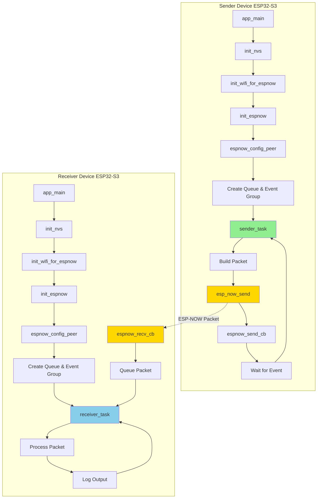

# ESP-NOW Project Flowcharts

This document contains Mermaid flowcharts that visualize the ESP-NOW communication flow and architecture.

## Overall System Architecture

## Sender Device Detailed Flow

## Receiver Device Detailed Flow

## Packet Structure

## Initialization Sequence

## Send Operation Flow

## Receive Operation Flow

## State Machine Overview

## Memory and Resource Flow

## Channel Configuration Impact

## Error Handling Flow

---

## Notes on Flowcharts

### Key Components

1. **NVS (Non-Volatile Storage)**: Required by Wi-Fi driver for storing calibration data
2. **Wi-Fi STA Mode**: Station mode without connecting to an access point
3. **ESP-NOW Callbacks**: Execute in Wi-Fi task context (high priority)
4. **FreeRTOS Queue**: Thread-safe communication between callback and task
5. **Event Group**: Synchronization mechanism for send confirmation

### Design Decisions

- **Callback Minimal Work**: Callbacks do minimal processing to avoid blocking Wi-Fi driver
- **Queue-Based Handoff**: Received data is queued for processing in normal task context
- **Event-Based Synchronization**: Sender waits for confirmation using event bits
- **One-Second Interval**: Balances demonstration with manageable log output

### Performance Considerations

- Queue size of 16 can handle burst traffic
- 200ms send timeout prevents indefinite blocking
- 1-second send interval is conservative; can be reduced to 10-100ms
- Task stack of 4096 bytes is sufficient for current operations

---

For more details, see the [README.md](README.md) file.
