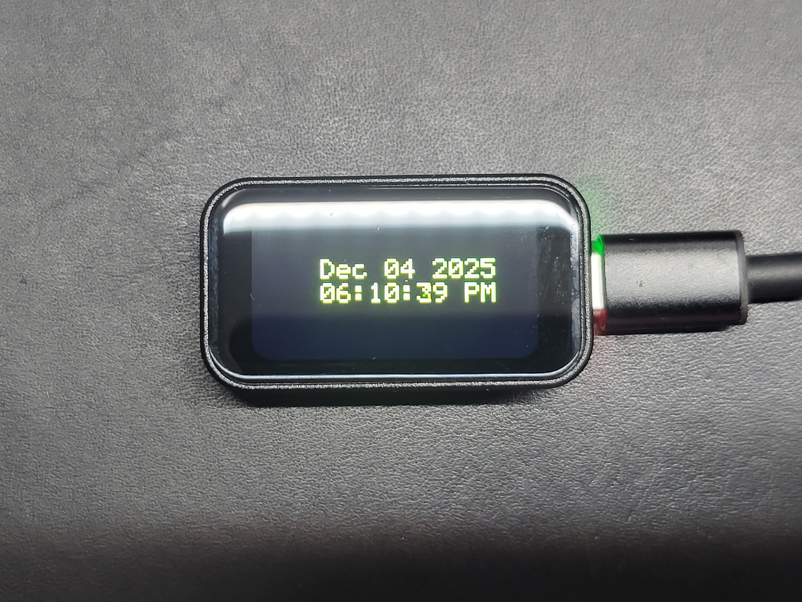
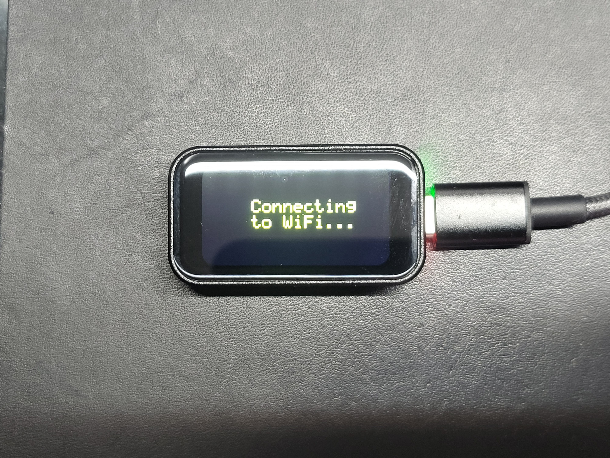

# ESP32-C6 WiFi Internet Clock

[](https://docs.espressif.com/projects/esp-idf/en/latest/esp32c6/)
[](LICENSE)
[](https://www.espressif.com/en/products/socs/esp32-c6)

A minimalist, internet-connected clock application for the WaveShare ESP32-C6-Touch-LCD-1.47 development board. Features WiFi connectivity, NTP time synchronization, and real-time date/time display with automatic timezone and DST adjustment.


## 📋 Table of Contents

- [Features](#-features)
- [Hardware Requirements](#-hardware-requirements)
- [Quick Start](#-quick-start)
- [Project Architecture](#-project-architecture)
- [Configuration](#-configuration)
- [Display Examples](#-display-examples)
- [Technical Details](#-technical-details)
- [Troubleshooting](#-troubleshooting)
- [Contributing](#-contributing)
- [License](#-license)

## ✨ Features

- **WiFi Connectivity**: Automatic connection to 2.4 GHz networks with retry mechanism
- **NTP Time Sync**: Real-time synchronization with network time servers
- **Auto-Update Display**: Date and time refresh every second
- **Timezone Support**: Configurable timezone with automatic DST adjustment
- **Status Display**: Visual feedback for connection and sync status
- **Low Power**: Efficient operation with minimal power consumption
- **Custom Fonts**: Scalable 5×8 and 8×12 bitmap fonts
- **Landscape Mode**: Optimized display orientation for clock viewing

## 🔧 Hardware Requirements

| Component | Specification |
|-----------|---------------|
| **MCU** | ESP32-C6 (RISC-V, 160 MHz) |
| **Display** | JD9853 LCD Driver, 172×320 pixels, RGB565 |
| **WiFi** | 2.4 GHz 802.11b/g/n |
| **Board** | WaveShare ESP32-C6-Touch-LCD-1.47 |
| **Power** | 5V via USB-C |
| **Backlight** | PWM-controlled, GPIO 23 |

### Pin Configuration

```
Display Interface:
├── MOSI (SPI Data)    → GPIO 2
├── SCLK (SPI Clock)   → GPIO 1
├── CS (Chip Select)   → GPIO 14
├── DC (Data/Command)  → GPIO 15
├── RST (Reset)        → GPIO 22
└── BL (Backlight)     → GPIO 23
```

## 🚀 Quick Start

### Prerequisites

- [ESP-IDF v5.4+](https://docs.espressif.com/projects/esp-idf/en/latest/esp32c6/get-started/)
- Python 3.8 or higher
- USB-C cable
- WiFi network with internet access

### Installation

1. **Clone the repository**
   ```bash
   git clone https://github.com/yourusername/esp32c6-wifi-clock.git
   cd esp32c6-wifi-clock
   ```

2. **Configure WiFi credentials**
   
   Edit `main/main.c` (lines 38-39):
   ```c
   #define WIFI_SSID      "Your_Network_Name"
   #define WIFI_PASSWORD  "Your_Password"
   ```

3. **Set ESP-IDF target**
   ```bash
   idf.py set-target esp32c6
   ```

4. **Build the project**
   ```bash
   idf.py build
   ```

5. **Flash and monitor**
   ```bash
   idf.py -p /dev/ttyUSB0 flash monitor
   ```
   
   *Replace `/dev/ttyUSB0` with your actual port (Windows: `COM3`, macOS: `/dev/cu.usbserial-*`)*

### Expected Startup Sequence

1. Display initializes (200ms)
2. "Connecting to WiFi..." message appears
3. WiFi connection established (2-5 seconds)
4. Time synchronization via NTP (1-3 seconds)
5. Current date and time displayed
6. Display updates every second

## 📐 Project Architecture

### Directory Structure

```
esp32c6-wifi-clock/
├── CMakeLists.txt              # Main CMake configuration
├── sdkconfig.defaults          # Default SDK configuration
├── README.md                   # Project documentation
├── CHANGES.md                  # Version history
├── FONT_8x5_DOCUMENTATION.txt  # Font documentation
├── FONT_8x12_DOCUMENTATION.txt # Font documentation
├── main/
│   ├── CMakeLists.txt          # Main component CMake
│   ├── main.c                  # Application entry point
│   ├── font_5x8.h              # 5×8 bitmap font
│   └── font_8x12.h             # 8×12 bitmap font
└── components/
    └── esp_lcd_jd9853/         # JD9853 LCD driver
        ├── CMakeLists.txt      # Component CMake
        ├── esp_lcd_jd9853.c    # Driver implementation
        └── include/
            └── esp_lcd_jd9853.h # Driver header
```

### System Flow Diagram

See the included [FLOWCHART.md](FLOWCHART.md) for a detailed Mermaid diagram of the application flow.

### Key Components

#### 1. Display Driver (`esp_lcd_jd9853`)
- Custom ESP-IDF LCD panel driver for JD9853 controller
- SPI interface communication
- RGB565 color format support
- Configurable orientation modes

#### 2. Font Rendering System
- Two bitmap fonts: 5×8 and 8×12 pixels
- Scalable character rendering
- ASCII character support (32-126)
- Efficient pixel-by-pixel drawing

#### 3. WiFi Management
- ESP-IDF WiFi station mode
- Event-driven connection handling
- Automatic reconnection with retry mechanism
- WPA2-PSK authentication

#### 4. Time Synchronization
- SNTP client implementation
- Hourly automatic resync
- Timezone-aware time formatting
- DST automatic adjustment

## ⚙️ Configuration

### Change Timezone

Edit `main/main.c` (line 662):

```c
// Current: Miami, USA (EST/EDT)
setenv("TZ", "EST5EDT,M3.2.0/2,M11.1.0/2", 1);

// Common US Timezones:
// Pacific:  "PST8PDT,M3.2.0/2,M11.1.0/2"
// Mountain: "MST7MDT,M3.2.0/2,M11.1.0/2"
// Central:  "CST6CDT,M3.2.0/2,M11.1.0/2"
// Arizona:  "MST7" (no DST)
// Hawaii:   "HST10" (no DST)

// International:
// UTC:             "UTC0"
// UK:              "GMT0BST,M3.5.0/1,M10.5.0"
// Central Europe:  "CET-1CEST,M3.5.0,M10.5.0/3"
```

### Change NTP Server

Edit `main/main.c` (line 520):

```c
// Current (default)
esp_sntp_setservername(0, "pool.ntp.org");

// Alternatives:
esp_sntp_setservername(0, "time.google.com");
esp_sntp_setservername(0, "time.nist.gov");
esp_sntp_setservername(0, "time.cloudflare.com");
```

### Display Customization

Edit `main/main.c`:

```c
// Colors (RGB565 format)
#define FOREGROUND_COLOR COLOR_YELLOW   // Line 89
#define BACKGROUND_COLOR COLOR_BLACK    // Line 90

// Font selection
#define SELECTED_FONT FONT_8x5          // Line 97
// Options: FONT_8x5 or FONT_8x12

// Font scaling
#define FONT_SCALE 3                    // Line 93
// Range: 1-4 (affects size and sharpness)
```

### Display Orientation

Edit `main/main.c` (line 61):

```c
#define DISPLAY_ORIENTATION DISPLAY_LANDSCAPE_MODE
// Options:
//   DISPLAY_LANDSCAPE_MODE (320×172) - Default for clock
//   DISPLAY_PORTRAIT_MODE  (172×320) - Vertical orientation
```

## 📺 Display Examples

### Normal Operation



### Connecting State



### Connection Failed


## 🔍 Technical Details

### Time Format

**Date Display**: `MMM DD YYYY`
- Month: 3-letter abbreviation (Jan, Feb, Mar, etc.)
- Day: 2 digits with leading zero (01-31)
- Year: 4 digits (2024, 2025, etc.)

**Time Display**: `HH:MM:SS AM/PM`
- 12-hour format
- Hours: 01-12
- Minutes/Seconds: 00-59
- AM/PM indicator

### Memory Usage

| Category | Usage | Details |
|----------|-------|---------|
| **Flash** | ~280 KB | Application + WiFi + LWIP + SNTP |
| **Static RAM** | ~80 KB | WiFi buffers + Display + Tasks |
| **Free Heap** | ~420 KB | Available for operation |

### Performance Metrics

- **Display Update Rate**: 1 Hz (every second)
- **NTP Sync Interval**: 3600 seconds (hourly)
- **WiFi Connection Time**: 2-5 seconds
- **Time Sync Latency**: 1-3 seconds
- **Display Refresh Time**: ~100 ms per update

### Network Requirements

- **WiFi Frequency**: 2.4 GHz (802.11b/g/n)
- **Authentication**: WPA2-PSK
- **Internet Access**: Required for NTP
- **Firewall**: Allow UDP port 123 (NTP)
- **Bandwidth**: ~2.4 KB/day (NTP traffic)

### Power Consumption

| Mode | Current | Details |
|------|---------|---------|
| **Active Operation** | ~150 mA | Display + WiFi + CPU |
| **Display Only** | ~50 mA | Backlight + LCD |
| **WiFi Radio** | ~80 mA | Transmit/receive |
| **CPU** | ~20 mA | Processing |

## 🐛 Troubleshooting

### WiFi Won't Connect

**Symptoms**: Display stuck on "Connecting to WiFi..."

**Solutions**:
- Verify SSID and password are correct (case-sensitive)
- Ensure 2.4 GHz WiFi is enabled (ESP32-C6 doesn't support 5 GHz)
- Check WiFi signal strength at device location
- Confirm WPA2-PSK authentication is used
- Try moving closer to the router
- Check router MAC address filtering
- Monitor serial output: `idf.py monitor`

### Time Not Synchronizing

**Symptoms**: Display shows "Time Sync Failed!" after WiFi connects

**Solutions**:
- Verify internet connectivity (try pinging 8.8.8.8)
- Check firewall allows UDP port 123
- Try alternative NTP server (Google, Cloudflare)
- Verify router doesn't block NTP traffic
- Check if network requires proxy configuration
- Monitor serial logs for SNTP errors

### Display Shows Wrong Time

**Symptoms**: Time is off by hours or doesn't match local time

**Solutions**:
- Verify timezone string is correct for your location
- Check DST rules match your region
- Confirm NTP sync was successful (check serial logs)
- Wait 1-2 seconds for display update
- Rebuild and reflash after timezone changes

### Display Not Updating

**Symptoms**: Time/date frozen on screen

**Solutions**:
- Check serial monitor for task errors
- Verify `time_display_task` is running
- Monitor free heap memory (`esp_get_free_heap_size()`)
- Check for stack overflow in display task
- Verify SPI communication is functioning
- Power cycle the device

### Build Errors

**Common Issues**:

```bash
# Missing ESP-IDF environment
source $HOME/esp/esp-idf/export.sh

# Wrong target
idf.py set-target esp32c6

# Clean build
idf.py fullclean
idf.py build
```

## 📊 Serial Monitor Output

### Successful Startup
```
I (xxx) MAIN: ====================================
I (xxx) MAIN: ESP32-C6 WiFi Clock
I (xxx) MAIN: ====================================
I (xxx) MAIN: Display initialized successfully!
I (xxx) MAIN: WiFi initialization finished.
I (xxx) MAIN: Got IP:192.168.1.xxx
I (xxx) MAIN: Connected to AP SSID:YourNetwork
I (xxx) MAIN: Timezone set to Miami, USA (EST/EDT)
I (xxx) MAIN: Initializing SNTP
I (xxx) MAIN: Time synchronized!
I (xxx) MAIN: Time synchronized successfully
```

### Connection Failure
```
I (xxx) MAIN: Retry to connect to the AP (attempt 1/5)
I (xxx) MAIN: Retry to connect to the AP (attempt 2/5)
...
E (xxx) MAIN: Failed to connect to SSID:YourNetwork
E (xxx) MAIN: WiFi initialization failed
```

## 🤝 Contributing

Contributions are welcome! Please follow these guidelines:

1. Fork the repository
2. Create a feature branch (`git checkout -b feature/amazing-feature`)
3. Commit your changes (`git commit -m 'Add amazing feature'`)
4. Push to the branch (`git push origin feature/amazing-feature`)
5. Open a Pull Request

### Development Guidelines

- Follow ESP-IDF coding standards
- Add comments for complex logic
- Test on actual hardware before submitting
- Update documentation for new features
- Include serial output examples for debugging

## 📚 Resources

- [ESP-IDF Programming Guide](https://docs.espressif.com/projects/esp-idf/en/latest/esp32c6/)
- [ESP32-C6 Technical Reference](https://www.espressif.com/sites/default/files/documentation/esp32-c6_technical_reference_manual_en.pdf)
- [WaveShare ESP32-C6-Touch-LCD-1.47](https://www.waveshare.com/wiki/ESP32-C6-Touch-LCD-1.47)
- [SNTP Documentation](https://docs.espressif.com/projects/esp-idf/en/latest/esp32/api-reference/system/system_time.html)
- [WiFi API Guide](https://docs.espressif.com/projects/esp-idf/en/latest/esp32/api-guides/wifi.html)

## 📝 Version History

### v5.0 (Current)
- WiFi station connectivity
- NTP time synchronization
- Real-time clock display
- Timezone support with DST
- Connection status display

### v4.0
- Button control interface
- Color test sequences
- Display orientation fixes
- Text rendering system

See [CHANGES.md](CHANGES.md) for detailed version history.

## 📄 License

This project is licensed under the Apache License 2.0 - see the [LICENSE](LICENSE) file for details.

Based on WaveShare factory demo code. ESP-IDF components are licensed under Apache 2.0.

## 👤 Author

**Yamil Garcia**
- GitHub: [@god233012yamil](https://github.com/god233012yamil)

## 🌟 Acknowledgments

- Espressif Systems for ESP-IDF framework
- WaveShare for the ESP32-C6 development board
- NTP Pool Project for time servers
- ESP32 community for support and examples

---

**Status**: Production Ready ✓  
**Version**: 5.0  
**Last Updated**: December 4, 2025  
**Platform**: ESP32-C6  
**Framework**: ESP-IDF v5.4+

If you find this project useful, please consider giving it a ⭐!
