# ESP32-C6 Touch Demo - Program Flowchart

## Complete System Flow

```mermaid
flowchart TD
    Start([System Start]) --> DisplayInit[Initialize Display]
    
    DisplayInit --> SPIBus[Configure SPI Bus]
    SPIBus --> SPIInit{SPI Init OK?}
    SPIInit -->|Error| Error1[Log Error & Stop]
    SPIInit -->|Success| PanelIO[Create Panel IO]
    
    PanelIO --> PanelCreate[Create JD9853 Panel]
    PanelCreate --> PanelReset[Reset Panel]
    PanelReset --> PanelInit[Initialize Panel]
    PanelInit --> PanelInvert[Enable Color Invert]
    PanelInvert --> PanelMirror[Configure Mirror/Swap]
    PanelMirror --> PanelOn[Turn Display On]
    PanelOn --> PanelGap[Set Gap Offset 34,0]
    PanelGap --> Backlight[Initialize Backlight PWM]
    
    Backlight --> I2CInit[Initialize I2C Bus]
    I2CInit --> I2CCfg[Configure I2C Master<br/>Port 0, 400kHz]
    I2CCfg --> I2CPullup[Enable Internal Pullups]
    I2CPullup --> I2CCheck{I2C Init OK?}
    I2CCheck -->|Error| Error2[Log Error & Stop]
    
    I2CCheck -->|Success| TouchInit[Initialize Touch Controller]
    TouchInit --> TouchDev[Add I2C Device<br/>Address 0x63]
    TouchDev --> TouchCfg[Configure AXS5106<br/>172x320, Mirror X]
    TouchCfg --> TouchRst[Initialize RST/INT Pins]
    TouchRst --> TouchCheck{Touch Init OK?}
    TouchCheck -->|Error| Error3[Log Error & Stop]
    
    TouchCheck -->|Success| TaskCreate[Create Touch Task<br/>Priority 5, 4KB Stack]
    TaskCreate --> MainLoop[Main Loop]
    
    MainLoop --> Wait[Wait 1 Second]
    Wait --> MainLoop
    
    TaskCreate --> TouchTask[Touch Task Start]
    TouchTask --> ShowTest[Display Touch Test Screen]
    ShowTest --> FillWhite[Fill Screen White]
    FillWhite --> DrawTitle[Draw 'Touch Test Mode']
    DrawTitle --> DrawInst[Draw Instructions]
    DrawInst --> InitVars[Initialize Variables<br/>last_x=-1, last_y=-1]
    
    InitVars --> TouchLoop[Touch Task Loop]
    TouchLoop --> ReadTouch[Read Touch Data from Controller]
    ReadTouch --> GetData[Get Touch Data Structure]
    GetData --> CheckRet{Return OK?}
    
    CheckRet -->|Error| Delay1[Delay 50ms]
    Delay1 --> TouchLoop
    
    CheckRet -->|OK| HasPoint{Has Touch Points?}
    HasPoint -->|No| Delay1
    
    HasPoint -->|Yes| GetXY[Extract X, Y from Data Structure]
    GetXY --> Changed{Position<br/>Changed?}
    
    Changed -->|No| Delay1
    
    Changed -->|Yes| LogTouch[Log Touch Event to Serial]
    LogTouch --> ClearScreen[Fill Screen White]
    ClearScreen --> DrawHeader[Draw 'Touch at:' Text]
    DrawHeader --> DrawX[Draw X Coordinate]
    DrawX --> DrawY[Draw Y Coordinate]
    DrawY --> DrawCircle[Draw Red Circle<br/>Radius 12px]
    DrawCircle --> UpdateLast[Update last_x, last_y]
    UpdateLast --> Delay2[Delay 50ms]
    Delay2 --> TouchLoop
    
    Error1 --> End([System Halt])
    Error2 --> End
    Error3 --> End

    style Start fill:#90EE90
    style End fill:#FFB6C1
    style Error1 fill:#FF6B6B
    style Error2 fill:#FF6B6B
    style Error3 fill:#FF6B6B
    style TouchLoop fill:#87CEEB
    style MainLoop fill:#DDA0DD
    style TouchTask fill:#F0E68C
```

## Initialization Sequence

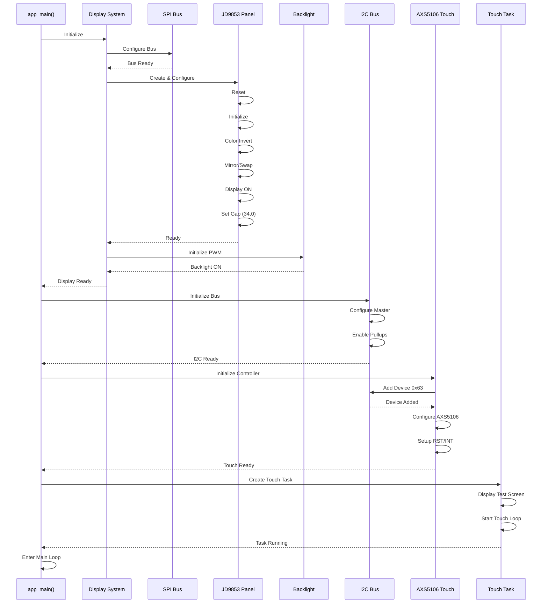

## Touch Processing Flow

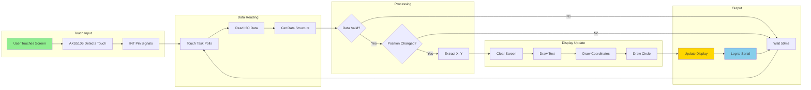

## System Architecture

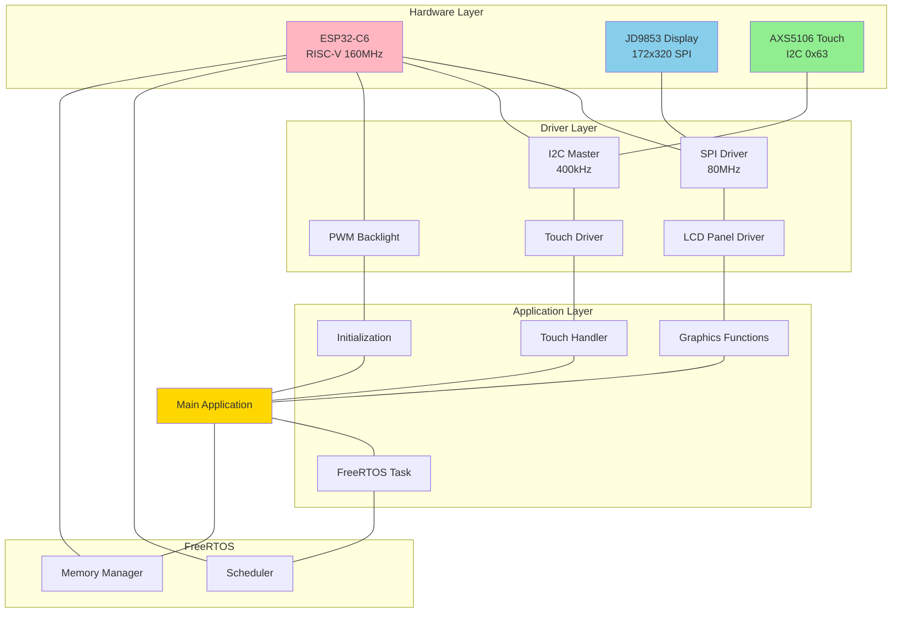

## Memory Layout

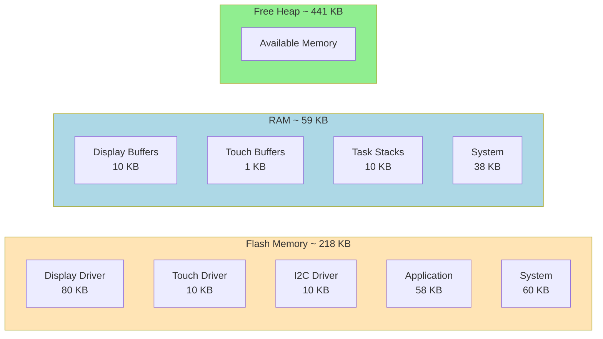

## State Machine

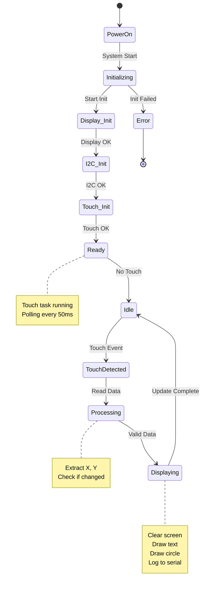

## Task Timing

```mermaid
gantt
    title Touch Task Timing Diagram
    dateFormat X
    axisFormat %L ms
    
    section Cycle
    Read Touch Data     :0, 5
    Get Data Structure  :5, 8
    Check Return        :8, 9
    Clear Screen        :9, 59
    Draw Text           :59, 79
    Draw Coordinates    :79, 89
    Draw Circle         :89, 99
    Log Serial          :99, 100
    Task Delay          :100, 150
    
    section Timing
    Touch Response      :crit, 0, 55
    Display Update      :0, 100
    Cycle Period        :0, 150
```

## Component Dependencies

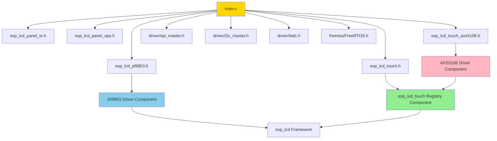

## Build Process

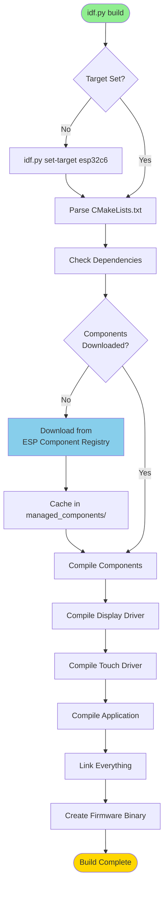

## Application Code Flow

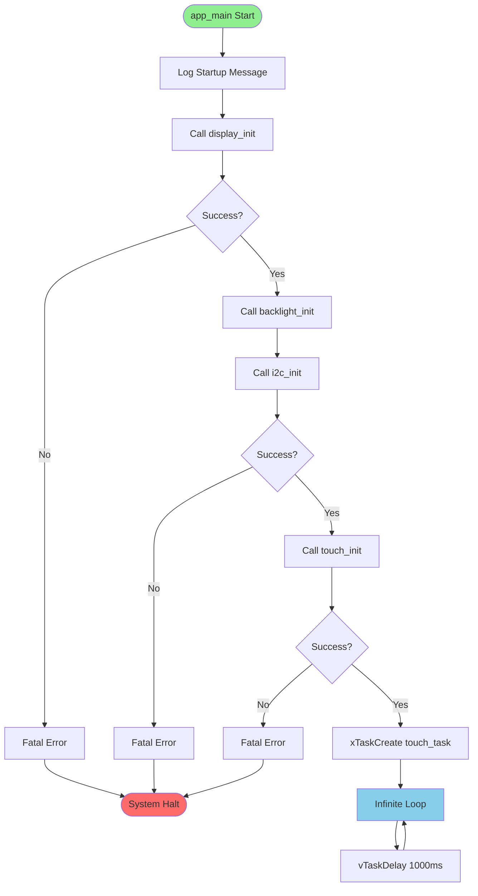

## Touch Data Structure

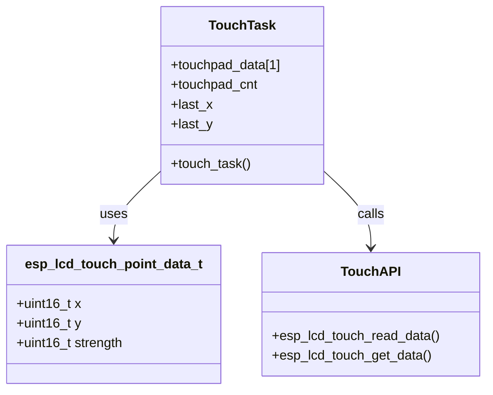

---

## Flowchart Legend

| Symbol | Meaning |
|--------|---------|
| 🟢 Green | Start/Entry Point |
| 🔵 Blue | Process/Action |
| 🟡 Yellow | Decision Point |
| 🔴 Red | Error State |
| 🟣 Purple | Loop |

## Usage

These Mermaid diagrams can be rendered on:
- GitHub (native support)
- GitLab (native support)
- VS Code (with Mermaid extension)
- [Mermaid Live Editor](https://mermaid.live/)

## Diagram Types Included

1. **Complete System Flow** - Full program execution
2. **Initialization Sequence** - Step-by-step startup
3. **Touch Processing Flow** - Touch event handling
4. **System Architecture** - Component relationships
5. **Memory Layout** - Flash/RAM allocation
6. **State Machine** - System states
7. **Task Timing** - Timing diagram
8. **Component Dependencies** - File relationships
9. **Build Process** - Build system flow
10. **Application Code Flow** - Main function flow
11. **Touch Data Structure** - Data structure diagram

## Key Changes from v6.0

- Removed NVS initialization from all flowcharts
- Updated memory usage (218 KB flash, 59 KB RAM)
- Updated initialization sequence (no NVS step)
- Updated system flow (starts directly with display init)
- Updated state machine (no NVS state)
- Updated touch API (uses new esp_lcd_touch_get_data)
- Added touch data structure diagram
- Simplified initialization process
