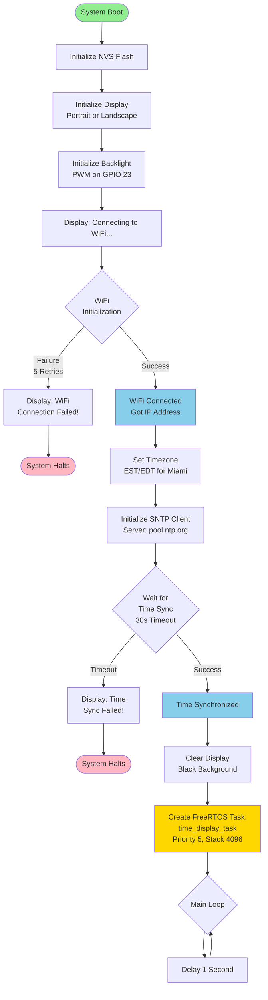
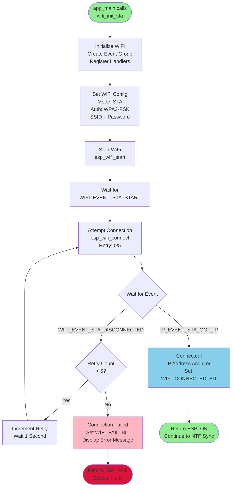
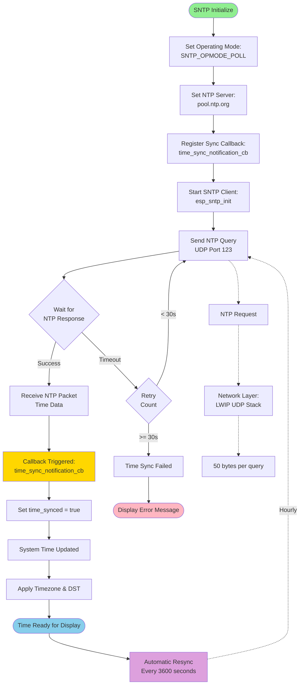
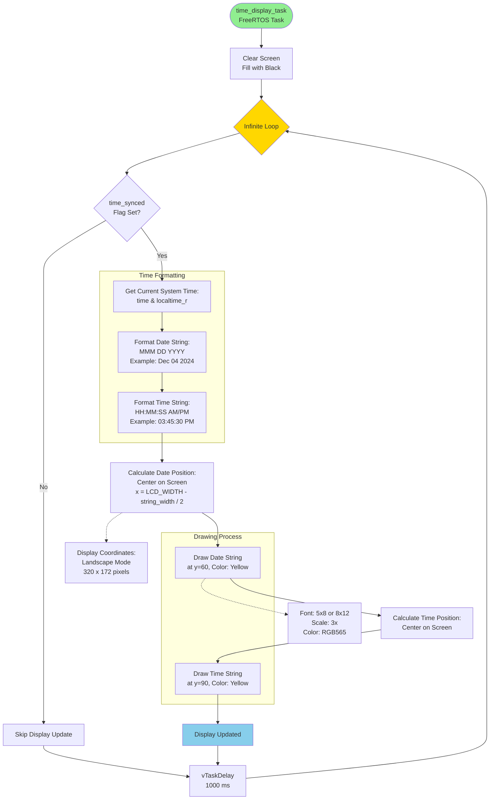
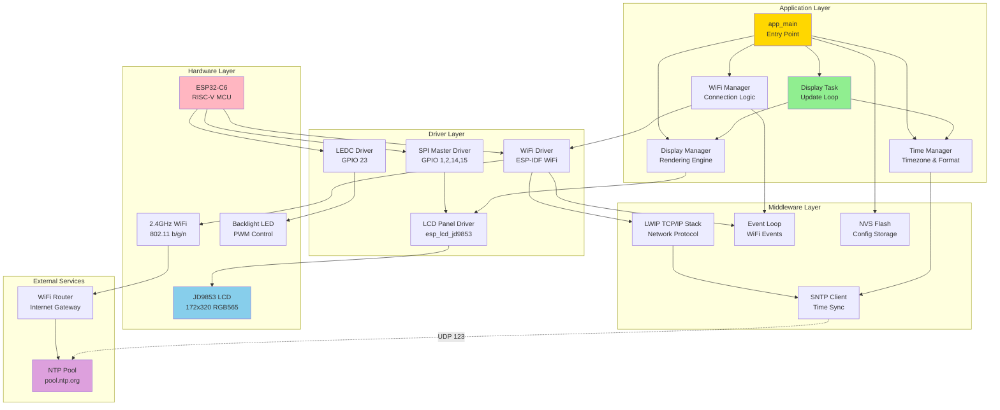
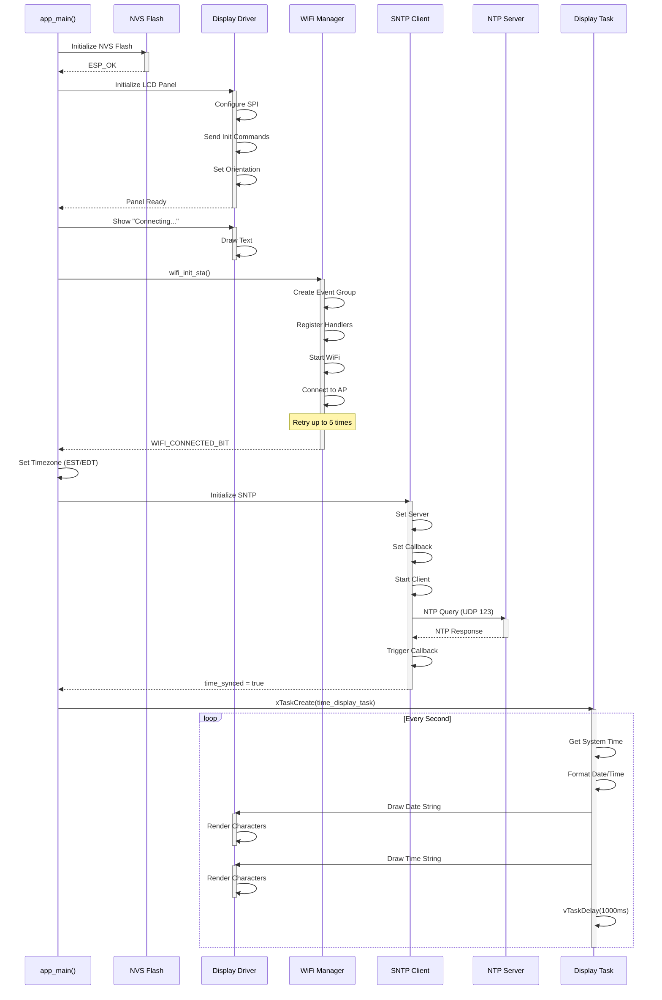
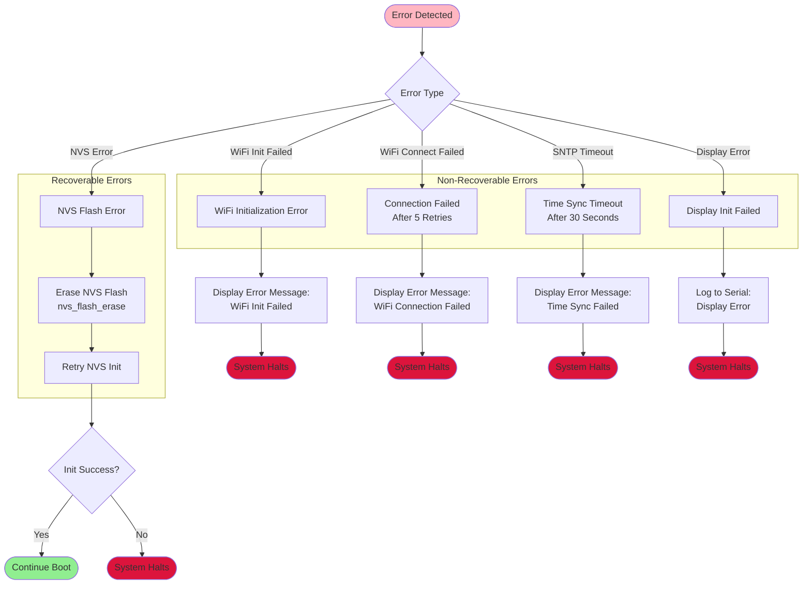
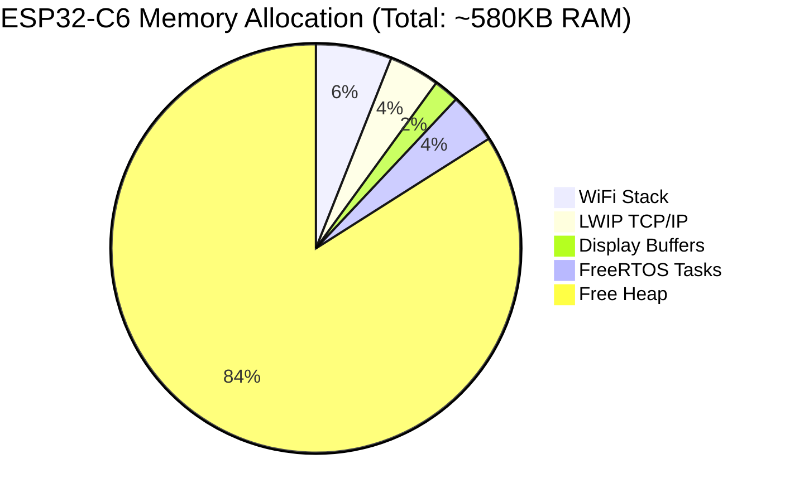
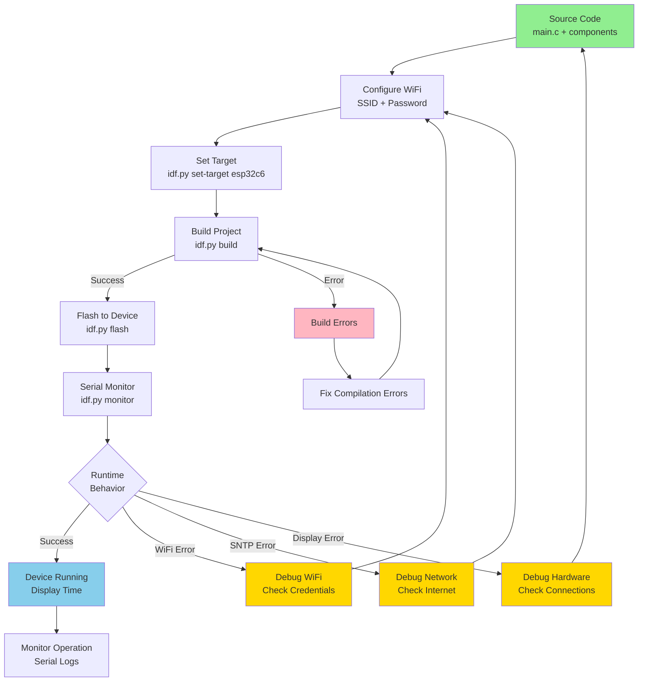

# ESP32-C6 WiFi Clock - System Flowchart

This document contains comprehensive flowcharts illustrating the system architecture and execution flow of the ESP32-C6 WiFi Internet Clock application.

## Table of Contents
- [Main Application Flow](#main-application-flow)
- [WiFi Connection State Machine](#wifi-connection-state-machine)
- [Time Synchronization Flow](#time-synchronization-flow)
- [Display Update Task](#display-update-task)
- [System Architecture](#system-architecture)

---

## Main Application Flow

This flowchart shows the complete execution path from system startup to normal operation.

---

## WiFi Connection State Machine

Detailed state machine showing WiFi connection handling with event-driven architecture.

---

## Time Synchronization Flow

SNTP client initialization and time synchronization process.

---

## Display Update Task

FreeRTOS task responsible for continuous display updates.

---

## System Architecture

High-level component interaction diagram.

---

## Component Interaction Sequence

Detailed sequence diagram showing component communication during startup.

---

## Error Handling Flow

Error handling paths and recovery mechanisms.

---

## Memory Management

Memory allocation and usage across system components.

---

## Data Flow - Time Display

Shows the flow of time data from NTP server to display pixels.

```mermaid
flowchart LR
    NTP[NTP Server<br/>pool.ntp.org] -->|UDP Packet<br/>50 bytes| SNTP[SNTP Client<br/>LWIP Stack]
    
    SNTP -->|Unix Timestamp| SysTime[System Time<br/>time_t]
    
    SysTime -->|time & localtime_r| TZ[Timezone<br/>Conversion]
    
    TZ -->|struct tm| Format[Time Formatting<br/>strftime]
    
    Format -->|Date String<br/>MMM DD YYYY| Render1[Text Renderer]
    Format -->|Time String<br/>HH:MM:SS AP| Render2[Text Renderer]
    
    Render1 -->|Character Pixels| Font1[Font Lookup<br/>5x8 or 8x12]
    Render2 -->|Character Pixels| Font2[Font Lookup<br/>5x8 or 8x12]
    
    Font1 -->|Scaled Pixels<br/>x3 Zoom| Draw1[SPI Draw<br/>Operations]
    Font2 -->|Scaled Pixels<br/>x3 Zoom| Draw2[SPI Draw<br/>Operations]
    
    Draw1 -->|RGB565 Data| LCD[LCD Panel<br/>JD9853]
    Draw2 -->|RGB565 Data| LCD
    
    LCD -->|Display Output| Screen[Physical Screen<br/>172x320 pixels]
    
    style NTP fill:#DDA0DD
    style SysTime fill:#87CEEB
    style Screen fill:#90EE90
    style LCD fill:#FFD700
```

---

## Build and Deploy Process

Development workflow from source to running device.

---

## Legend

### Node Colors
- 🟢 **Green**: Start/Success states
- 🔵 **Blue**: Normal operation states
- 🟡 **Yellow**: Important/Action states
- 🔴 **Red**: Error/Halt states
- 🟣 **Purple**: External services

### Connection Types
- **Solid Line** (→): Direct execution flow
- **Dashed Line** (-.->): Reference/Note connection
- **Thick Line** (⇒): Data flow

---

## Notes

1. All diagrams are rendered using Mermaid syntax compatible with GitHub, GitLab, and most documentation platforms.

2. The flowcharts show the actual code execution paths based on the `main.c` implementation.

3. Error handling is comprehensive but non-recoverable errors halt the system to prevent undefined behavior.

4. The display update task runs independently after initialization, ensuring smooth time updates without blocking.

5. WiFi reconnection is handled automatically by the ESP-IDF WiFi stack after initial connection.

---

**Document Version**: 1.0  
**Last Updated**: December 4, 2025  
**Project**: ESP32-C6 WiFi Internet Clock  
**License**: MIT
