# ESP32-C6 Power Gating Demo - Project Flow Chart

## System Architecture Flow

This flowchart illustrates the complete lifecycle of the ESP32-C6 Power Gating Demo, from boot/wake through task execution to deep sleep.

## Detailed Phase Descriptions

### Phase 1: System Initialization (Blue)
- **Boot/Wake**: System starts from power-on reset or timer wake from deep sleep
- **Event Groups**: FreeRTOS synchronization primitives created for inter-task communication
- **Bus-Safe Init**: I2C SCL/SDA pins configured as high-impedance inputs (prevents phantom powering during boot)
- **Power Gating Init**: Enable GPIO configured as output, rail kept in OFF state

### Phase 2: Task Spawning
Three independent FreeRTOS tasks are created with different priorities:
- **Measurement Task** (Priority 5): Handles sensor power and data acquisition
- **Communication Task** (Priority 4): Handles data transmission simulation
- **Power Manager Task** (Priority 6, highest): Orchestrates shutdown sequence

### Phase 3: Measurement Task (Orange)
1. **Enable Gated Rail**: Drive enable GPIO to turn on external power
2. **Stabilization Wait**: Delay for voltage settling and peripheral boot (configurable)
3. **Sensor Read**: Execute stub sensor transaction (hardware-agnostic)
4. **Signal Completion**: Set EVT_MEAS_DONE event bit
5. **Delete Self**: Task cleanup

### Phase 4: Communication Task
1. **Wait for Data**: Block until EVT_MEAS_DONE is set
2. **Simulate Transmission**: Stub for Wi-Fi/BLE data upload
3. **Signal Completion**: Set EVT_COMM_DONE event bit
4. **Delete Self**: Task cleanup

### Phase 5: Power-Down Sequence (Red - Critical!)
1. **Wait for All Tasks**: Block until both EVT_MEAS_DONE and EVT_COMM_DONE are set
2. **Apply Bus-Safe State**: 
   - Set I2C SCL/SDA to INPUT mode
   - Disable internal pull-up/pull-down resistors
   - Prevents back-powering through ESD diodes
3. **Disable Gated Rail**: Drive enable GPIO to turn off external power
4. **Rail Collapse Delay**: Brief wait for voltage decay (helpful for verification)
5. **Configure Deep Sleep**: Set timer wake source and power domain options
6. **Enter Deep Sleep**: CPU and most peripherals powered down

### Phase 6: Sleep Period (Light Blue)
- System in ultra-low-power state
- Only RTC and timer active
- Wake on timer expiration
- Loop back to Phase 1

## Task Synchronization

## Power Gating State Machine

## GPIO State Transitions

## Power Consumption Profile

```mermaid
graph LR
    A[Deep Sleep<br/>5-20 µA] -->|Timer Wake| B[Boot<br/>~40 mA]
    B -->|pg_init| C[Idle<br/>~15 mA]
    C -->|Rail Enable| D[Active + Sensor<br/>~50 mA]
    D -->|Work Done| E[Active<br/>~40 mA]
    E -->|Bus Safe| F[Active<br/>~40 mA]
    F -->|Rail Disable| G[Active<br/>~15 mA]
    G -->|Sleep Entry| A
    
    style A fill:#e6f3ff
    style D fill:#fff4e6
    style E fill:#ffe6e6
    style F fill:#ffe6e6
```

## Configuration Flow

## Notes

- **Orange nodes**: Active power consumption phases
- **Red nodes**: Critical safety operations (bus-safe, rail disable)
- **Blue nodes**: Low power states
- **Dashed arrows**: Asynchronous wake events
- **Event bits**: FreeRTOS synchronization primitives ensure tasks complete before power-down
