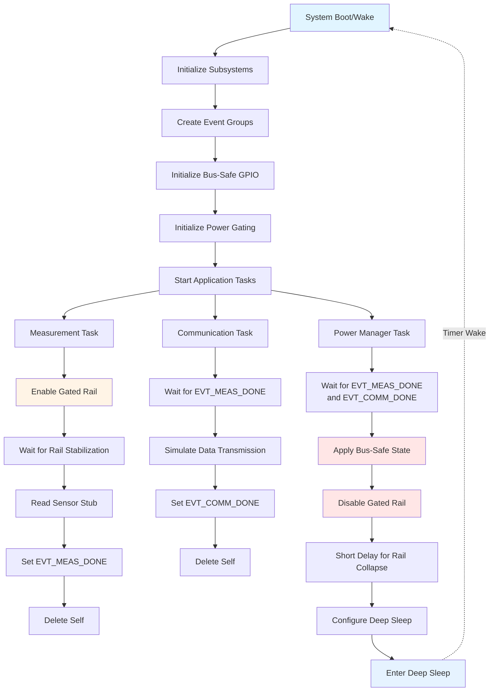

# ESP32-C6 Power Gating Demo

[](https://www.espressif.com/en/products/socs/esp32-c6)
[](https://github.com/espressif/esp-idf)
[](LICENSE)

A practical demonstration of firmware patterns for power gating external rails on ESP32-C6 systems. This project showcases multiple hardware gating techniques using a unified firmware interface, with emphasis on safe GPIO sequencing to prevent phantom powering.

## Overview

Power gating is a critical technique for battery-powered IoT devices. By controlling power to external peripherals (sensors, radios, displays), you can dramatically reduce system current consumption during sleep periods. However, improper implementation can lead to back-powering through GPIO pins, unreliable startup sequencing, and increased overall power consumption.

This demo provides production-ready firmware patterns for three common power gating topologies, all controlled through a single, hardware-agnostic API.

### Key Features

- **Multiple gating techniques** (selectable via menuconfig):
  - Regulator EN pin control
  - Load switch control
  - P-FET high-side switching with gate driver
- **Bus-safe shutdown** to prevent phantom powering via GPIO ESD diodes
- **Task-based architecture** with coordinated power management
- **Deep sleep integration** with timer wake
- **Comprehensive configuration** through ESP-IDF menuconfig
- **Hardware-agnostic sensor interface** (stub implementation)

## Why This Project?

Common pitfalls when implementing power gating include:

- **Back-powering peripherals** through I2C/SPI bus pins when the rail is off
- **Unreliable GPIO states** during reset and deep sleep transitions
- **Missing rail stabilization delays** causing sensor communication failures
- **Incorrect enable signal polarity** or missing default-off pull resistors

This project addresses all these issues with firmware patterns proven in production battery-powered devices.

## Supported Hardware

- **MCU**: ESP32-C6
- **Framework**: ESP-IDF v5.x (tested with v5.4)
- **External Components**: Regulator/load switch/P-FET (see [Wiring Guide](docs/wiring.md))

## Architecture

The firmware is organized into modular components:

```
ESP32C6_Power_Gating_Demo/
├── main/
│   ├── app_main.c           # Main application and task orchestration
│   ├── power_gating.c/h     # Power gating driver (technique-agnostic)
│   ├── bus_safe.c/h         # GPIO safe-state management
│   ├── sleep_ctrl.c/h       # Deep sleep configuration
│   └── Kconfig.projbuild    # Configuration menu definitions
├── docs/
│   └── wiring.md            # Hardware wiring guide for each technique
├── FLOWCHART.md             # Detailed project flow diagrams
├── CMakeLists.txt
└── README.md
```

### Component Descriptions

#### Power Gating Driver (`power_gating.c/h`)

Provides a unified interface for controlling external rails regardless of hardware topology:

- **API Functions**:
  - `pg_init()` - Initialize GPIO and set safe default state (OFF)
  - `pg_set_enabled()` - Toggle rail power on/off
  - `pg_get_config()` - Query current configuration

- **Supported Techniques**:
  - `PG_TECH_REG_EN` - Direct regulator enable control
  - `PG_TECH_LOAD_SWITCH` - Load switch enable control
  - `PG_TECH_PFET_DRIVER` - P-FET gate driver enable control

#### Bus-Safe Module (`bus_safe.c/h`)

Prevents phantom powering by managing GPIO states before power transitions:

- Configures bus pins (I2C SCL/SDA) as high-impedance inputs
- Disables internal pull-up/pull-down resistors
- Called automatically before rail shutdown

**Why this matters**: When a peripheral is unpowered but still connected to ESP32-C6 GPIOs, current can flow backward through the peripheral's ESD protection diodes, partially powering it and defeating the purpose of power gating.

#### Sleep Controller (`sleep_ctrl.c/h`)

Manages deep sleep entry with optional power domain configuration:

- Configures timer-based wake source
- Optionally powers down RTC peripherals for maximum power savings
- Provides clean sleep entry point for the power manager task

#### Application Main (`app_main.c`)

Demonstrates a realistic multi-task application structure:

1. **Measurement Task**: Powers on rail → waits for stabilization → reads sensor → signals completion
2. **Communication Task**: Waits for data → simulates transmission (Wi-Fi/BLE stub) → signals completion
3. **Power Manager Task**: Waits for all tasks → applies bus-safe state → gates rail → enters deep sleep

This architecture separates concerns and provides a template for real-world IoT applications.

## Project Flow

The following diagram illustrates the complete power gating cycle:



For additional detailed diagrams including task synchronization, state machines, and power profiles, see [FLOWCHART.md](FLOWCHART.md).

### Sequence Explanation

1. **Boot/Wake**: System starts from cold boot or timer wake from deep sleep
2. **Initialization**: Subsystems initialized in specific order:
   - Event groups for task synchronization
   - Bus-safe GPIO configuration (pins set to safe state early)
   - Power gating driver (enable GPIO configured, rail kept OFF)
3. **Task Creation**: Three FreeRTOS tasks are spawned with different priorities
4. **Measurement Phase**:
   - Rail enabled via GPIO
   - Stabilization delay allows voltage to settle and peripheral to boot
   - Sensor read performed (stub for hardware-agnostic demo)
   - Event signaled to communication task
5. **Communication Phase**:
   - Waits for measurement completion
   - Simulates radio transmission (Wi-Fi/BLE stub)
   - Event signaled to power manager
6. **Power-Down Sequence** (Critical for preventing issues):
   - Wait for all work to complete
   - Apply bus-safe state: I2C pins → INPUT, internal pulls disabled
   - Gate rail OFF
   - Allow time for rail to collapse (helpful for verification)
   - Configure and enter deep sleep
7. **Sleep Period**: System draws minimal current until timer wake

## Getting Started

### Prerequisites

- ESP-IDF v5.x installed and configured
- ESP32-C6 development board
- External power gating hardware (see [Wiring Guide](docs/wiring.md))
- USB cable for programming and monitoring

### Quick Start

1. **Clone the repository**:
   ```bash
   git clone https://github.com/yourusername/ESP32C6_Power_Gating_Demo.git
   cd ESP32C6_Power_Gating_Demo
   ```

2. **Set target**:
   ```bash
   idf.py set-target esp32c6
   ```

3. **Configure the project**:
   ```bash
   idf.py menuconfig
   ```
   
   Navigate to **"Power Gating Demo"** and configure:
   - **Power gating technique**: Select your hardware topology
   - **Enable GPIO**: GPIO pin controlling the enable signal (default: 10)
   - **Enable polarity**: Active high or active low (default: active high)
   - **Stabilization delay**: Time to wait after enabling rail (default: 5ms)
   - **Wake interval**: Deep sleep duration between cycles (default: 60s)
   - **I2C SCL/SDA GPIOs**: Bus pins to manage (defaults: 8/9)
   - **Log sample value**: Enable/disable sensor value logging

4. **Build and flash**:
   ```bash
   idf.py build flash monitor
   ```

5. **Observe operation**:
   The serial monitor will display:
   ```
   I (xxx) main: Boot: starting tasks
   I (xxx) pg: Technique: Regulator EN pin
   I (xxx) bus_safe: Bus-safe init: SCL=8 SDA=9
   I (xxx) main: Measurement: enabling rail (GPIO=10)
   I (xxx) main: Measurement: sample=2847
   I (xxx) main: Comm: simulated transmit
   I (xxx) main: Power manager: applying bus-safe state
   I (xxx) bus_safe: Bus-safe applied before power-off
   I (xxx) main: Power manager: disabling rail
   I (xxx) sleep: Configuring deep sleep, wake in 60 s
   I (xxx) sleep: Entering deep sleep now
   ```

## Configuration Options

All options are accessible via `idf.py menuconfig` under **"Power Gating Demo"**:

| Option | Description | Default | Range |
|--------|-------------|---------|-------|
| Power gating technique | Hardware topology selection | Regulator EN | REG_EN / LOAD_SWITCH / PFET_DRIVER |
| Enable GPIO | GPIO controlling power enable | 10 | 0-30 |
| Enable is active high | Polarity of enable signal | Yes | Yes/No |
| Rail stabilize delay (ms) | Time after enable before use | 5 | 0-1000 |
| Wake interval (seconds) | Deep sleep duration | 60 | 1-86400 |
| I2C SCL GPIO | Bus SCL pin for safe-state | 8 | 0-30 |
| I2C SDA GPIO | Bus SDA pin for safe-state | 9 | 0-30 |
| Log sample value | Enable sensor value logging | Yes | Yes/No |

## Hardware Design Guidelines

### Critical Design Rules

1. **Default OFF State**: The enable GPIO must have a hardware default OFF state (pull-up or pull-down resistor) because GPIO states during reset and deep sleep are not reliable across all boards.

2. **Pull-Up Placement**: If gating sensor power, place I2C pull-up resistors on the gated rail, not the always-on MCU rail. This prevents current flow when the rail is off.

3. **Bus Isolation**: Before disabling the rail, firmware must set bus GPIOs to high-impedance input with pulls disabled to prevent back-powering through ESD diodes.

4. **Stabilization Time**: After enabling the rail, wait for both:
   - Power supply rise time and settling
   - Peripheral startup/boot time
   
   Configure `PG_STABILIZE_MS` appropriately for your hardware (typically 5-20ms).

### Hardware Topologies

See [docs/wiring.md](docs/wiring.md) for detailed wiring diagrams and component selection guidance for each technique.

#### Technique A: Regulator EN Pin

```
ESP32-C6 GPIO ---[Optional R]---> Regulator EN
                                  ├─ Pull-down/up (DEFAULT OFF)
                                  └─ Regulator VIN
                                      └─> VOUT (gated rail)
```

**Best for**: Simple designs, low BOM count, moderate current loads

#### Technique B: Load Switch

```
ESP32-C6 GPIO ---[Optional R]---> Load Switch EN
                                  ├─ Pull-down/up (DEFAULT OFF)
Load Switch IN  <--- Always-on 3V3
Load Switch OUT ---> Gated Rail (VDD_SENS)
```

**Best for**: Predictable off-state leakage, controlled inrush, reverse current blocking

#### Technique C: P-FET High-Side + Driver

```
ESP32-C6 GPIO ---> Gate Driver Input
Gate Driver Out ---[R]---> P-FET Gate
                           ├─ Pull-up to Source (DEFAULT OFF)
P-FET Source <--- Always-on Rail
P-FET Drain  ---> Gated Rail (VDD_SENS)
```

**Best for**: Lowest cost, highest flexibility, handles high current

## Real-World Deployment Considerations

### Current Measurement

- Use a precision ammeter or power profiler (e.g., Nordic PPK2, Joulescope)
- Measure at the battery input for true system current
- Development boards often have high idle current (USB-UART bridges, LEDs, LDO quiescent current)
- For accurate measurements, use a custom low-power board or bare module

### Expected Current Consumption

Typical ESP32-C6 deep sleep current (timer wake enabled):
- **Development board**: 0.5-2 mA (due to peripherals)
- **Optimized custom board**: 5-20 µA
- **With gated peripherals OFF**: +0-1 µA (depends on regulator/switch leakage)

### Sensor Integration

This demo uses a stub sensor interface. For real sensors:

1. Initialize I2C/SPI driver after rail enable
2. Perform sensor transactions
3. **Deinitialize driver before rail disable** (call `i2c_driver_delete()` or equivalent)
4. Then apply bus-safe state
5. Finally gate rail OFF

### Production Checklist

- [ ] Verify enable signal defaults to OFF in hardware (resistor present)
- [ ] Measure rail rise time and configure `PG_STABILIZE_MS` with margin
- [ ] Test power cycling 100+ times to verify reliability
- [ ] Measure current in all states (active, bus-safe, rail-off, deep sleep)
- [ ] Verify no back-powering occurs (check peripheral rail voltage when ESP32 is active but rail is "off")
- [ ] Test wake reliability over temperature range
- [ ] Validate with actual sensors/peripherals, not stubs

## Troubleshooting

### Issue: Rail doesn't turn off completely

**Possible causes**:
- Back-powering through bus pins (I2C/SPI) via ESD diodes
- Pull-ups on always-on rail instead of gated rail
- Bus-safe state not applied before rail disable

**Solutions**:
- Verify bus-safe functions are called
- Move pull-ups to gated rail
- Add series resistors or bus switches if needed
- Measure current at peripheral VDD pin with multimeter

### Issue: Sensor communication fails after wake

**Possible causes**:
- Insufficient stabilization delay
- Sensor not fully booted
- I2C driver not reinitialized

**Solutions**:
- Increase `PG_STABILIZE_MS`
- Check sensor datasheet for startup time
- Reinitialize I2C driver each wake cycle

### Issue: GPIO enable doesn't control rail

**Possible causes**:
- Wrong GPIO number
- Incorrect polarity (`PG_ACTIVE_HIGH`)
- Missing external pull resistor
- Hardware fault

**Solutions**:
- Verify GPIO in schematic
- Toggle `PG_ACTIVE_HIGH` setting
- Check continuity from GPIO to enable pin
- Test enable signal with oscilloscope

### Issue: Inconsistent behavior across reboots

**Possible causes**:
- No hardware default on enable pin
- GPIO state during reset is undefined

**Solutions**:
- Add external pull resistor (10kΩ-100kΩ) on enable pin
- Never rely on GPIO state during reset or uninitialized state

## Contributing

Contributions are welcome! Please feel free to submit issues or pull requests.

Areas for improvement:
- Additional hardware technique examples (e.g., low-side N-FET)
- Multi-rail gating support
- SPI bus-safe implementation
- Example integration with real sensors
- Power profiling scripts

## License

This project is licensed under the MIT License - see the [LICENSE](LICENSE) file for details.

## References

- [ESP32-C6 Technical Reference Manual](https://www.espressif.com/sites/default/files/documentation/esp32-c6_technical_reference_manual_en.pdf)
- [ESP-IDF Programming Guide](https://docs.espressif.com/projects/esp-idf/en/latest/esp32c6/)
- [ESP32-C6 Deep Sleep Guide](https://docs.espressif.com/projects/esp-idf/en/latest/esp32c6/api-reference/system/sleep_modes.html)

## Acknowledgments

This project demonstrates patterns developed through production IoT device design. The techniques shown here have been validated in battery-powered environmental sensors, wearables, and remote monitoring systems.

---

**Questions?** Open an issue or check the [Wiring Guide](docs/wiring.md) for hardware-specific details.
