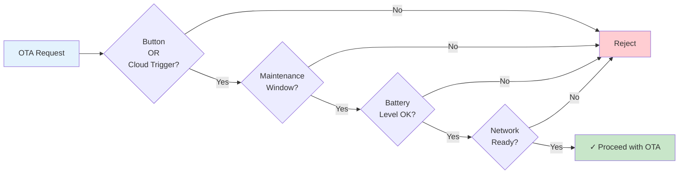
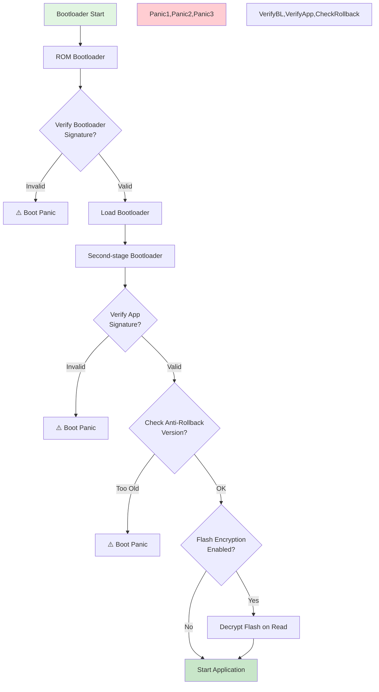
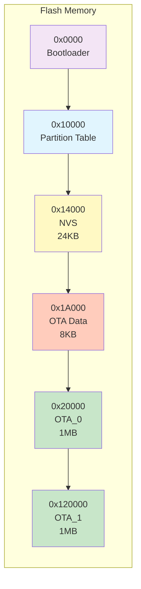
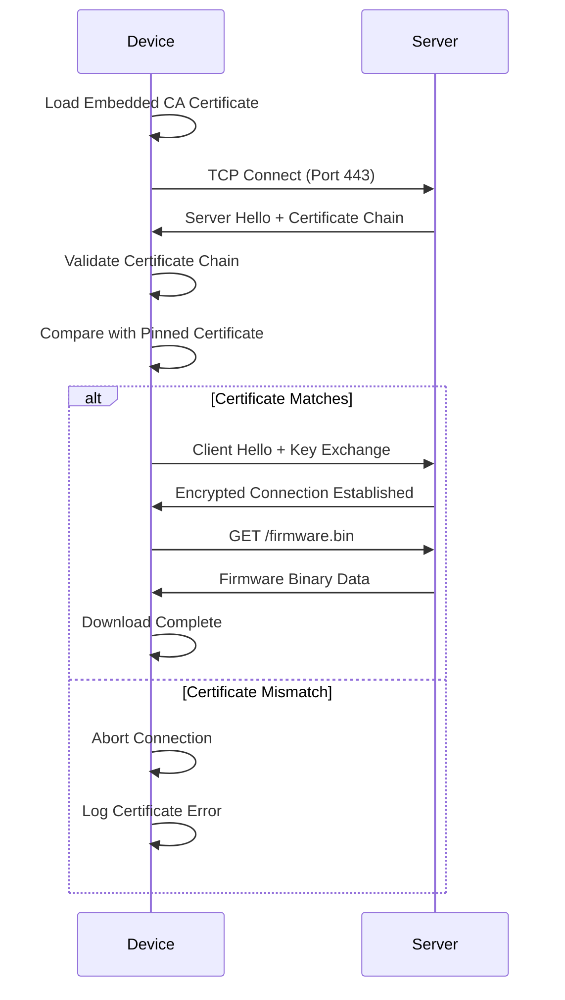
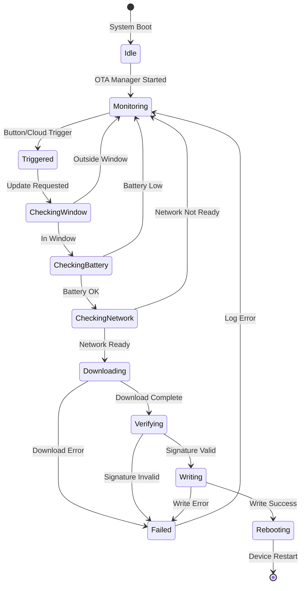

# ESP32-C6 Secure Boot + HTTPS OTA System Flowchart

## Complete System Flow

```mermaid
graph TD
    Start([Device Power On / Reset]) --> Init[Platform Initialization]
    
    Init --> NVS[Initialize NVS Flash]
    NVS --> WiFi[Start Wi-Fi Station]
    WiFi --> Connect[Connect to Configured AP]
    Connect --> Security[Log Security State]
    
    Security --> CheckSB{Secure Boot<br/>Enabled?}
    CheckSB -->|Yes| LogSB[Log: Secure Boot ON]
    CheckSB -->|No| LogSBOff[Log: Secure Boot OFF]
    LogSB --> CheckFE{Flash Encryption<br/>Enabled?}
    LogSBOff --> CheckFE
    
    CheckFE -->|Yes| LogFE[Log: Flash Encryption ON]
    CheckFE -->|No| LogFEOff[Log: Flash Encryption OFF]
    LogFE --> StartOTA[Start OTA Manager Task]
    LogFEOff --> StartOTA
    
    StartOTA --> InitGPIO[Configure OTA Button GPIO<br/>Pull-up, Active Low]
    InitGPIO --> InitSNTP[Initialize SNTP Client<br/>pool.ntp.org]
    InitSNTP --> Ready[System Ready]
    Ready --> Loop{OTA Decision Loop<br/>Every 2s}
    
    %% OTA Decision Logic
    Loop --> CheckButton{GPIO Button<br/>Pressed?}
    CheckButton -->|No| CheckCloud{Cloud Trigger<br/>Requested?}
    CheckButton -->|Yes| Debounce[Debounce 30ms]
    Debounce --> ButtonConfirm{Still Pressed?}
    ButtonConfirm -->|No| Loop
    ButtonConfirm -->|Yes| UpdateReq[Update Requested]
    
    CheckCloud -->|No Trigger URL| Loop
    CheckCloud -->|Trigger URL Set| HTTPSTrigger[HTTPS GET Trigger URL]
    HTTPSTrigger --> ParseTrigger{Response == '1'?}
    ParseTrigger -->|No| Loop
    ParseTrigger -->|Yes| UpdateReq
    
    %% Maintenance Window Check
    UpdateReq --> TimeCheck{Time Synced?}
    TimeCheck -->|No| AllowNoTime{Allow Without<br/>Time?}
    AllowNoTime -->|No| Loop
    AllowNoTime -->|Yes| BattCheck
    TimeCheck -->|Yes| GetTime[Get Current Time]
    GetTime --> WindowCheck{In Maintenance<br/>Window?}
    WindowCheck -->|No| Loop
    WindowCheck -->|Yes| BattCheck[Read Battery Voltage]
    
    %% Battery Check
    BattCheck --> BattLevel{Battery ≥<br/>Minimum?}
    BattLevel -->|No| Loop
    BattLevel -->|Yes| NetworkCheck[Network Readiness Check]
    
    %% Network Readiness
    NetworkCheck --> ParseURL[Parse HTTPS Host<br/>from Firmware URL]
    ParseURL --> DNS[DNS Resolve Host]
    DNS --> DNSSuccess{DNS OK?}
    DNSSuccess -->|No| Loop
    DNSSuccess -->|Yes| TCPConnect[TCP Connect to<br/>Host:443]
    TCPConnect --> TCPSuccess{TCP OK?}
    TCPSuccess -->|No| Loop
    TCPSuccess -->|Yes| BeginOTA[Begin HTTPS OTA]
    
    %% OTA Process
    BeginOTA --> InitHTTPS[Initialize HTTPS Client<br/>with Pinned Certificate]
    InitHTTPS --> Connect443[Connect to Server:443]
    Connect443 --> TLSHandshake[TLS Handshake]
    TLSHandshake --> VerifyCert{Certificate<br/>Valid?}
    VerifyCert -->|No| OTAFail[OTA Failed:<br/>Certificate Error]
    VerifyCert -->|Yes| GetFirmware[Download Firmware Binary]
    
    GetFirmware --> ValidateImage{Validate Image<br/>Signature?}
    ValidateImage -->|Invalid| OTAFail
    ValidateImage -->|Valid| CheckSize{Image Size<br/>Fits Partition?}
    CheckSize -->|No| OTAFail
    CheckSize -->|Yes| ErasePartition[Erase Target OTA Partition]
    
    ErasePartition --> WriteFlash[Write Firmware to Flash<br/>Chunk by Chunk]
    WriteFlash --> VerifyWrite{Write<br/>Successful?}
    VerifyWrite -->|No| OTAFail
    VerifyWrite -->|Yes| UpdateOTAData[Update OTA Data Partition]
    UpdateOTAData --> SetBootPartition[Set Next Boot Partition]
    SetBootPartition --> Delay[Delay 500ms]
    Delay --> Restart[ESP Restart]
    
    OTAFail --> LogError[Log Error Details]
    LogError --> Loop
    
    Restart --> Start
    
    %% Styling
    classDef startEnd fill:#e1f5e1,stroke:#4caf50,stroke-width:3px
    classDef process fill:#e3f2fd,stroke:#2196f3,stroke-width:2px
    classDef decision fill:#fff3e0,stroke:#ff9800,stroke-width:2px
    classDef error fill:#ffebee,stroke:#f44336,stroke-width:2px
    classDef security fill:#f3e5f5,stroke:#9c27b0,stroke-width:2px
    classDef success fill:#e8f5e9,stroke:#4caf50,stroke-width:2px
    
    class Start,Restart,Ready startEnd
    class Init,NVS,WiFi,Connect,InitGPIO,InitSNTP,Debounce,HTTPSTrigger,GetTime,BattCheck,NetworkCheck,ParseURL,DNS,TCPConnect,BeginOTA,InitHTTPS,Connect443,TLSHandshake,GetFirmware,ErasePartition,WriteFlash,UpdateOTAData,SetBootPartition,Delay process
    class CheckSB,CheckFE,Loop,CheckButton,CheckCloud,ButtonConfirm,ParseTrigger,TimeCheck,AllowNoTime,WindowCheck,BattLevel,DNSSuccess,TCPSuccess,VerifyCert,ValidateImage,CheckSize,VerifyWrite decision
    class OTAFail,LogError error
    class Security,LogSB,LogSBOff,LogFE,LogFEOff security
    class UpdateReq success
```

## OTA Gating Logic Flow

## Security Verification Flow

## Partition Layout

## Certificate Pinning Process

## State Machine: OTA Manager

