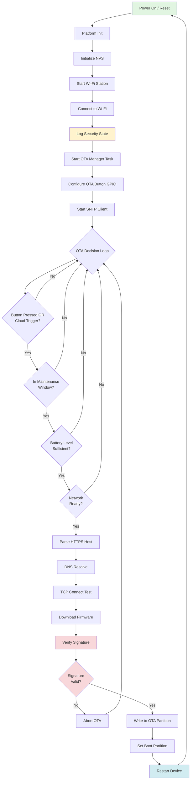

# ESP32-C6 Secure Boot + HTTPS OTA Reference Project

A production-ready ESP-IDF reference implementation demonstrating secure firmware updates using Secure Boot v2, Flash Encryption, and HTTPS OTA with certificate pinning on the ESP32-C6 microcontroller.

## 🔐 Features

### Security
- **Secure Boot v2**: Ensures only cryptographically signed firmware runs on the device
- **Flash Encryption**: Protects firmware and sensitive data stored in flash memory
- **Certificate Pinning**: Validates HTTPS server certificates to prevent man-in-the-middle attacks
- **Anti-Rollback Protection**: Prevents downgrade attacks by rejecting older firmware versions

### OTA Update Gating
The project implements a multi-layered gating mechanism to ensure safe and controlled firmware updates:

- **User Action**: Manual trigger via GPIO button press
- **Cloud Command**: Optional HTTPS endpoint that returns '1' to request OTA
- **Maintenance Window**: Configurable time window for automatic updates (SNTP-based)
- **Battery Check**: Ensures sufficient power before starting OTA (demo stub included)
- **Network Readiness**: Validates DNS resolution and TCP connectivity before download

### Architecture
- Dual OTA partition scheme with automatic failover
- Wi-Fi station mode with configurable credentials
- Modular design with separate components for Wi-Fi, OTA management, and application logic

## 📋 Requirements

### Hardware
- ESP32-C6 development board
- USB cable for flashing and serial monitoring
- Optional: GPIO button connected to configured pin (default: GPIO 9)

### Software
- [ESP-IDF v5.0+](https://docs.espressif.com/projects/esp-idf/en/latest/esp32c6/get-started/index.html)
- Python 3.7+
- Serial port driver for your development board

## 🚀 Quick Start

### 1. Clone the Repository
```bash
git clone https://github.com/yourusername/ESP32C6_Secure_Boot_Https_Ota_Ref.git
cd ESP32C6_Secure_Boot_Https_Ota_Ref
```

### 2. Configure the Project
```bash
idf.py set-target esp32c6
idf.py menuconfig
```

Navigate to **"Secure OTA Reference (app settings)"** and configure:
- Wi-Fi SSID and password
- HTTPS firmware URL (where your OTA binary is hosted)
- Optional: HTTPS trigger URL for cloud-initiated updates
- Maintenance window hours
- Battery thresholds
- OTA button GPIO pin

### 3. Certificate Pinning Setup
Replace the default certificate with your server's root CA certificate:
```bash
# Place your server's root CA certificate here
cp /path/to/your/ca_cert.pem main/server_root_cert.pem
```

### 4. Build and Flash
```bash
idf.py build
idf.py -p /dev/ttyUSB0 flash monitor
```

Replace `/dev/ttyUSB0` with your actual serial port (e.g., `COM3` on Windows).

## 🔧 Project Structure

```
ESP32C6_Secure_Boot_Https_Ota_Ref/
├── main/
│   ├── main.c                    # Application entry point
│   ├── ota_manager.c             # OTA decision logic and execution
│   ├── ota_manager.h
│   ├── wifi_station.c            # Wi-Fi station management
│   ├── wifi_station.h
│   ├── app_cfg.h                 # Configuration mappings
│   ├── server_root_cert.pem      # Pinned server certificate
│   ├── CMakeLists.txt
│   └── Kconfig.projbuild         # Menuconfig options
├── scripts/
│   ├── provision_dev.sh          # Development provisioning script
│   ├── provision_prod.sh         # Production provisioning script
│   └── factory_checklist.md      # Production deployment checklist
├── partitions.csv                # Partition table definition
├── sdkconfig.defaults            # Default development configuration
├── sdkconfig.defaults.production # Production configuration template
├── secure_boot_signing_key.pem   # Secure Boot signing key (example)
├── CMakeLists.txt
└── README.md
```

## 📊 System Flow



## 🔒 Security Implementation

### Secure Boot v2
Secure Boot v2 uses RSA-PSS signatures to ensure only authorized firmware runs on the device:

1. **Key Generation**: A private signing key is generated and must be kept secure (offline/HSM)
2. **Firmware Signing**: Each firmware binary is signed with the private key during build
3. **Bootloader Verification**: The ROM bootloader verifies the bootloader signature
4. **Application Verification**: The bootloader verifies the application signature before execution

### Flash Encryption
Flash encryption protects the firmware and data stored in flash:

- **Development Mode**: Allows re-flashing (useful for development)
- **Release Mode**: One-time programmable, production-ready (configured in production build)

### Certificate Pinning
The project implements HTTPS certificate pinning to prevent MITM attacks:

```c
// The server's root CA certificate is embedded in the binary
extern const char server_root_cert_pem_start[] asm("_binary_server_root_cert_pem_start");

// HTTPS client configuration with pinned certificate
esp_http_client_config_t cfg = {
    .url = firmware_url,
    .cert_pem = server_root_cert_pem_start,
    .timeout_ms = 15000,
};
```

## 🏭 Production Deployment

### Development vs. Production

**Development Configuration** (`sdkconfig.defaults`):
- Secure Boot v2 enabled with signing key in project
- Flash Encryption disabled (allows re-flashing)
- Suitable for development and testing

**Production Configuration** (`sdkconfig.defaults.production`):
- Secure Boot v2 enabled (key digest burned to eFuses)
- Flash Encryption enabled in Release mode
- Anti-rollback protection enabled

### Production Provisioning Process

1. **Prepare Secure Assets**
   - Store private signing key securely (offline/HSM)
   - Finalize and deploy pinned certificates
   - Establish certificate rotation plan

2. **Build Production Firmware**
   ```bash
   cp sdkconfig.defaults.production sdkconfig.defaults
   idf.py fullclean
   idf.py build
   ```

3. **Flash and Validate**
   ```bash
   idf.py -p /dev/ttyUSB0 flash
   idf.py -p /dev/ttyUSB0 monitor
   ```

4. **Burn eFuses** (⚠️ IRREVERSIBLE)
   - Burn Secure Boot v2 key digest
   - Enable Flash Encryption in Release mode
   - Verify with: `idf.py -p /dev/ttyUSB0 efuse-summary`

5. **Final Validation**
   - Confirm device only boots signed images
   - Verify flash encryption is enabled
   - Test OTA update process

See `scripts/factory_checklist.md` for detailed production deployment steps.

## ⚙️ Configuration Options

### Wi-Fi Settings
- `APP_WIFI_SSID`: Network SSID
- `APP_WIFI_PASSWORD`: Network password

### OTA Settings
- `APP_OTA_FIRMWARE_URL`: HTTPS URL to firmware binary
- `APP_OTA_TRIGGER_URL`: Optional cloud trigger endpoint
- `APP_OTA_BUTTON_GPIO`: GPIO pin for manual OTA trigger (default: 9)
- `APP_OTA_POLL_PERIOD_MS`: OTA check interval (default: 2000ms)

### Maintenance Window
- `APP_OTA_MAINT_START_HOUR`: Start hour (0-23, default: 2)
- `APP_OTA_MAINT_END_HOUR`: End hour (0-23, default: 5)
- `APP_OTA_ALLOW_WITHOUT_TIME`: Allow OTA without time sync (default: yes)

### Battery Protection
- `APP_BATT_MIN_MV`: Minimum voltage for OTA (default: 3600mV)
- `APP_BATT_FAKE_MV`: Demo battery reading (default: 4200mV)

> **Note**: The battery reading is a stub. Implement actual ADC reading in `read_battery_mv()` for production use.

## 🌐 Hosting OTA Firmware

### Server Requirements
1. HTTPS server with valid SSL certificate
2. Firmware binary accessible via HTTPS
3. Optional: Trigger endpoint returning '1' to initiate OTA

### Example Server Setup (Python)
```python
# Simple HTTPS server for testing
from http.server import HTTPServer, SimpleHTTPRequestHandler
import ssl

httpd = HTTPServer(('0.0.0.0', 8443), SimpleHTTPRequestHandler)
httpd.socket = ssl.wrap_socket(httpd.socket,
                               server_side=True,
                               certfile='server.crt',
                               keyfile='server.key',
                               ssl_version=ssl.PROTOCOL_TLS)
httpd.serve_forever()
```

Place your firmware binary (e.g., `esp32c6_ota.bin`) in the server directory and configure the URL in menuconfig.

## 🐛 Troubleshooting

### Common Issues

**OTA fails with certificate verification error**
- Ensure `server_root_cert.pem` matches your server's CA certificate
- Verify the server's certificate chain is valid
- Check that certificate hasn't expired

**Device won't boot after Secure Boot**
- Verify firmware is properly signed with the correct key
- Check eFuse summary: `idf.py -p PORT efuse-summary`
- Ensure bootloader and application are both signed

**OTA stuck in maintenance window check**
- Verify SNTP server is accessible
- Check time zone settings
- Enable `APP_OTA_ALLOW_WITHOUT_TIME` for testing

**Network readiness check fails**
- Confirm DNS server is reachable
- Test HTTPS URL is accessible from your network
- Check firewall rules for port 443

### Logging
Enable verbose logging for debugging:
```bash
idf.py menuconfig
# Component config → Log output → Default log verbosity → Debug
```

## 📝 Customization

### Implementing Real Battery Reading
Replace the stub in `main/ota_manager.c`:

```c
static int read_battery_mv(void)
{
    // Example: Read ADC channel for battery voltage
    adc_oneshot_unit_handle_t adc1_handle;
    adc_oneshot_unit_init_cfg_t init_config = {
        .unit_id = ADC_UNIT_1,
    };
    ESP_ERROR_CHECK(adc_oneshot_new_unit(&init_config, &adc1_handle));
    
    int raw_value;
    ESP_ERROR_CHECK(adc_oneshot_read(adc1_handle, ADC_CHANNEL_0, &raw_value));
    
    // Convert raw ADC value to millivolts based on your voltage divider
    return (raw_value * 3300 * 2) / 4095; // Example for 2:1 divider
}
```

### Custom Cloud Trigger Implementation
Replace `cloud_trigger_requested()` with your cloud service API:

```c
static bool cloud_trigger_requested(void)
{
    // Implement your cloud service API call
    // Example: Check device-specific endpoint
    // Return true if update is available for this device
}
```

## 🤝 Contributing

Contributions are welcome! Please feel free to submit a Pull Request. For major changes, please open an issue first to discuss what you would like to change.

## 📄 License

This project is provided as-is for reference and educational purposes. Please review and comply with ESP-IDF's license terms.

## 🔗 Resources

- [ESP-IDF Programming Guide](https://docs.espressif.com/projects/esp-idf/en/latest/esp32c6/)
- [ESP32-C6 Secure Boot v2](https://docs.espressif.com/projects/esp-idf/en/latest/esp32c6/security/secure-boot-v2.html)
- [ESP32-C6 Flash Encryption](https://docs.espressif.com/projects/esp-idf/en/latest/esp32c6/security/flash-encryption.html)
- [ESP HTTPS OTA](https://docs.espressif.com/projects/esp-idf/en/latest/esp32c6/api-reference/system/esp_https_ota.html)

## 📧 Support

For questions and support, please open an issue in the GitHub repository.

---

**⚠️ Security Notice**: This is a reference implementation. Always conduct thorough security audits and testing before deploying to production. Keep your signing keys secure and implement proper key management practices.
