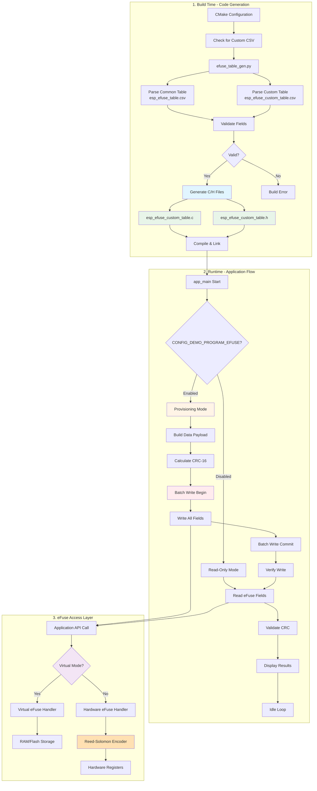
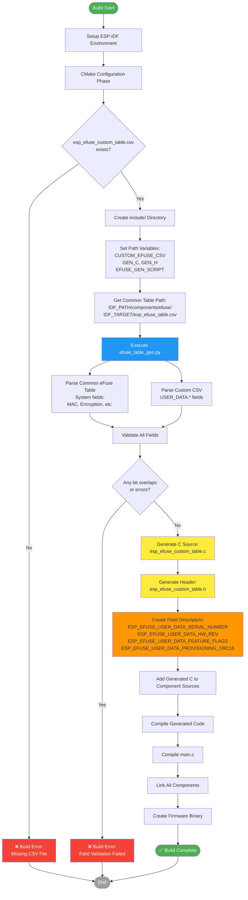
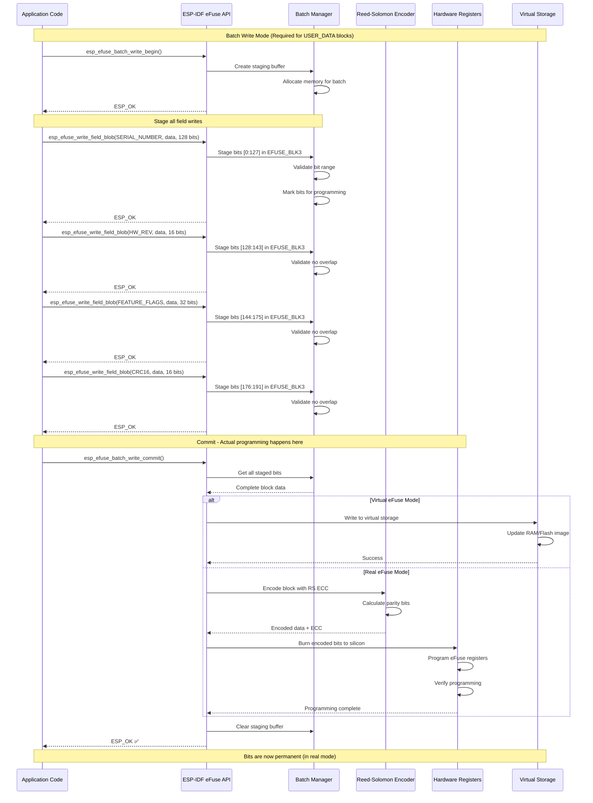
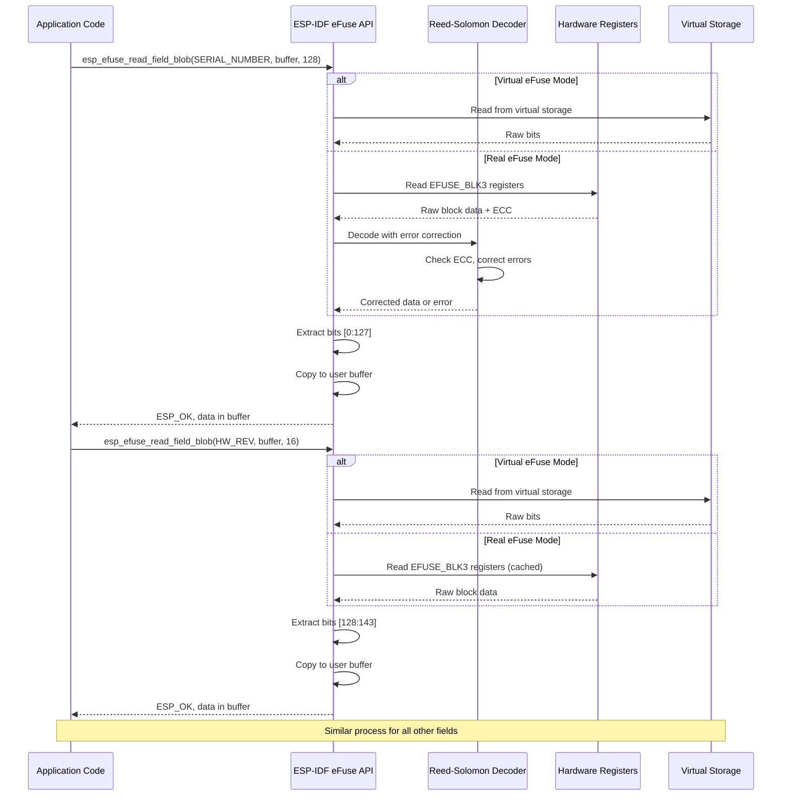
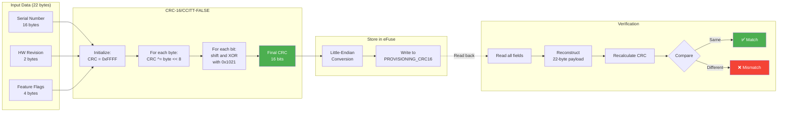
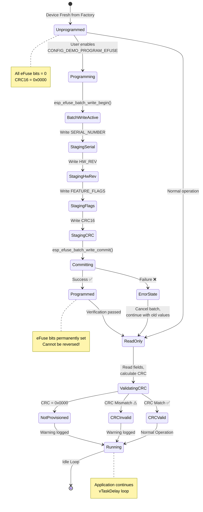
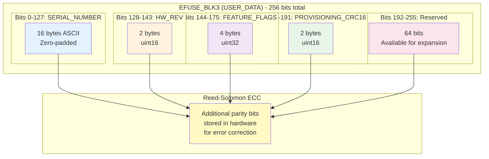
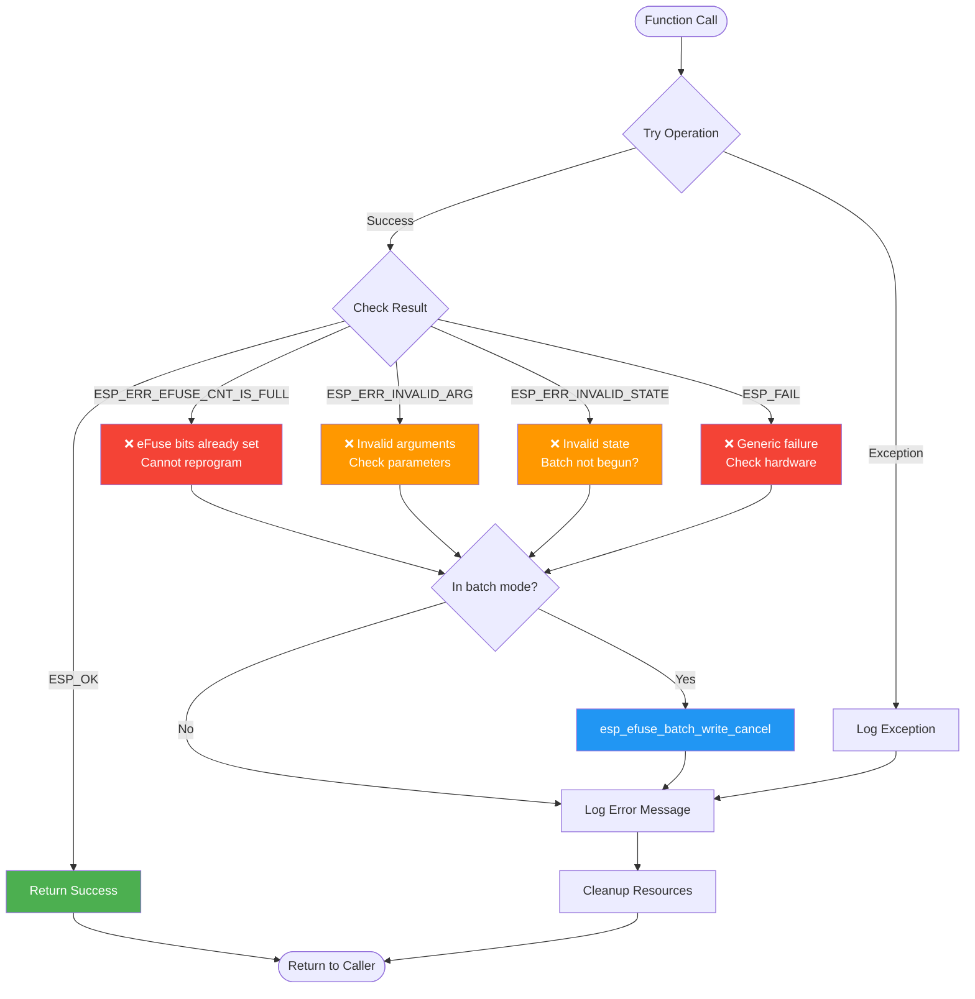

# ESP32-S3 Custom eFuse Demo - Project Flowcharts

## Complete System Flow Diagram

## Detailed Build Process Flow

## Runtime Application Flow

```mermaid
flowchart TD
    Start([System Boot]) --> InitHW[Hardware Initialization]
    InitHW --> AppMain[app_main Entry Point]
    
    AppMain --> LogStart[Log: Demo Starting]
    LogStart --> CheckConfig{CONFIG_DEMO_PROGRAM_EFUSE<br/>enabled?}
    
    CheckConfig -->|Yes| LogWarning[⚠️ Log: Programming Enabled]
    CheckConfig -->|No| ReadFields[Read eFuse Fields]
    
    LogWarning --> DefineData[Define Provisioning Data:<br/>Serial: SN-ESP32S3-0001<br/>HW Rev: 0x0001<br/>Flags: 0x0000000F]
    
    DefineData --> BuildPayload[Build 22-byte Payload:<br/>Serial16 + HwRev2 + Flags4]
    
    BuildPayload --> CalcCRC[Calculate CRC-16/CCITT-FALSE<br/>over payload]
    
    CalcCRC --> BatchBegin[esp_efuse_batch_write_begin]
    
    BatchBegin --> CheckBatchErr1{Success?}
    CheckBatchErr1 -->|No| ErrorLog1[❌ Log: Batch Begin Failed]
    CheckBatchErr1 -->|Yes| WriteSerial[Write SERIAL_NUMBER<br/>128 bits]
    
    WriteSerial --> CheckWriteErr1{Success?}
    CheckWriteErr1 -->|No| BatchCancel1[esp_efuse_batch_write_cancel]
    CheckWriteErr1 -->|Yes| WriteHwRev[Write HW_REV<br/>16 bits]
    
    WriteHwRev --> CheckWriteErr2{Success?}
    CheckWriteErr2 -->|No| BatchCancel2[esp_efuse_batch_write_cancel]
    CheckWriteErr2 -->|Yes| WriteFlags[Write FEATURE_FLAGS<br/>32 bits]
    
    WriteFlags --> CheckWriteErr3{Success?}
    CheckWriteErr3 -->|No| BatchCancel3[esp_efuse_batch_write_cancel]
    CheckWriteErr3 -->|Yes| WriteCRC[Write PROVISIONING_CRC16<br/>16 bits]
    
    WriteCRC --> CheckWriteErr4{Success?}
    CheckWriteErr4 -->|No| BatchCancel4[esp_efuse_batch_write_cancel]
    CheckWriteErr4 -->|Yes| BatchCommit[esp_efuse_batch_write_commit]
    
    BatchCommit --> CheckCommitErr{Success?}
    CheckCommitErr -->|No| ErrorLog2[❌ Log: Commit Failed]
    CheckCommitErr -->|Yes| LogCommit[✅ Log: Provisioning Committed]
    
    BatchCancel1 --> ErrorLog1
    BatchCancel2 --> ErrorLog1
    BatchCancel3 --> ErrorLog1
    BatchCancel4 --> ErrorLog1
    ErrorLog1 --> ReadFields
    ErrorLog2 --> ReadFields
    LogCommit --> ReadFields
    
    ReadFields --> ReadSerial[Read SERIAL_NUMBER<br/>esp_efuse_read_field_blob]
    ReadSerial --> ReadHwRev[Read HW_REV<br/>esp_efuse_read_field_blob]
    ReadHwRev --> ReadFlags2[Read FEATURE_FLAGS<br/>esp_efuse_read_field_blob]
    ReadFlags2 --> ReadCRCStored[Read PROVISIONING_CRC16<br/>esp_efuse_read_field_blob]
    
    ReadCRCStored --> ConvertSerial[Convert Serial to String]
    ConvertSerial --> LogValues[Log All Field Values:<br/>SERIAL, HW_REV, FLAGS, CRC]
    
    LogValues --> RebuildPayload[Rebuild 22-byte Payload<br/>from read values]
    RebuildPayload --> RecalcCRC[Recalculate CRC-16]
    RecalcCRC --> LogRecalc[Log: CRC Recalculated]
    
    LogRecalc --> CheckCRC{Compare CRC values}
    CheckCRC -->|CRC = 0x0000| LogNotProvisioned[⚠️ Log: Not Provisioned Yet]
    CheckCRC -->|CRC Mismatch| LogMismatch[⚠️ Log: CRC Mismatch]
    CheckCRC -->|CRC Match| LogOK[✅ Log: CRC Check OK]
    
    LogNotProvisioned --> IdleLoop[Infinite Idle Loop:<br/>vTaskDelay 2000ms]
    LogMismatch --> IdleLoop
    LogOK --> IdleLoop
    
    IdleLoop --> IdleLoop
    
    style Start fill:#4caf50,color:#fff
    style LogWarning fill:#ff9800,color:#fff
    style BatchBegin fill:#2196f3,color:#fff
    style BatchCommit fill:#2196f3,color:#fff
    style ErrorLog1 fill:#f44336,color:#fff
    style ErrorLog2 fill:#f44336,color:#fff
    style LogCommit fill:#4caf50,color:#fff
    style LogOK fill:#4caf50,color:#fff
    style LogMismatch fill:#ff9800,color:#fff
    style LogNotProvisioned fill:#ff9800,color:#fff
    style IdleLoop fill:#9e9e9e,color:#fff
```

## eFuse Write Operation (Batch Mode Detail)

## eFuse Read Operation

## CRC-16 Calculation Flow

## State Machine: eFuse Provisioning States

## Data Structure: eFuse Block Layout (EFUSE_BLK3)

## Error Handling Flow

