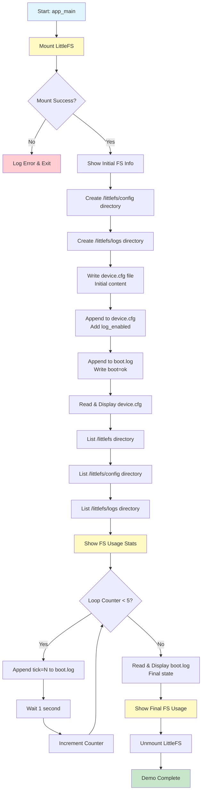
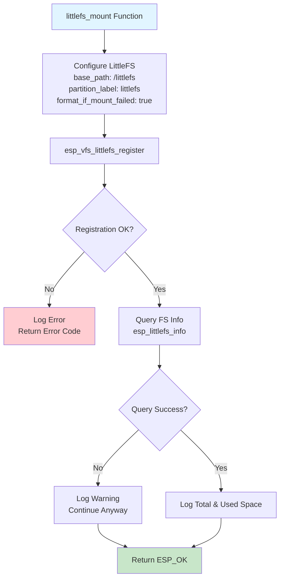
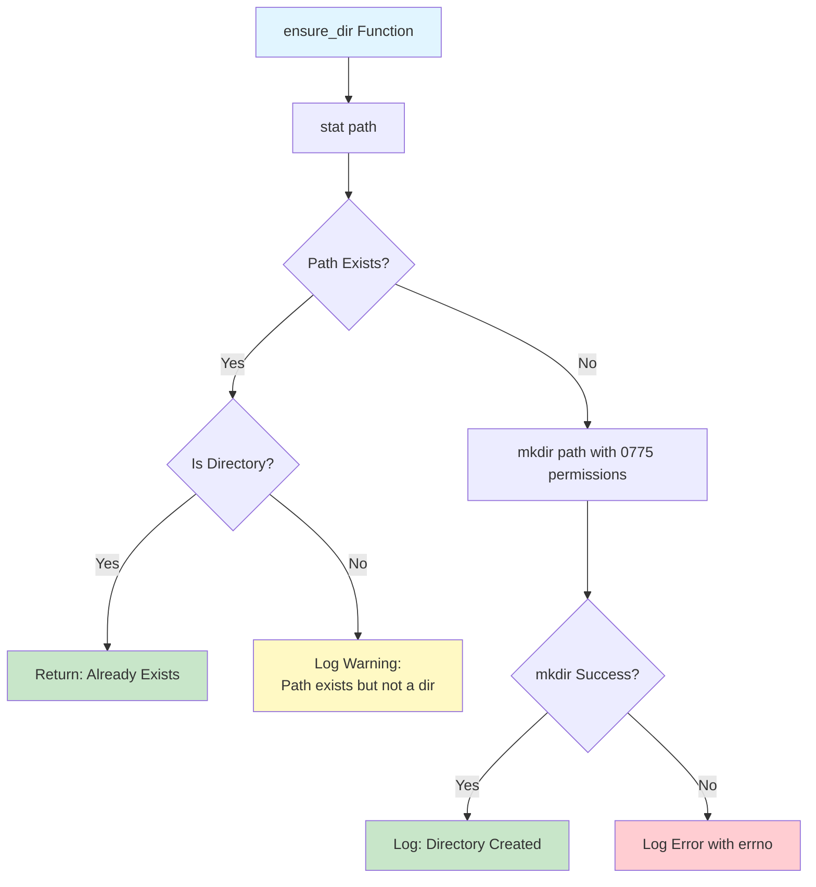
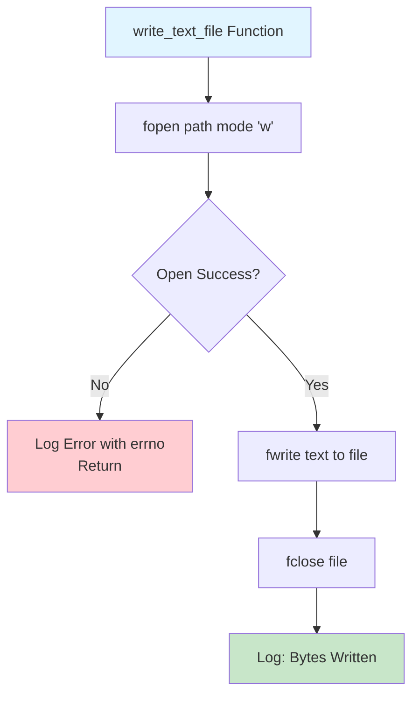
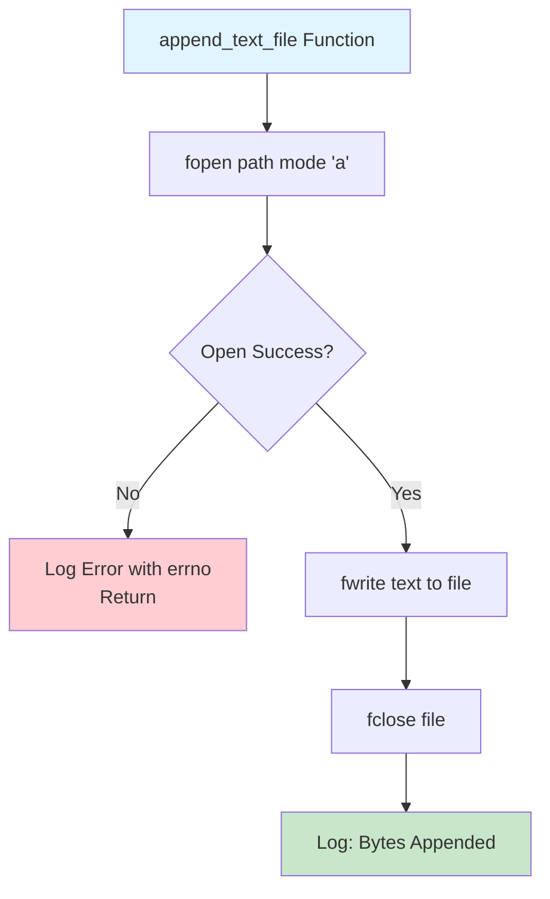
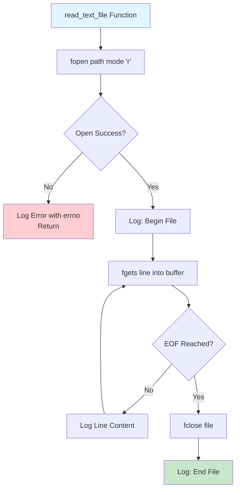
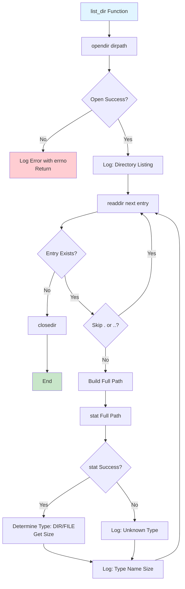
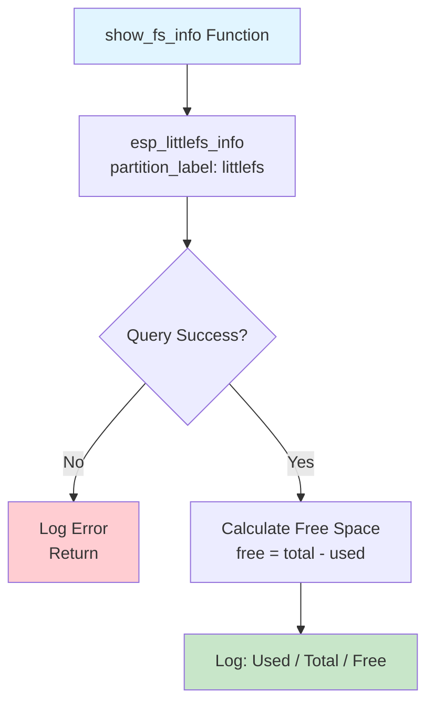
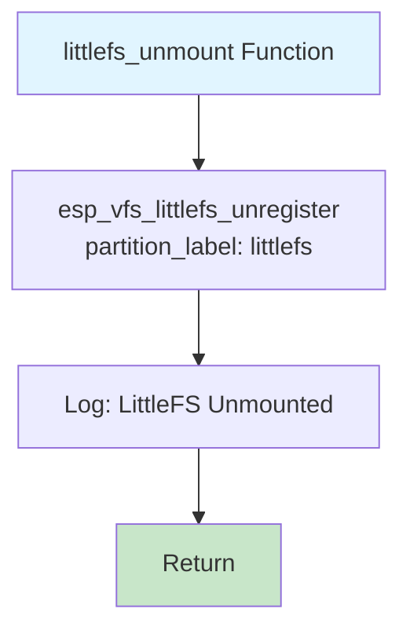
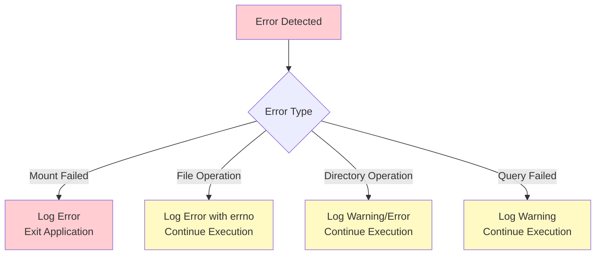

# ESP32-S3 LittleFS Demo - Flowchart

This document contains the detailed flowchart of the LittleFS demo application.

## Main Application Flow

## Filesystem Mount Process

## Directory Creation Process

## File Write Process

## File Append Process

## File Read Process

## Directory Listing Process

## Filesystem Info Query

## Unmount Process

## Error Handling Flow

## Legend

- **Blue boxes**: Entry points and start states
- **Red boxes**: Error states and exits
- **Green boxes**: Success states and completions
- **Yellow boxes**: Information/status operations
- **White boxes**: Normal processing steps
