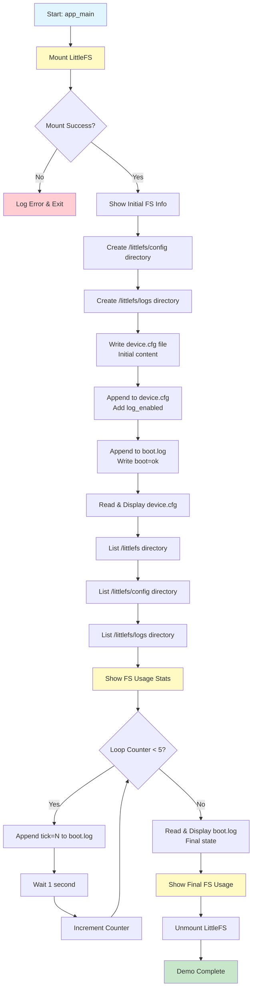

# ESP32-S3 LittleFS Demo

A comprehensive ESP-IDF project demonstrating LittleFS filesystem operations on ESP32-S3, including mounting, file I/O operations, directory management, and filesystem usage monitoring.

## 📋 Table of Contents

- [Overview](#-overview)
- [Features](#-features)
- [Hardware Requirements](#-hardware-requirements)
- [Software Requirements](#-software-requirements)
- [Project Structure](#-project-structure)
- [Partition Table](#-partition-table)
- [Configuration](#-configuration)
- [Building and Flashing](#-building-and-flashing)
- [How It Works](#-how-it-works)
- [Program Flow](#-program-flow)
- [Expected Output](#-expected-output)
- [API Reference](#-api-reference)
- [Troubleshooting](#-troubleshooting)
- [License](#license)

## 🔍 Overview

This project demonstrates the complete workflow of using LittleFS (Little File System) on ESP32-S3 microcontrollers. LittleFS is a lightweight filesystem designed for embedded systems with limited resources, providing wear leveling and power-loss resilience.

The demo showcases:
- Filesystem mounting and unmounting
- Creating directories
- Writing files (overwrite mode)
- Appending to files
- Reading file contents
- Listing directory contents
- Querying filesystem usage statistics

## ✨ Features

- **Auto-Format on Mount Failure**: Automatically formats the partition if mounting fails
- **Directory Management**: Creates nested directory structures
- **File Operations**: Write, append, and read text files
- **Directory Listing**: Enumerate files and subdirectories with size information
- **Usage Monitoring**: Real-time filesystem usage statistics (total, used, free space)
- **Error Handling**: Comprehensive error checking with detailed logging
- **Periodic Logging**: Demonstrates continuous append operations with timestamps

## 🔧 Hardware Requirements

- ESP32-S3 development board (any variant)
- USB cable for programming and monitoring
- Computer with USB port

## 💻 Software Requirements

- **ESP-IDF**: Version 5.0 or later (recommended: 5.1+)
- **Python**: 3.8 or later
- **LittleFS Component**: joltwallet/littlefs v1.20.0 or later (auto-installed via component manager)

### Installing ESP-IDF

Follow the official [ESP-IDF Getting Started Guide](https://docs.espressif.com/projects/esp-idf/en/latest/esp32s3/get-started/index.html) for your operating system.

## 📁 Project Structure

```
ESP32S3_LittleFS_Demo/
├── CMakeLists.txt              # Main project CMake configuration
├── partitions.csv              # Custom partition table definition
├── sdkconfig.defaults          # Default SDK configuration
├── README.md                   # This file
└── main/
    ├── CMakeLists.txt          # Main component CMake configuration
    ├── idf_component.yml       # Component dependencies
    └── main.c                  # Application source code
```

## 🗂️ Partition Table

The project uses a custom partition table defined in `partitions.csv`:

| Name      | Type | SubType  | Offset   | Size  | Description              |
|-----------|------|----------|----------|-------|--------------------------|
| nvs       | data | nvs      | 0x9000   | 20KB  | Non-volatile storage     |
| phy_init  | data | phy      | 0xE000   | 4KB   | PHY initialization data  |
| factory   | app  | factory  | 0x10000  | 1MB   | Application binary       |
| littlefs  | data | littlefs | 0x110000 | 512KB | LittleFS filesystem      |

The **littlefs** partition (512KB) is dedicated to the filesystem storage.

## ⚙️ Configuration

### LittleFS Settings (sdkconfig.defaults)

The project is pre-configured with optimal LittleFS settings:

```
CONFIG_LITTLEFS_PAGE_SIZE=256           # Flash page size
CONFIG_LITTLEFS_OBJ_NAME_LEN=64         # Maximum filename length
CONFIG_LITTLEFS_READ_SIZE=128           # Minimum read size
CONFIG_LITTLEFS_WRITE_SIZE=128          # Minimum write size
CONFIG_LITTLEFS_CACHE_SIZE=512          # Cache size
CONFIG_LITTLEFS_LOOKAHEAD_SIZE=128      # Lookahead buffer size
CONFIG_LITTLEFS_USE_MTIME=y             # Enable file modification timestamps
CONFIG_LITTLEFS_ENABLE_FALLOCATE=y      # Enable file pre-allocation
CONFIG_LITTLEFS_MAX_PARTITIONS=3        # Maximum LittleFS partitions
```

These values are tuned for ESP32-S3's flash characteristics.

## 🚀 Building and Flashing

### 1. Set up ESP-IDF environment

```bash
# Linux/macOS
. $HOME/esp/esp-idf/export.sh

# Windows (Command Prompt)
%userprofile%\esp\esp-idf\export.bat

# Windows (PowerShell)
.$HOME\esp\esp-idf\export.ps1
```

### 2. Navigate to project directory

```bash
cd ESP32S3_LittleFS_Demo
```

### 3. Build the project

```bash
idf.py build
```

### 4. Flash to ESP32-S3

```bash
idf.py -p PORT flash
```

Replace `PORT` with your serial port (e.g., `/dev/ttyUSB0` on Linux, `COM3` on Windows).

### 5. Monitor output

```bash
idf.py -p PORT monitor
```

To exit the monitor, press `Ctrl+]`.

### Combined flash and monitor

```bash
idf.py -p PORT flash monitor
```

## 🔄 How It Works

### 1. **Filesystem Mounting**

The application starts by mounting the LittleFS partition:

```c
esp_vfs_littlefs_conf_t conf = {
    .base_path = "/littlefs",
    .partition_label = "littlefs",
    .format_if_mount_failed = true,
    .dont_mount = false,
};
esp_vfs_littlefs_register(&conf);
```

- **base_path**: Mount point in the virtual filesystem (`/littlefs`)
- **partition_label**: Matches the partition name in `partitions.csv`
- **format_if_mount_failed**: Auto-formats if partition is corrupted or unformatted

### 2. **Directory Creation**

Creates a directory structure:
```
/littlefs/
├── config/
│   └── device.cfg
└── logs/
    └── boot.log
```

The `ensure_dir()` function checks if a directory exists and creates it if needed.

### 3. **File Operations**

- **Write (Overwrite)**: Creates or overwrites `device.cfg` with initial configuration
- **Append**: Adds additional configuration lines and log entries
- **Read**: Reads and displays file contents line by line

### 4. **Directory Listing**

Lists all files and subdirectories with:
- File type (FILE/DIR)
- File name
- File size in bytes

### 5. **Usage Monitoring**

Queries and displays:
- Total filesystem capacity
- Used space
- Free space

### 6. **Periodic Logging**

Appends timestamped log entries every second for 5 seconds, demonstrating continuous file operations.

## 📊 Program Flow



## 📤 Expected Output

```
I (xxx) littlefs_demo: Booting LittleFS demo...
I (xxx) littlefs_demo: LittleFS mounted at /littlefs
I (xxx) littlefs_demo: Partition: total=524288 bytes, used=8192 bytes
I (xxx) littlefs_demo: Created directory: /littlefs/config
I (xxx) littlefs_demo: Created directory: /littlefs/logs
I (xxx) littlefs_demo: Wrote 59 bytes to /littlefs/config/device.cfg
I (xxx) littlefs_demo: Appended 17 bytes to /littlefs/config/device.cfg
I (xxx) littlefs_demo: Appended 8 bytes to /littlefs/logs/boot.log
I (xxx) littlefs_demo: ---- Begin file: /littlefs/config/device.cfg ----
I (xxx) littlefs_demo: device_id=ESP32S3
I (xxx) littlefs_demo: mode=demo
I (xxx) littlefs_demo: wifi_autostart=false
I (xxx) littlefs_demo: log_enabled=true
I (xxx) littlefs_demo: ---- End file ----
I (xxx) littlefs_demo: Directory listing for: /littlefs
I (xxx) littlefs_demo:   DIR   config  size=0
I (xxx) littlefs_demo:   DIR   logs  size=0
I (xxx) littlefs_demo: Directory listing for: /littlefs/config
I (xxx) littlefs_demo:   FILE  device.cfg  size=76
I (xxx) littlefs_demo: Directory listing for: /littlefs/logs
I (xxx) littlefs_demo:   FILE  boot.log  size=8
I (xxx) littlefs_demo: LittleFS usage: used=8192 / total=524288 bytes (free=516096 bytes)
I (xxx) littlefs_demo: Appended 7 bytes to /littlefs/logs/boot.log
I (xxx) littlefs_demo: Appended 7 bytes to /littlefs/logs/boot.log
I (xxx) littlefs_demo: Appended 7 bytes to /littlefs/logs/boot.log
I (xxx) littlefs_demo: Appended 7 bytes to /littlefs/logs/boot.log
I (xxx) littlefs_demo: Appended 7 bytes to /littlefs/logs/boot.log
I (xxx) littlefs_demo: ---- Begin file: /littlefs/logs/boot.log ----
I (xxx) littlefs_demo: boot=ok
I (xxx) littlefs_demo: tick=0
I (xxx) littlefs_demo: tick=1
I (xxx) littlefs_demo: tick=2
I (xxx) littlefs_demo: tick=3
I (xxx) littlefs_demo: tick=4
I (xxx) littlefs_demo: ---- End file ----
I (xxx) littlefs_demo: LittleFS usage: used=8192 / total=524288 bytes (free=516096 bytes)
I (xxx) littlefs_demo: LittleFS unmounted
I (xxx) littlefs_demo: Demo complete.
```

## 📚 API Reference

### Core Functions

#### `littlefs_mount()`
Mounts the LittleFS partition and reports usage statistics.

**Returns**: `ESP_OK` on success, error code otherwise

#### `littlefs_unmount()`
Unmounts and unregisters the LittleFS partition.

#### `ensure_dir(const char *path)`
Creates a directory if it doesn't exist.

**Parameters**:
- `path`: Full path to directory

#### `write_text_file(const char *path, const char *text)`
Writes text to a file, overwriting existing content.

**Parameters**:
- `path`: Full path to file
- `text`: Text content to write

#### `append_text_file(const char *path, const char *text)`
Appends text to the end of a file.

**Parameters**:
- `path`: Full path to file
- `text`: Text content to append

#### `read_text_file(const char *path)`
Reads and logs the contents of a text file.

**Parameters**:
- `path`: Full path to file

#### `list_dir(const char *dirpath)`
Lists all files and subdirectories in a directory.

**Parameters**:
- `dirpath`: Full path to directory

#### `show_fs_info()`
Displays filesystem usage statistics (total, used, free space).

## 🐛 Troubleshooting

### Mount Failed Error

**Problem**: `esp_vfs_littlefs_register failed`

**Solutions**:
1. Verify partition table is flashed: `idf.py partition-table-flash`
2. Check partition label matches in both `partitions.csv` and code
3. Increase partition size if full
4. Erase flash and reflash: `idf.py erase-flash flash`

### File Operation Failures

**Problem**: `fopen` or `fwrite` failures

**Solutions**:
1. Ensure filesystem is mounted before file operations
2. Check available space with `show_fs_info()`
3. Verify file paths don't exceed `CONFIG_LITTLEFS_OBJ_NAME_LEN`
4. Check that parent directories exist

### Build Errors

**Problem**: Cannot find LittleFS component

**Solutions**:
1. Ensure `idf_component.yml` is present in `main/` directory
2. Run `idf.py reconfigure` to refresh dependencies
3. Check internet connection for component download
4. Manually install: `idf.py add-dependency "joltwallet/littlefs^1.20.0"`

### Serial Port Issues

**Problem**: Cannot connect to ESP32-S3

**Solutions**:
1. Install CP210x or CH340 drivers
2. Verify port with `idf.py -p PORT monitor`
3. Press BOOT button while connecting
4. Check USB cable supports data transfer

## 📖 Additional Resources

- [ESP-IDF Programming Guide](https://docs.espressif.com/projects/esp-idf/en/latest/esp32s3/)
- [LittleFS GitHub Repository](https://github.com/littlefs-project/littlefs)
- [ESP-IDF LittleFS Component](https://github.com/joltwallet/esp_littlefs)
- [LittleFS Design Documentation](https://github.com/littlefs-project/littlefs/blob/master/DESIGN.md)

## 📄 License

This project is provided as-is for educational and development purposes. Feel free to modify and use it in your own projects.

---

**Developed for ESP32-S3 | ESP-IDF Framework**
