# ESP32 Low-Power Reference Project Flowchart

This document contains the system architecture flowchart showing the complete firmware execution flow.

## Main Application Flow


## Wi-Fi Manager Lifecycle


## Power State Transitions

```mermaid
stateDiagram-v2
    [*] --> Active: Power On / Wake
    
    Active --> LightSleep: Task Blocks<br/>(PM enabled)
    LightSleep --> Active: Interrupt / Event
    
    Active --> DeepSleep: esp_deep_sleep_start()
    DeepSleep --> Active: Timer Wake
    DeepSleep --> Active: GPIO Wake (EXT0)
    
    Active --> [*]: Shutdown
    
    note right of DeepSleep
        Current: 10-50 µA
        Duration: 99%+ of time
    end note
    
    note right of Active
        Current: 80-240 mA
        Duration: < 1% of time
    end note
    
    note right of LightSleep
        Current: 0.8-2 mA
        Automatic when idle
    end note
```



## Event-Driven Task Pattern


## Timing Diagram


## Legend

| Color | Meaning |
|-------|---------|
| 🟢 Green | Normal operation, low power |
| 🟡 Yellow | Wi-Fi operations, medium power |
| 🔴 Red | Critical state (deep sleep entry) |
| 🔵 Blue | Power management enabled |

## Notes

- **Solid lines** represent actual code execution flow
- **Dashed lines** represent interrupt/notification mechanisms
- **Decision diamonds** represent conditional logic
- **Colored boxes** highlight power-critical states

## Usage

To render these diagrams:
1. Use [Mermaid Live Editor](https://mermaid.live/)
2. Use GitHub (renders automatically)
3. Use VS Code with Mermaid extension
4. Generate PNG/SVG using Mermaid CLI

```bash
# Install Mermaid CLI
npm install -g @mermaid-js/mermaid-cli

# Generate PNG
mmdc -i FLOWCHART.md -o flowchart.png
```
