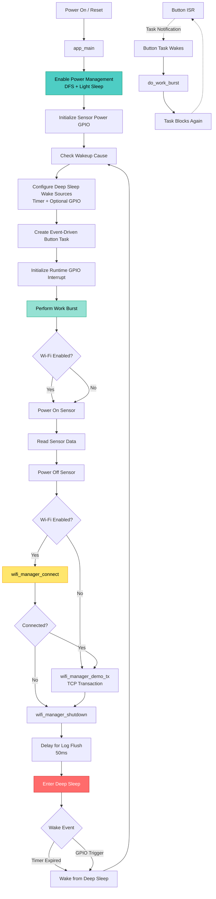

# ESP32 Low-Power Reference Project

A comprehensive ESP-IDF reference implementation demonstrating firmware techniques for maximizing battery life in ESP32-based IoT devices. This project showcases production-ready patterns for building ultra-low-power battery-operated sensors and edge devices.

[](https://docs.espressif.com/projects/esp-idf/en/latest/esp32/)
[](LICENSE)

## 🎯 Key Features

This project demonstrates five critical power optimization techniques:

1. **Event-Driven FreeRTOS Tasks** - Tasks block on notifications instead of polling, allowing the CPU to sleep
2. **ESP-IDF Power Management** - Dynamic Frequency Scaling (DFS) and automatic light sleep
3. **Deep Sleep Duty Cycling** - Wake → Work → Sleep pattern for minimal active time
4. **Explicit Wi-Fi Lifecycle** - Connect → Transmit → Shutdown to minimize radio-on time
5. **Multiple Wake Sources** - Timer-based periodic wake and GPIO (EXT0) wake support

## 📊 System Architecture



## 🔋 Power Consumption Profile

The firmware is optimized for the following power states:

| State | Typical Current | Duration | Description |
|-------|----------------|----------|-------------|
| **Deep Sleep** | 10-150 µA | 99%+ of time | Only RTC and wake sources active |
| **Light Sleep** | 0.8-2 mA | During idle blocks | Automatic when tasks block |
| **Active (DFS)** | 20-80 mA | <1% of time | CPU frequency scales with load |
| **Wi-Fi TX** | 120-170 mA | Seconds | Brief connection for data upload |

> **Note**: Actual measurements depend heavily on hardware design. Development boards typically consume 10-50 mA due to USB-UART bridges, power LEDs, and inefficient regulators.

## 🚀 Quick Start

### Prerequisites

- [ESP-IDF v5.0 or later](https://docs.espressif.com/projects/esp-idf/en/latest/esp32/get-started/)
- ESP32, ESP32-S2, ESP32-S3, or ESP32-C3 development board
- USB cable for flashing and monitoring

### Build and Flash

1. **Clone the repository**
```bash
git clone https://github.com/yourusername/esp32-low-power-reference.git
cd esp32-low-power-reference
```

2. **Set your target chip**
```bash
idf.py set-target esp32
```

3. **Configure the project**
```bash
idf.py menuconfig
```

Navigate to `Low-Power Reference Project` and configure:
- **Report period in seconds** (default: 300) - How often to wake and report
- **Enable GPIO wake (EXT0)** - Allow button press to wake from deep sleep
- **Wake GPIO number** (default: 0) - GPIO0 is the BOOT button on most dev boards
- **Enable Wi-Fi** - Optionally enable Wi-Fi connectivity demo
  - If enabled, set your SSID, password, and test host/port

4. **Build, flash, and monitor**
```bash
idf.py build flash monitor
```

5. **Exit the monitor**
Press `Ctrl+]` to exit the monitor

## 📁 Project Structure

```
esp32-low-power-reference/
├── main/
│   ├── main.c                    # Core application logic
│   ├── wifi_manager.c            # Wi-Fi lifecycle management
│   ├── wifi_manager.h            # Wi-Fi manager interface
│   ├── Kconfig.projbuild         # Configuration menu
│   └── CMakeLists.txt
├── docs/
│   ├── POWER_OPTIMIZATION.md     # Detailed power optimization guide
│   └── FLOWCHART.md              # System flowcharts
├── CMakeLists.txt                # Project CMake configuration
├── sdkconfig.defaults            # Default SDK configuration
└── README.md                     # This file
```

## 🔍 How It Works

### Deep Sleep Duty Cycling

The firmware follows a strict duty-cycle pattern:

```
┌─────────────────────────────────────────────────┐
│ WAKE → Work Burst (< 1s) → SLEEP (5-300s)      │
└─────────────────────────────────────────────────┘
```

1. **Wake Up** - Device wakes from deep sleep via timer or GPIO
2. **Work Burst** - Executes critical tasks in minimal time:
   - Power on sensor via GPIO
   - Read sensor data
   - Optionally connect to Wi-Fi and transmit data
   - Power off sensor
   - Shutdown Wi-Fi
3. **Deep Sleep** - Enters deep sleep until next wake event

### Event-Driven Task Pattern

The `button_task` demonstrates proper FreeRTOS power management:

```c
static void button_task(void *arg) {
    while (1) {
        // Task blocks here - CPU can sleep
        ulTaskNotifyTake(pdTRUE, portMAX_DELAY);
        
        // Only runs when notified by ISR
        do_work_burst();
    }
}
```

**Key Points:**
- Task blocks indefinitely using `portMAX_DELAY`
- No polling loops or periodic checks
- ISR wakes task via `vTaskNotifyGiveFromISR()`
- Allows automatic light sleep during idle periods

### Power Management Configuration

ESP-IDF power management enables automatic frequency scaling and light sleep:

```c
esp_pm_config_t cfg = {
    .max_freq_mhz = 240,           // Full speed when needed
    .min_freq_mhz = 40,            // Scale down during light loads
    .light_sleep_enable = true,    // Auto light sleep when idle
};
esp_pm_configure(&cfg);
```

The system automatically:
- Reduces CPU frequency during low computational load
- Enters light sleep when all tasks are blocked
- Wakes instantly on interrupts or task notifications

### Wi-Fi Lifecycle Management

The Wi-Fi manager follows a strict connect-transmit-disconnect pattern:

```c
// 1. Connect with timeout
wifi_manager_connect(15000);

// 2. Perform minimal transaction
wifi_manager_demo_tx("api.example.com", 443, 3000);

// 3. Immediately shutdown
wifi_manager_shutdown();
```

**Why This Matters:**
- Wi-Fi radio is the largest power consumer (~120-170 mA)
- Keeping Wi-Fi connected drains battery even in modem sleep
- Explicit lifecycle ensures radio is off during deep sleep
- Connection time is deterministic and bounded

### Wake Source Configuration

Two wake sources are configured:

1. **Timer Wake** (always enabled)
```c
esp_sleep_enable_timer_wakeup(CONFIG_LP_REPORT_PERIOD_SEC * 1000000ULL);
```

2. **GPIO Wake** (optional, EXT0)
```c
esp_sleep_enable_ext0_wakeup(GPIO_NUM_0, 0);  // Wake on low level
```

The firmware logs the wake cause on each boot for debugging:
```c
esp_sleep_wakeup_cause_t cause = esp_sleep_get_wakeup_cause();
// ESP_SLEEP_WAKEUP_TIMER, ESP_SLEEP_WAKEUP_EXT0, etc.
```

### Sensor Power Gating

External sensors often consume more power than the ESP32 itself. The project demonstrates power gating:

```c
// Power on sensor
gpio_set_level(GPIO_SENSOR_PWR, 1);
vTaskDelay(pdMS_TO_TICKS(10));  // Settling time

// Read sensor
int sensor_value = read_sensor_adc();

// Power off sensor
gpio_set_level(GPIO_SENSOR_PWR, 0);
```

Using a load switch (e.g., TPS22916) controlled by GPIO allows complete sensor shutdown during sleep.

## ⚙️ Configuration Options

All options are configurable via `idf.py menuconfig` under `Low-Power Reference Project`:

| Option | Default | Description |
|--------|---------|-------------|
| `LP_REPORT_PERIOD_SEC` | 300 | Deep sleep duration between wake cycles |
| `LP_ENABLE_GPIO_WAKE` | Yes | Enable wake from GPIO button press |
| `LP_WAKE_GPIO` | 0 | GPIO number for EXT0 wake (BOOT button) |
| `LP_WAKE_LEVEL` | 0 | GPIO level that triggers wake (0=low, 1=high) |
| `LP_ENABLE_WIFI` | No | Enable Wi-Fi connectivity demo |
| `LP_WIFI_SSID` | "" | Your Wi-Fi network name |
| `LP_WIFI_PASSWORD` | "" | Your Wi-Fi password |
| `LP_WIFI_CONNECT_TIMEOUT_MS` | 15000 | Maximum time to wait for connection |
| `LP_WIFI_TX_HOST` | "example.com" | Host for demo TCP connection |
| `LP_WIFI_TX_PORT` | 80 | Port for demo TCP connection |

## 📝 Expected Behavior

After flashing, you should see:

```
I (345) lp_ref: wakeup cause=0
W (356) lp_ref: sample: adc_mv=1830
I (357) wifi_mgr: connected
I (2435) wifi_mgr: demo tx ok
W (2486) lp_ref: entering deep sleep (300 s)
```

The device will:
1. Wake up (first boot shows cause=0)
2. Read fake sensor value
3. Connect to Wi-Fi (if enabled)
4. Perform TCP connection test
5. Enter deep sleep for configured period
6. Repeat on timer wake or GPIO wake

Press the BOOT button (GPIO0) to trigger an immediate wake and work burst.

## 🔬 Measuring Power Consumption

### Development Board Considerations

Development boards are **not** representative of production power consumption:

| Component | Typical Current | Impact |
|-----------|----------------|---------|
| USB-UART Bridge (CP2102, etc.) | 5-15 mA | Always on |
| Power LED | 2-10 mA | Always on |
| LDO Regulator | 1-5 mA quiescent | Inefficient |
| Pull-up Resistors | 0.1-1 mA | On GPIO pins |

### Accurate Measurement Setup

For realistic measurements:

1. **Use a Power Profiler**
   - Nordic PPK2 (recommended)
   - Joulescope JS220
   - Otii Arc

2. **Disconnect USB**
   - Use external power supply (3.3V or battery)
   - Break the connection between USB and ESP32 VDD

3. **Remove LEDs**
   - Desolder power LEDs
   - Or use a custom board without LEDs

4. **Minimize External Leakage**
   - Remove or disable pull-up/pull-down resistors
   - Power-gate all external peripherals
   - Use high-impedance mode on unused GPIOs

5. **Measure in Production Environment**
   - Use actual battery voltage (3.0-4.2V for Li-ion)
   - Account for temperature effects
   - Measure over full duty cycle

### Expected Production Results

On a well-designed custom PCB:

- **Deep Sleep**: 10-50 µA (ESP32), 5-20 µA (ESP32-S3/C3)
- **Light Sleep**: 800 µA - 2 mA
- **Active (minimal load)**: 20-40 mA
- **Wi-Fi TX**: 120-170 mA (peaks to 240 mA)

### Battery Life Calculation Example

For a 2000 mAh Li-ion battery with 300-second wake cycle:

```
Work burst: 1 second @ 80 mA (with Wi-Fi TX)
Deep sleep: 299 seconds @ 20 µA

Average current = (1s × 80mA + 299s × 0.02mA) / 300s
                = (80 + 5.98) / 300
                = 0.287 mA

Battery life = 2000 mAh / 0.287 mA = 6968 hours = 290 days
```

## 🛠️ Customization for Your Application

### Replace the Demo Sensor Code

In `main.c`, modify the `do_work_burst()` function:

```c
static void do_work_burst(void)
{
    // Your sensor initialization
    sensor_power_set(true);
    vTaskDelay(pdMS_TO_TICKS(100));  // Sensor startup time
    
    // Read real sensor data
    float temperature = read_temperature_sensor();
    float humidity = read_humidity_sensor();
    
    sensor_power_set(false);
    
    // Your network transaction
    #ifdef CONFIG_LP_ENABLE_WIFI
    if (wifi_manager_connect(CONFIG_LP_WIFI_CONNECT_TIMEOUT_MS) == ESP_OK) {
        send_mqtt_data(temperature, humidity);
        // or: post_http_data(temperature, humidity);
    }
    wifi_manager_shutdown();
    #endif
}
```

### Replace the Demo Network Code

In `wifi_manager.c`, replace `wifi_manager_demo_tx()` with your protocol:

```c
esp_err_t send_sensor_data(float temp, float humidity) {
    // MQTT example
    esp_mqtt_client_config_t mqtt_cfg = { ... };
    esp_mqtt_client_handle_t client = esp_mqtt_client_init(&mqtt_cfg);
    esp_mqtt_client_start(client);
    
    char payload[128];
    snprintf(payload, sizeof(payload), 
             "{\"temp\":%.2f,\"humidity\":%.2f}", temp, humidity);
    
    esp_mqtt_client_publish(client, "sensors/data", payload, 0, 1, 0);
    
    vTaskDelay(pdMS_TO_TICKS(1000));  // Wait for publish
    
    esp_mqtt_client_stop(client);
    esp_mqtt_client_destroy(client);
    return ESP_OK;
}
```

### Adjust Sleep Duration Dynamically

```c
// Sleep for different durations based on conditions
uint64_t sleep_time_us;

if (battery_low) {
    sleep_time_us = 3600 * 1000000ULL;  // 1 hour
} else if (sensor_anomaly_detected) {
    sleep_time_us = 60 * 1000000ULL;    // 1 minute
} else {
    sleep_time_us = 300 * 1000000ULL;   // 5 minutes
}

esp_sleep_enable_timer_wakeup(sleep_time_us);
esp_deep_sleep_start();
```

## 🐛 Troubleshooting

### Device Won't Wake from Deep Sleep

**Check:**
- Power supply can deliver peak current (200+ mA during Wi-Fi)
- GPIO wake pin has proper pull-up/pull-down
- RTC GPIO is used for EXT0 wake (not all GPIOs support RTC)
- Timer wake duration is reasonable (not too short)

**Debug:**
```c
// Add before entering deep sleep
ESP_LOGI(TAG, "Enabled wake sources: 0x%x", 
         esp_sleep_get_wakeup_cause());
```

### High Deep Sleep Current

**Common causes:**
- External sensors not powered off
- Pull-up/pull-down resistors (3.3V/10kΩ = 330 µA per resistor)
- Wi-Fi not properly shut down before sleep
- GPIO pins in incorrect state (floating or driving loads)

**Solution:**
```c
// Before deep sleep, set all GPIOs to high-impedance
for (int i = 0; i < GPIO_NUM_MAX; i++) {
    if (i != GPIO_WAKE_PIN && i != GPIO_SENSOR_PWR) {
        gpio_reset_pin(i);
    }
}
```

### Wi-Fi Connection Fails

**Check:**
- SSID and password are correct in menuconfig
- Wi-Fi is within range (try dev board closer to AP)
- 2.4 GHz band is used (ESP32 does not support 5 GHz)
- Router allows new connections

**Increase timeout:**
```bash
idf.py menuconfig
# Set LP_WIFI_CONNECT_TIMEOUT_MS to 30000
```

### Brown-out Detector Resets

**Symptom:**
```
Brownout detector was triggered
```

**Cause:** Power supply cannot handle Wi-Fi TX peaks (170-240 mA)

**Solutions:**
1. Use larger power supply or battery
2. Add bulk capacitance (100-220 µF) near ESP32
3. Reduce `CONFIG_ESP_PHY_MAX_WIFI_TX_POWER` in menuconfig
4. Disable Wi-Fi for testing: `CONFIG_LP_ENABLE_WIFI=n`

## 📚 Further Reading

- [ESP-IDF Power Management](https://docs.espressif.com/projects/esp-idf/en/latest/esp32/api-reference/system/power_management.html)
- [ESP32 Low Power Guide](https://docs.espressif.com/projects/esp-idf/en/latest/esp32/api-guides/low-power-mode.html)
- [Deep Sleep Wake Stubs](https://docs.espressif.com/projects/esp-idf/en/latest/esp32/api-guides/deep-sleep-stub.html)
- [FreeRTOS Task Notifications](https://www.freertos.org/RTOS-task-notifications.html)
- [ESP32 Hardware Design Guidelines](https://www.espressif.com/sites/default/files/documentation/esp32_hardware_design_guidelines_en.pdf)
- [Detailed Power Optimization Guide](docs/POWER_OPTIMIZATION.md)
- [System Flowcharts](docs/FLOWCHART.md)

## 🤝 Contributing

Contributions are welcome! Areas for improvement:

- [ ] Example integrations (MQTT, HTTP, LoRaWAN)
- [ ] Support for more wake sources (UART, touch, ULP)
- [ ] Battery monitoring and fuel gauge examples
- [ ] OTA update integration with power management
- [ ] Multi-sensor examples
- [ ] Real-world case studies and measurements

Please see [CONTRIBUTING.md](CONTRIBUTING.md) for guidelines.

## 📄 License

This project is licensed under the MIT License - see the [LICENSE](LICENSE) file for details.

## 🙏 Acknowledgments

- Espressif Systems for ESP-IDF and excellent documentation
- FreeRTOS.org for the real-time kernel
- The ESP32 community for sharing power optimization techniques

---

**Built for battery-powered IoT devices that need to run for months or years on a single charge.**
