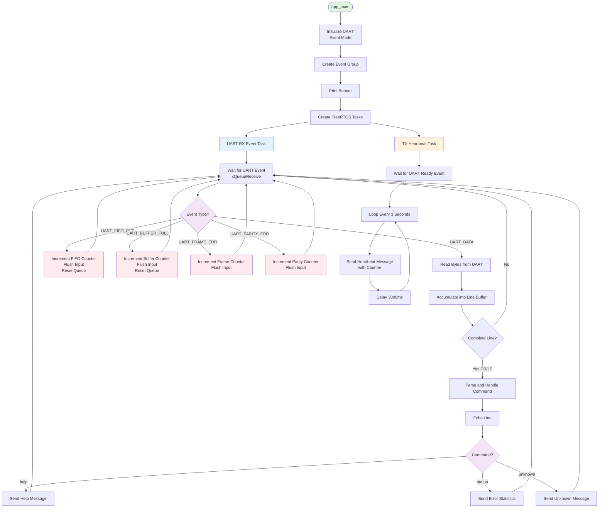
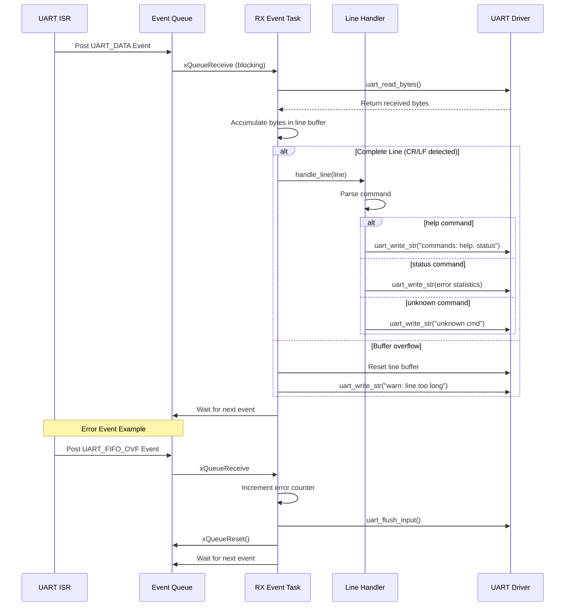
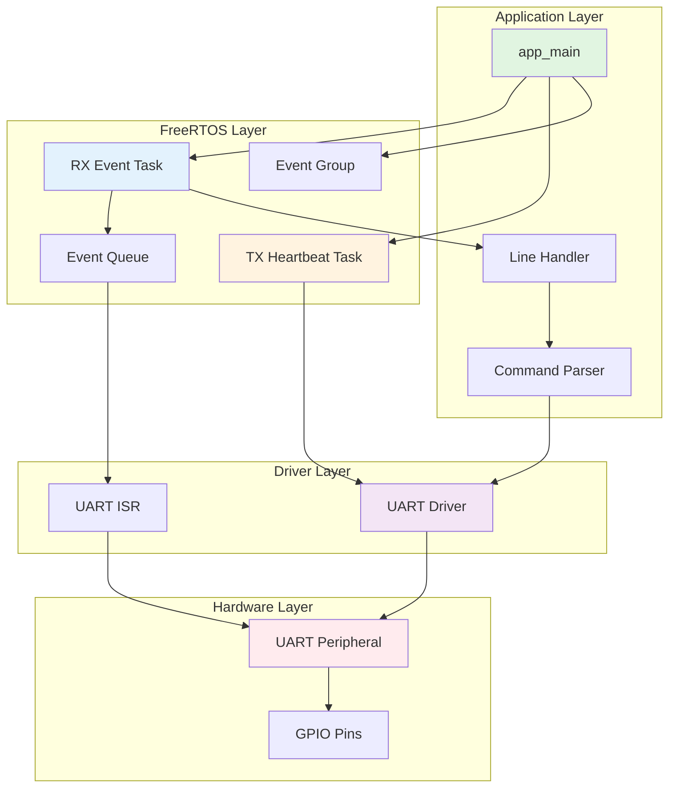
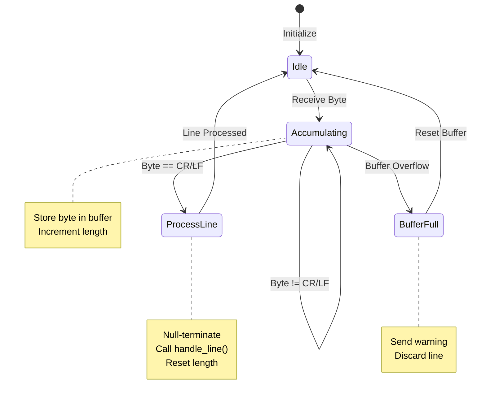
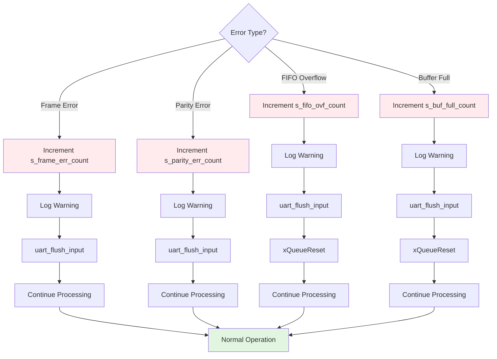

# ESP32 UART Event Reference - System Architecture

## Main Application Flow

## UART Event Processing Sequence

## Component Architecture

## Data Flow Diagram

```mermaid
flowchart LR
    Input[External UART<br/>Device] -->|Serial Data| RX[RX Pin<br/>GPIO16]
    RX -->|Hardware| FIFO[UART FIFO<br/>Buffer]
    FIFO -->|DMA/ISR| RingBuf[Ring Buffer<br/>2048 bytes]
    RingBuf -->|Event| Queue[Event Queue<br/>20 events]
    Queue -->|FreeRTOS| Task[RX Event Task]
    Task -->|Process| LineBuf[Line Buffer<br/>256 bytes]
    LineBuf -->|Parse| Handler[Command Handler]
    Handler -->|Response| TXBuf[TX Ring Buffer<br/>2048 bytes]
    TXBuf -->|Hardware| TX[TX Pin<br/>GPIO17]
    TX -->|Serial Data| Output[External UART<br/>Device]
    
    Heartbeat[Heartbeat Task] -.->|Periodic| TXBuf
    
    style Input fill:#e1f5e1
    style Output fill:#e1f5e1
    style Task fill:#e3f2fd
    style Heartbeat fill:#fff3e0
    style Handler fill:#f3e5f5
```

## State Machine - Line Accumulator

## Error Recovery Flow

