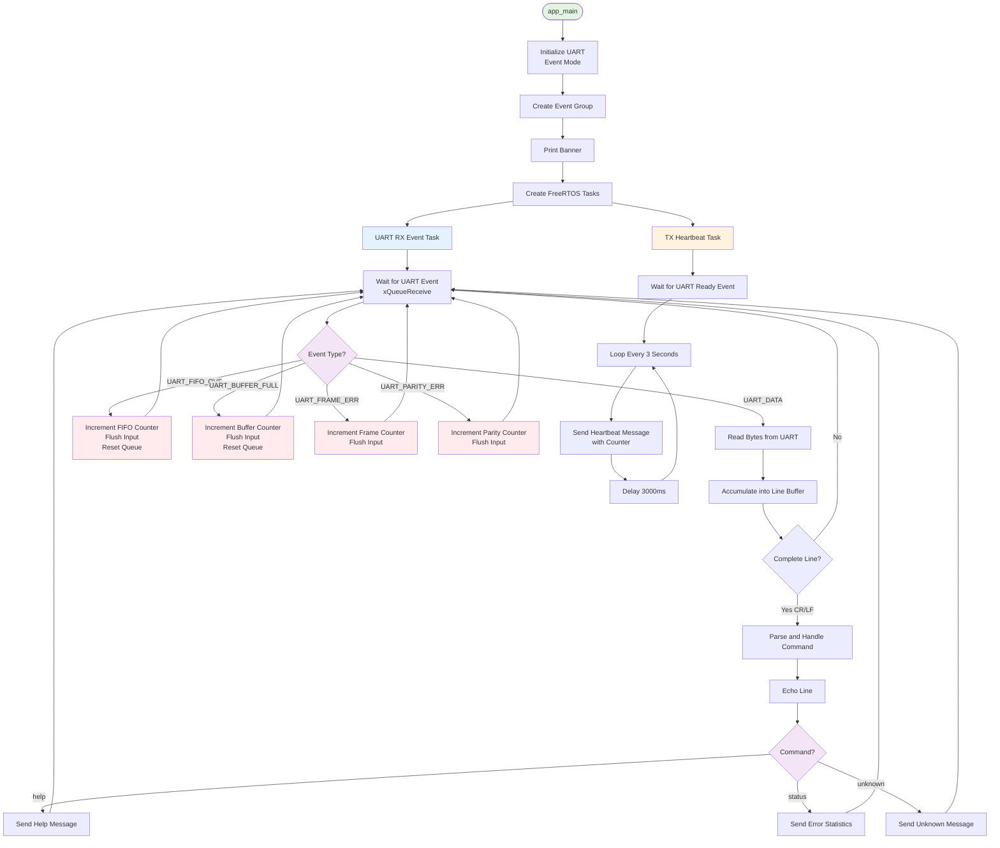
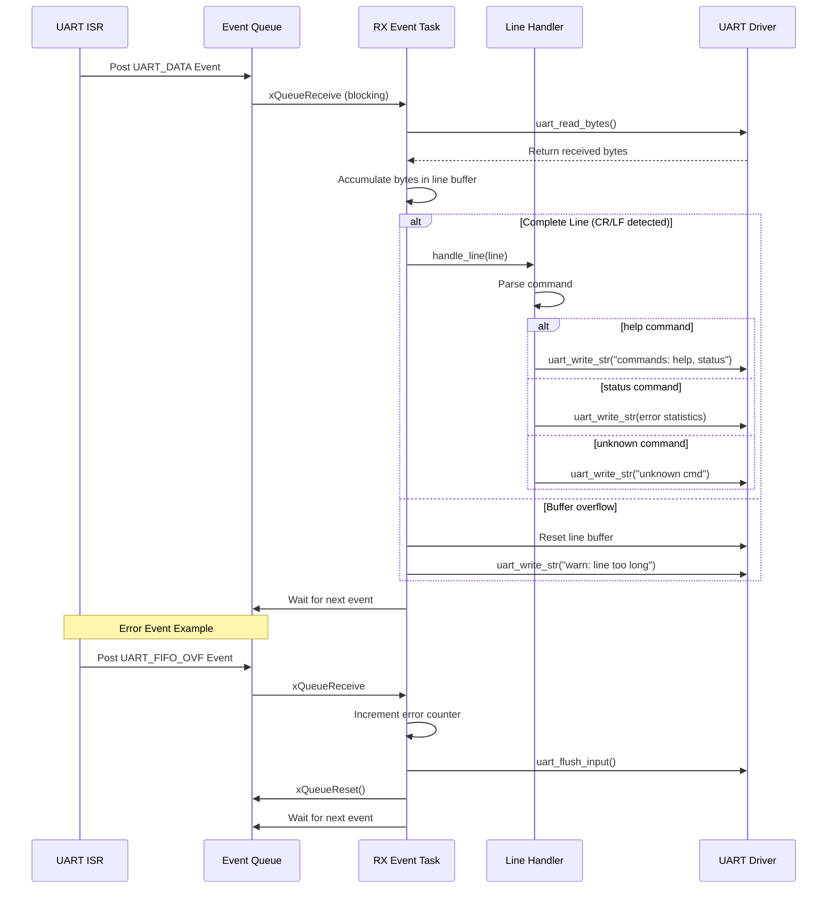

# ESP32 UART Event Reference

A production-ready ESP-IDF reference project demonstrating best practices for event-driven UART communication on ESP32 microcontrollers. This project showcases robust error handling, FreeRTOS task integration, and a practical line-based protocol implementation.

## 🎯 Overview

This project provides a comprehensive, well-documented example of how to implement UART communication on ESP32 using the ESP-IDF framework. It demonstrates an event-driven architecture that efficiently handles incoming data without blocking or polling, making it suitable for real-world embedded applications.

### Key Features

- **Event-Driven Architecture**: Uses ESP-IDF's UART event queue for efficient, non-blocking communication
- **Robust Error Handling**: Comprehensive handling of UART errors including FIFO overflow, buffer full, frame errors, and parity errors
- **FreeRTOS Integration**: Dedicated tasks for RX event processing and TX operations
- **Line-Based Protocol**: Implements a simple CR/LF line protocol with command parsing
- **Production-Ready Code**: Clean, well-documented code with proper error recovery mechanisms
- **Heartbeat Functionality**: Periodic TX task demonstrating alive status monitoring

## 🏗️ Architecture

### System Flow



### UART Event Processing Flow



For detailed flowcharts and architecture diagrams, see [FLOWCHART.md](FLOWCHART.md).

## 🔧 Hardware Setup

### Requirements

- ESP32 development board (any variant with UART1 support)
- USB-to-UART converter (3.3V logic level)
- Jumper wires
- USB cable for programming and power

### Wiring Diagram

```
USB-UART Adapter          ESP32 Board
┌─────────────┐          ┌─────────────┐
│             │          │             │
│    TX   ────┼──────────┼──── RX      │ (GPIO16)
│             │          │             │
│    RX   ────┼──────────┼──── TX      │ (GPIO17)
│             │          │             │
│    GND  ────┼──────────┼──── GND     │
│             │          │             │
└─────────────┘          └─────────────┘
```

**⚠️ Important:** ESP32 GPIO pins operate at 3.3V logic level. Never connect 5V signals directly to ESP32 pins, as this may damage the microcontroller.

### Default Pin Configuration

| Function | GPIO Pin | Notes |
|----------|----------|-------|
| UART TX  | GPIO17   | Configurable in code |
| UART RX  | GPIO16   | Configurable in code |
| UART Port| UART1    | UART0 used for console |

## 🚀 Getting Started

### Prerequisites

- ESP-IDF v4.4 or later (v5.x recommended)
- Python 3.7 or later
- ESP-IDF toolchain properly installed and configured

For ESP-IDF installation instructions, visit: [ESP-IDF Getting Started Guide](https://docs.espressif.com/projects/esp-idf/en/latest/esp32/get-started/)

### Building and Flashing

1. **Clone the repository:**
   ```bash
   git clone https://github.com/god233012yamil/ESP32-IoT-Projects/tree/main/ESP32_Uart_Event_Ref.git
   cd esp32-uart-event-ref
   ```

2. **Set the target ESP32 chip:**
   ```bash
   idf.py set-target esp32
   ```
   
   For other ESP32 variants:
   ```bash
   idf.py set-target esp32s2  # For ESP32-S2
   idf.py set-target esp32s3  # For ESP32-S3
   idf.py set-target esp32c3  # For ESP32-C3
   ```

3. **Build the project:**
   ```bash
   idf.py build
   ```

4. **Flash to your ESP32:**
   ```bash
   idf.py flash
   ```

5. **Monitor the output:**
   ```bash
   idf.py monitor
   ```

   To flash and monitor in one command:
   ```bash
   idf.py flash monitor
   ```

   Press `Ctrl+]` to exit the monitor.

## 📝 Usage

### Initial Boot

Upon booting, the ESP32 will:

1. Initialize UART1 with the configured parameters
2. Print a banner message:
   ```
   === ESP32 UART Event Reference ===
   Type: help, status
   ==================================
   ```
3. Start the event processing task
4. Begin sending periodic heartbeat messages every 3 seconds

### Available Commands

Connect a serial terminal (PuTTY, Tera Term, minicom, screen, etc.) to your USB-UART adapter with these settings:

- **Baud rate:** 115200
- **Data bits:** 8
- **Parity:** None
- **Stop bits:** 1
- **Flow control:** None

#### Commands

| Command | Description | Response |
|---------|-------------|----------|
| `help` | Display available commands | `commands: help, status` |
| `status` | Show UART error statistics | Displays frame errors, parity errors, FIFO overflows, and buffer full counts |
| Any other text | Echo the input | `echo: <your input>` followed by "unknown cmd" message |

### Example Session

```
heartbeat 0 (type 'help' or 'status')
hello
echo: hello
unknown cmd (type 'help')
help
echo: help
commands: help, status
heartbeat 1 (type 'help' or 'status')
status
echo: status
status: frame_err=0, parity_err=0, fifo_ovf=0, buf_full=0
```

## ⚙️ Configuration

All user-configurable parameters are located at the top of `main/uart_event_ref.c`:

### UART Configuration

```c
#define UART_PORT               UART_NUM_1      // UART port number
#define UART_BAUDRATE           115200          // Baud rate
#define UART_TX_PIN             GPIO_NUM_17     // TX pin
#define UART_RX_PIN             GPIO_NUM_16     // RX pin
```

### Buffer Sizes

```c
#define UART_RX_BUF_SIZE        2048           // RX ring buffer size (bytes)
#define UART_TX_BUF_SIZE        2048           // TX ring buffer size (bytes)
#define UART_EVT_QUEUE_LEN      20             // Event queue length
#define LINE_BUF_SIZE           256            // Line accumulator buffer size
```

### Task Configuration

```c
#define RX_TASK_STACK           4096           // RX task stack size (bytes)
#define RX_TASK_PRIO            10             // RX task priority
#define TX_TASK_STACK           3072           // TX task stack size (bytes)
#define TX_TASK_PRIO            9              // TX task priority
```

To modify the heartbeat interval, edit the delay in `uart_tx_heartbeat_task()`:
```c
vTaskDelay(pdMS_TO_TICKS(3000));  // Change 3000 to desired milliseconds
```

## 🛠️ Code Structure

### File Organization

```
esp32-uart-event-ref/
├── main/
│   ├── uart_event_ref.c       # Main implementation file
│   └── CMakeLists.txt          # Component build configuration
├── CMakeLists.txt              # Project build configuration
├── sdkconfig.defaults          # Default SDK configuration
├── FLOWCHART.md                # Detailed architecture diagrams
├── CONTRIBUTING.md             # Contribution guidelines
├── LICENSE                     # MIT License
└── README.md                   # This file
```

### Key Functions

#### Initialization

- **`uart_init_event_mode()`**: Configures UART parameters, assigns GPIO pins, and installs the UART driver with event queue support

#### Event Processing

- **`uart_event_task()`**: Main event loop that blocks on the UART event queue and dispatches to appropriate handlers based on event type

#### Line Protocol

- **`line_accumulator_feed()`**: Accumulates incoming bytes into a line buffer and triggers `handle_line()` when CR/LF is detected
- **`handle_line()`**: Parses complete lines and executes corresponding commands

#### Error Recovery

- **`uart_recover_from_overflow()`**: Flushes the UART input buffer and resets the event queue to recover from overflow conditions

#### Utilities

- **`uart_write_str()`**: Convenience wrapper for transmitting null-terminated strings
- **`uart_tx_heartbeat_task()`**: Periodic task demonstrating TX operations and system alive monitoring

## 🔍 Error Handling

The project implements comprehensive error handling for common UART communication issues:

### Error Types

| Error Type | Event | Handling Strategy | Counter |
|------------|-------|-------------------|---------|
| **FIFO Overflow** | `UART_FIFO_OVF` | Flush input, reset event queue | `s_fifo_ovf_count` |
| **Buffer Full** | `UART_BUFFER_FULL` | Flush input, reset event queue | `s_buf_full_count` |
| **Frame Error** | `UART_FRAME_ERR` | Flush input, log warning | `s_frame_err_count` |
| **Parity Error** | `UART_PARITY_ERR` | Flush input, log warning | `s_parity_err_count` |

### Error Recovery Strategy

1. **Overflow Conditions** (FIFO/Buffer Full):
   - Increment error counter for monitoring
   - Flush all buffered input data
   - Reset the event queue to clear pending events
   - Continue normal operation

2. **Frame/Parity Errors**:
   - Increment error counter
   - Flush input buffer to discard corrupted data
   - For structured protocols, consider implementing delimiter-based resynchronization

### Viewing Error Statistics

Use the `status` command to view accumulated error counts in real-time.

## 🎓 Learning Objectives

This project teaches:

1. **ESP-IDF UART Driver API**: How to configure and use the UART peripheral with the ESP-IDF framework
2. **Event-Driven Programming**: Non-blocking, interrupt-driven communication patterns
3. **FreeRTOS Integration**: Creating and managing tasks, queues, and event groups
4. **Error Handling**: Robust recovery from hardware and communication errors
5. **Protocol Implementation**: Building a simple line-based command protocol
6. **Production Patterns**: Code organization and documentation suitable for professional embedded systems

## 🔄 Extending This Project

### Adding New Commands

Add your command handler in `handle_line()`:

```c
if (strcmp(line, "mycommand") == 0) {
    uart_write_str("Executing my command\r\n");
    // Your command logic here
    return;
}
```

### Implementing Binary Protocols

For binary protocols instead of line-based:

1. Remove or modify `line_accumulator_feed()`
2. Implement delimiter or length-based framing in the `UART_DATA` handler
3. Add header validation and CRC checking as needed

### Adding Mutex for Multi-Task TX

For multiple tasks transmitting simultaneously:

```c
static SemaphoreHandle_t s_uart_tx_mutex = NULL;

void safe_uart_write(const char *text) {
    xSemaphoreTake(s_uart_tx_mutex, portMAX_DELAY);
    uart_write_str(text);
    xSemaphoreGive(s_uart_tx_mutex);
}
```

### Hardware Flow Control

To enable RTS/CTS flow control:

```c
cfg.flow_ctrl = UART_HW_FLOWCTRL_CTS_RTS;
cfg.rx_flow_ctrl_thresh = 122;  // Trigger threshold

uart_set_pin(UART_PORT, TX_PIN, RX_PIN, 
             RTS_PIN,              // Set RTS pin
             CTS_PIN);             // Set CTS pin
```

## 🐛 Troubleshooting

### No Output on Terminal

- Verify wiring: TX → RX, RX → TX, GND → GND
- Check that USB-UART adapter is 3.3V logic level
- Confirm baud rate matches (115200)
- Ensure correct COM port is selected in terminal software
- Try swapping TX/RX connections if wiring is incorrect

### FIFO Overflow Errors

- Increase `UART_RX_BUF_SIZE` if processing is too slow
- Reduce baud rate if CPU cannot keep up
- Optimize processing in the event task
- Consider increasing RX task priority

### Frame/Parity Errors

- Check physical connection quality (loose wires)
- Verify ground connection is solid
- Ensure voltage levels are compatible (3.3V)
- Reduce cable length if too long
- Check for electromagnetic interference

### Build Errors

- Ensure ESP-IDF is properly installed and environment variables are set
- Run `idf.py fullclean` and rebuild
- Verify target is set correctly: `idf.py set-target esp32`
- Check ESP-IDF version compatibility (v4.4+)

## 📚 Additional Resources

- [ESP-IDF UART Documentation](https://docs.espressif.com/projects/esp-idf/en/latest/esp32/api-reference/peripherals/uart.html)
- [FreeRTOS Documentation](https://www.freertos.org/Documentation/RTOS_book.html)
- [ESP32 Technical Reference Manual](https://www.espressif.com/sites/default/files/documentation/esp32_technical_reference_manual_en.pdf)
- [ESP-IDF Programming Guide](https://docs.espressif.com/projects/esp-idf/en/latest/esp32/index.html)

## 📄 License

This project is licensed under the MIT License - see the [LICENSE](LICENSE) file for details.

## 🤝 Contributing

Contributions, issues, and feature requests are welcome! Please read [CONTRIBUTING.md](CONTRIBUTING.md) for details on our code of conduct and the process for submitting pull requests.

## ✨ Acknowledgments

This project demonstrates ESP-IDF best practices for UART communication on ESP32 microcontrollers, suitable for both learning and production use.

---

**Happy Coding! 🚀**
