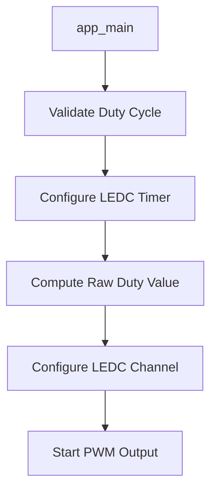

# ESP32 PWM Signal Generator

A simple ESP32 project demonstrating how to generate PWM (Pulse Width Modulation) signals using the LEDC (LED Control) peripheral with ESP-IDF and FreeRTOS.

## Table of Contents

- [Overview](#overview)
- [Features](#features)
- [Hardware Requirements](#hardware-requirements)
- [Hardware Notes](#hardware-notes)
- [Software Requirements](#software-requirements)
- [Configuration](#configuration)
- [Build and Flash](#build-and-flash)
- [Code Structure](#code-structure)
- [Key Functions](#key-functions)
- [Usage Examples](#usage-examples)
- [Troubleshooting](#troubleshooting)
- [Limitations](#limitations)
- [Future Enhancements](#future-enhancements)
- [Contributing](#contributing)
- [License](#license)

## Overview

This project demonstrates how to configure and use the ESP32's LEDC peripheral to generate PWM signals. The LEDC peripheral is designed for controlling LED brightness but can be used for any PWM application including motor control, servo control, or analog signal generation.

The implementation includes:
- LEDC timer configuration for frequency and resolution control
- LEDC channel configuration for GPIO output
- Duty cycle validation and conversion
- Comprehensive error handling and logging

## Features

- ✅ Configurable PWM frequency (default: 5 kHz)
- ✅ Adjustable duty cycle with percentage input (20-90% range for demonstration)
- ✅ 13-bit resolution for precise duty cycle control (8192 steps)
- ✅ Input validation with safety limits
- ✅ Comprehensive error handling
- ✅ Detailed logging with ESP_LOG
- ✅ Clean, documented code structure
- ✅ Support for all ESP32 variants (ESP32, ESP32-S2, ESP32-S3, ESP32-C3)

## Hardware Requirements

### Supported ESP32 Boards
- ESP32 DevKit
- ESP32-S2
- ESP32-S3  
- ESP32-C3
- Any ESP32-based development board

### External Components (Optional)
- LED with current-limiting resistor (for visual verification)
- Oscilloscope or logic analyzer (for signal verification)
- Breadboard and jumper wires

## Hardware Notes

⚠️ **Important GPIO Considerations:**

### ESP32 Classic
- **Input-only GPIOs:** GPIO 34-39 cannot be used for PWM output
- **Recommended GPIOs:** 2, 4, 5, 12-19, 21-23, 25-27, 32-33

### ESP32-S2/S3/C3
- Only `LEDC_LOW_SPEED_MODE` is available
- Check your specific board's pinout for available GPIOs

### Default Configuration
- **PWM Output GPIO:** GPIO 35 (⚠️ **Note:** GPIO 35 is input-only on ESP32 classic - change to a valid output GPIO)

## Software Requirements

- **ESP-IDF:** v4.4 or later
- **Python:** 3.6 or later
- **Git:** For cloning the repository

### ESP-IDF Installation
Follow the [ESP-IDF Getting Started Guide](https://docs.espressif.com/projects/esp-idf/en/latest/esp32/get-started/) for your operating system.

## Configuration

### Key Parameters (main.c)

```c
#define PWM_GPIO            35                 // ⚠️ Change to valid output GPIO
#define PWM_FREQ_HZ         5000               // PWM frequency in Hz
#define PWM_DUTY_PERCENT    75                 // Duty cycle (20-90%)
#define LEDC_MODE           LEDC_LOW_SPEED_MODE// Speed mode
```

### Customization Options

| Parameter | Range | Description |
|-----------|-------|-------------|
| `PWM_GPIO` | Valid output GPIOs | Target GPIO for PWM output |
| `PWM_FREQ_HZ` | 1 Hz - 40 MHz* | PWM frequency (*depends on resolution) |
| `PWM_DUTY_PERCENT` | 20-90% (demo), 0-100% (valid) | Duty cycle percentage |
| `PWM_RES_BITS` | 1-20 bits | Timer resolution (affects max frequency) |

## Build and Flash

### 1. Clone the Repository
```bash
git clone <your-repository-url>
cd esp32-pwm-generator
```

### 2. Set Target Device
```bash
idf.py set-target esp32
# or for other variants:
# idf.py set-target esp32s2
# idf.py set-target esp32s3
# idf.py set-target esp32c3
```

### 3. Configure (Optional)
```bash
idf.py menuconfig
```

### 4. Build the Project
```bash
idf.py build
```

### 5. Flash and Monitor
```bash
idf.py flash monitor
```

### Expected Output
```
I (xxx) LEDC_PWM: PWM started on GPIO35 @ 5000 Hz, 75% duty (raw=6143, res=13-bit)
```

## Code Structure

### File Organization
```
project/
├── main/
│   └── main.c              # Main application code
├── CMakeLists.txt          # Build configuration
└── README.md              # This file
```

### Code Architecture



## Key Functions

### Core Functions

| Function | Purpose |
|----------|---------|
| `pwm_validate_duty_percent()` | Validates duty cycle percentage input |
| `pwm_compute_duty()` | Converts percentage to raw duty value |
| `pwm_configure_timer()` | Sets up LEDC timer with frequency/resolution |
| `pwm_configure_channel()` | Configures LEDC channel for GPIO output |

### Function Details

#### Timer Configuration
```c
static esp_err_t pwm_configure_timer(ledc_mode_t mode,
                                     ledc_timer_t timer,
                                     ledc_timer_bit_t res_bits,
                                     uint32_t freq_hz);
```
Configures the LEDC timer that controls PWM frequency and duty resolution.

#### Channel Configuration  
```c
static esp_err_t pwm_configure_channel(ledc_mode_t mode,
                                       ledc_channel_t channel,
                                       ledc_timer_t timer,
                                       int gpio,
                                       uint32_t duty);
```
Configures an LEDC channel to output PWM on the specified GPIO.

## Usage Examples

### Basic LED Dimming
Connect an LED with a current-limiting resistor to the configured GPIO:

```
ESP32 GPIO --> [330Ω Resistor] --> [LED] --> GND
```

### Motor Speed Control
For motor control applications, adjust the frequency and connect through a motor driver:

```c
#define PWM_FREQ_HZ         1000    // Lower frequency for motors
#define PWM_DUTY_PERCENT    50      // 50% speed
```

### Servo Control
For servo control, use 50Hz frequency:

```c
#define PWM_FREQ_HZ         50      // Standard servo frequency
#define PWM_RES_BITS        LEDC_TIMER_16_BIT  // Higher resolution
```

## Troubleshooting

### Common Issues

| Problem | Cause | Solution |
|---------|-------|----------|
| No PWM output | GPIO not output-capable | Use valid output GPIO (avoid 34-39 on ESP32) |
| Compilation error | Wrong ESP-IDF version | Update to ESP-IDF v4.4+ |
| Duty validation fails | Percentage outside 20-90% | Modify validation range or duty value |
| Timer config fails | Invalid freq/resolution combination | Reduce frequency or resolution |

### Debug Steps

1. **Check GPIO Assignment**
   ```c
   // Verify GPIO is output-capable
   #define PWM_GPIO  2  // Try GPIO 2 instead of 35
   ```

2. **Verify Connections**
   - Ensure proper wiring
   - Check for loose connections
   - Verify component polarity

3. **Monitor Serial Output**
   ```bash
   idf.py monitor
   ```

4. **Test with Oscilloscope**
   - Measure signal frequency
   - Verify duty cycle accuracy
   - Check signal levels (3.3V logic)

## Limitations

- **Static Configuration:** No runtime duty cycle changes demonstrated
- **Single Channel:** Only one PWM channel configured
- **Fixed Parameters:** Frequency and resolution set at compile time
- **No Fade Effects:** LEDC fade functionality not implemented

## Future Enhancements

### Planned Features
- [ ] Runtime duty cycle adjustment
- [ ] Multiple PWM channels
- [ ] LEDC fade effects
- [ ] Web interface for remote control
- [ ] Frequency sweeping
- [ ] Save/load PWM profiles
- [ ] Advanced waveform generation

### API Extensions
```c
// Planned functions
esp_err_t pwm_set_duty_runtime(int percent);
esp_err_t pwm_start_fade(int start_duty, int end_duty, int duration_ms);
esp_err_t pwm_create_profile(pwm_profile_t *profile);
```

## Contributing

We welcome contributions! Please follow these guidelines:

1. Fork the repository
2. Create a feature branch: `git checkout -b feature/new-feature`
3. Commit changes: `git commit -am 'Add new feature'`
4. Push to branch: `git push origin feature/new-feature`
5. Submit a Pull Request

### Code Style
- Follow ESP-IDF coding standards
- Include comprehensive documentation
- Add error handling for all functions
- Write unit tests where applicable

## License

This project is licensed under the MIT License - see the [LICENSE](LICENSE) file for details.

---

**Created with ❤️ for the ESP32 community**

For questions, issues, or suggestions, please [open an issue](../../issues) on GitHub.