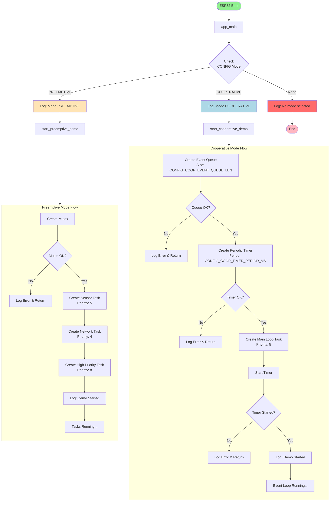
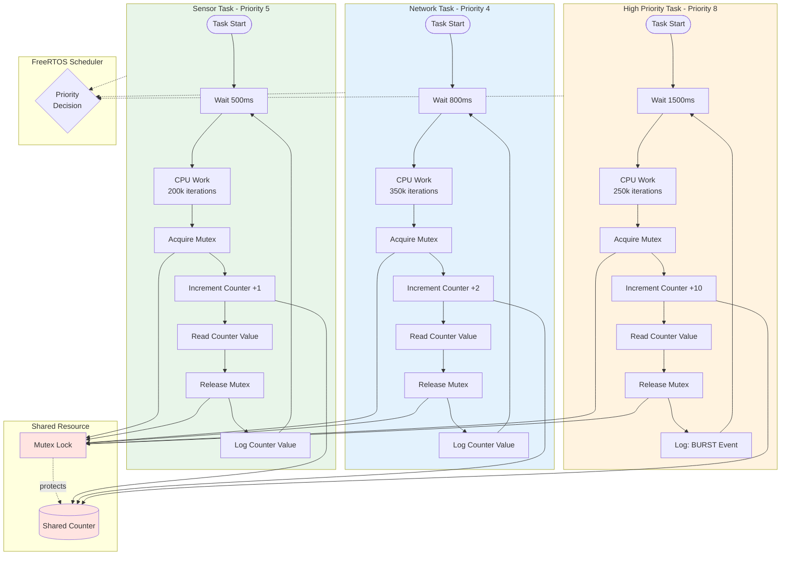
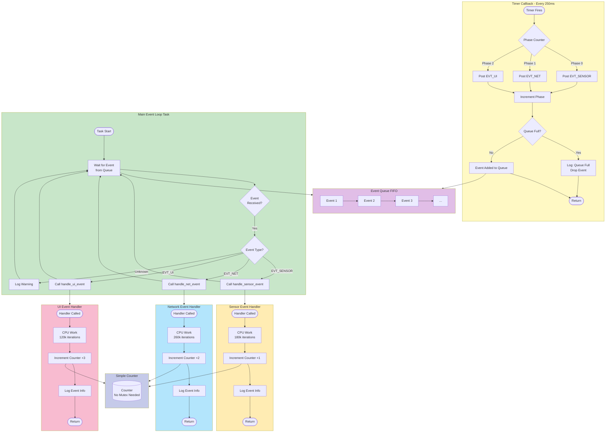
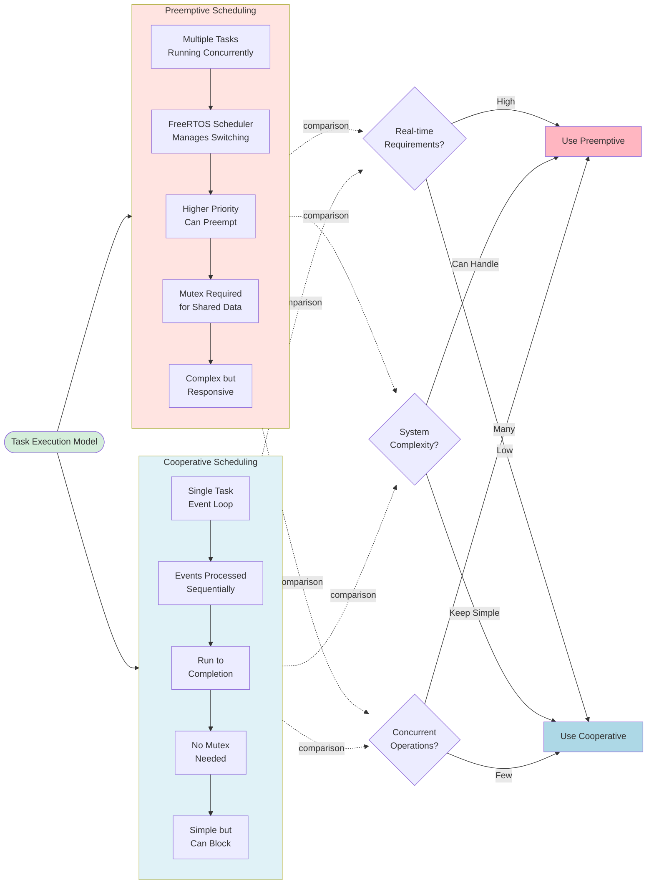
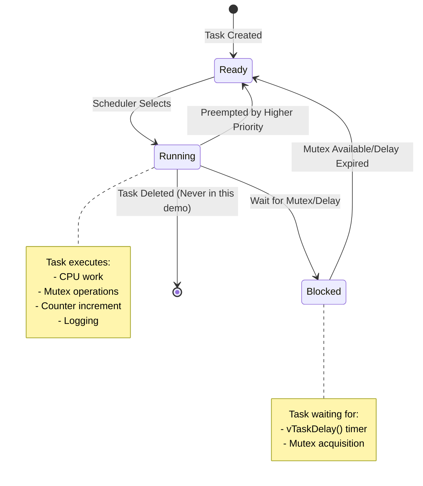
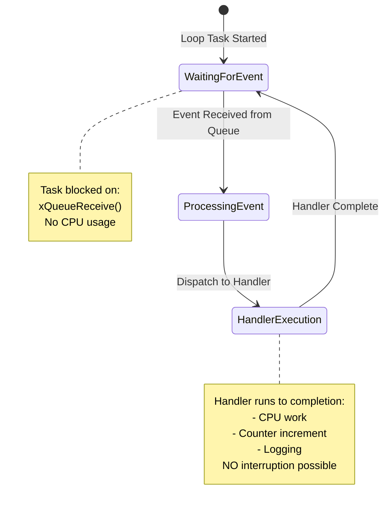

# Project Flow Diagrams

This document contains detailed Mermaid flowcharts for the ESP32 Scheduling Demo project.

## Overall System Flow

## Preemptive Mode - Detailed Task Flow

## Cooperative Mode - Detailed Event Flow

## Preemptive vs Cooperative Comparison Flow

## State Transition Diagram - Preemptive Mode

## State Transition Diagram - Cooperative Mode

## Timing Diagram - Preemptive Mode

```mermaid
gantt
    title Preemptive Task Execution Timeline (First 2 seconds)
    dateFormat  X
    axisFormat %L ms
    
    section High Priority (P=8)
    Idle           :0, 1500
    HIGH Burst     :1500, 1800
    Idle           :1800, 3000
    
    section Sensor (P=5)
    Work+Counter   :0, 100
    Delay          :100, 500
    Work+Counter   :500, 600
    Delay          :600, 1000
    Work+Counter   :1000, 1100
    Preempted      :1500, 1800
    Resume         :1800, 1900
    
    section Network (P=4)
    Work+Counter   :0, 150
    Delay          :150, 800
    Work+Counter   :800, 950
    Preempted      :1500, 1800
    Resume         :1800, 2000
```

## Timing Diagram - Cooperative Mode

```mermaid
gantt
    title Cooperative Event Processing Timeline (First 1 second)
    dateFormat  X
    axisFormat %L ms
    
    section Timer Posts
    EVT_SENSOR     :milestone, 0, 0
    EVT_NET        :milestone, 250, 250
    EVT_UI         :milestone, 500, 500
    EVT_SENSOR     :milestone, 750, 750
    EVT_NET        :milestone, 1000, 1000
    
    section Event Loop
    Process SENSOR :0, 80
    Idle           :80, 250
    Process NET    :250, 400
    Idle           :400, 500
    Process UI     :500, 600
    Idle           :600, 750
    Process SENSOR :750, 830
    Idle           :830, 1000
    Process NET    :1000, 1150
```

---

**Note**: These diagrams can be rendered in any Mermaid-compatible viewer, including:
- GitHub (directly in README.md)
- GitLab
- [Mermaid Live Editor](https://mermaid.live)
- VS Code with Mermaid extension
- Documentation sites (MkDocs, Docusaurus, etc.)
