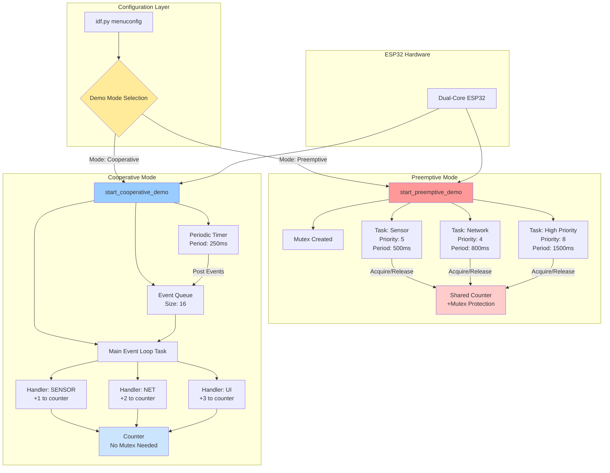

# ESP32 Preemptive vs Cooperative Scheduling Demo

[](https://github.com/espressif/esp-idf)
[](LICENSE)

A comprehensive demonstration project comparing **Preemptive** (FreeRTOS multi-tasking) and **Cooperative** (run-to-completion event loop) scheduling models on ESP32 using ESP-IDF.

## 📋 Table of Contents

- [Overview](#-overview)
- [Features](#-features)
- [Architecture](#-architecture)
- [Prerequisites](#-prerequisites)
- [Getting Started](#-getting-started)
- [Configuration](#-configuration)
- [Project Structure](#-project-structure)
- [How It Works](#-how-it-works)
  - [Preemptive Mode](#-preemptive-mode)
  - [Cooperative Mode](#-cooperative-mode)
- [Building and Flashing](#-building-and-flashing)
- [Expected Output](#-expected-output)
- [Use Cases](#-use-cases)
- [License](#-license)

## 🎯 Overview

This educational project demonstrates the fundamental differences between two common scheduling paradigms in embedded systems:

1. **Preemptive Scheduling** - Multiple concurrent tasks with priorities, context switching, and mutex-based synchronization
2. **Cooperative Scheduling** - Single-threaded event loop with run-to-completion handlers

Both modes run on the same ESP32 hardware, allowing for direct comparison of behavior, resource usage, and implementation complexity.

## ✨ Features

### Preemptive Mode
- ✅ Multiple FreeRTOS tasks running concurrently
- ✅ Task priority-based preemption
- ✅ Mutex-protected shared resource (counter)
- ✅ Demonstrates race conditions prevention
- ✅ Shows CPU time sharing between tasks

### Cooperative Mode
- ✅ Single event loop with timer-driven events
- ✅ Run-to-completion event handlers
- ✅ Queue-based event management
- ✅ Demonstrates the impact of blocking handlers
- ✅ No need for synchronization primitives

## 🏗️ Architecture

### System Architecture Diagram



## 📦 Prerequisites

- **ESP-IDF**: v4.4 or later (v5.0+ recommended)
- **Hardware**: Any ESP32 development board (ESP32, ESP32-S2, ESP32-C3, etc.)
- **Tools**: 
  - Python 3.7+
  - CMake 3.5+
  - Toolchain for your ESP32 variant

### Installing ESP-IDF

Follow the official [ESP-IDF Getting Started Guide](https://docs.espressif.com/projects/esp-idf/en/latest/esp32/get-started/index.html).

Quick setup (Linux/macOS):
```bash
mkdir -p ~/esp
cd ~/esp
git clone --recursive https://github.com/espressif/esp-idf.git
cd esp-idf
./install.sh esp32
. ./export.sh
```

## 🚀 Getting Started

### Clone the Repository

```bash
git clone https://github.com/god233012yamil/ESP32-IoT-Projects/tree/main/Preemptive_vs_Non_Preemptive_Scheduling_Demo.git
cd Preemptive_vs_Non_Preemptive_Scheduling_Demo
```

### Quick Build and Flash

```bash
# Set the target (ESP32, ESP32-S2, ESP32-C3, etc.)
idf.py set-target esp32

# Build the project
idf.py build

# Flash to device and open monitor
idf.py flash monitor
```

## ⚙️ Configuration

The demo mode is selected through ESP-IDF's configuration menu:

```bash
idf.py menuconfig
```

Navigate to: **Component config → Scheduling Model Demo → Demo mode**

### Available Options

#### 1. Preemptive (FreeRTOS tasks) - Default
Multiple tasks with different priorities running concurrently.

#### 2. Cooperative (run-to-completion event loop)
Single event loop with timer-posted events.

**Additional Cooperative Mode Settings:**
- **Event Queue Length**: 4-64 (default: 16)
- **Timer Period**: 50-5000ms (default: 250ms)

## 📁 Project Structure

```
esp32-scheduling-demo/
├── CMakeLists.txt              # Top-level CMake configuration
├── LICENSE                     # MIT-0 License
├── README.md                   # This file
├── sdkconfig                   # ESP-IDF SDK configuration
├── sdkconfig.defaults          # Default configuration values
├── main/
│   ├── CMakeLists.txt          # Main component CMake
│   ├── Kconfig.projbuild       # Menu configuration options
│   └── main.c                  # Main application code
└── .gitignore                  # Git ignore patterns
```

## 🔧 How It Works

### Preemptive Mode

In preemptive mode, three FreeRTOS tasks run concurrently with different priorities:

```
┌─────────────────────────────────────────────────────────────┐
│                     FreeRTOS Scheduler                       │
│  (Automatically switches between tasks based on priority)   │
└─────────────────────────────────────────────────────────────┘
                           │
        ┌──────────────────┼──────────────────┐
        ▼                  ▼                  ▼
   ┌────────┐         ┌─────────┐       ┌──────────┐
   │ Sensor │         │ Network │       │   High   │
   │ Task   │         │  Task   │       │ Priority │
   │ (P=5)  │         │  (P=4)  │       │  (P=8)   │
   └────────┘         └─────────┘       └──────────┘
        │                  │                  │
        └──────────────────┼──────────────────┘
                           ▼
                    ┌──────────────┐
                    │    Mutex     │
                    │  (Serialize  │
                    │   access)    │
                    └──────────────┘
                           │
                           ▼
                  ┌─────────────────┐
                  │ Shared Counter  │
                  └─────────────────┘
```

**Task Details:**

| Task | Priority | Period | Increment | Work Iterations |
|------|----------|--------|-----------|-----------------|
| Sensor | 5 | 500ms | +1 | 200,000 |
| Network | 4 | 800ms | +2 | 350,000 |
| High Priority | 8 | 1500ms | +10 | 250,000 |

**Key Concepts Demonstrated:**
- **Priority Preemption**: Higher priority tasks interrupt lower priority ones
- **Mutex Synchronization**: Prevents race conditions on shared counter
- **Context Switching**: CPU time shared between tasks
- **Real-time Behavior**: High-priority bursts execute immediately

**Code Flow:**
1. Create mutex for counter protection
2. Create three tasks with different priorities
3. Each task runs in infinite loop:
   - Perform CPU-intensive work (simulated)
   - Acquire mutex
   - Increment shared counter
   - Release mutex
   - Delay until next period

### Cooperative Mode

In cooperative mode, a single task processes events from a queue in run-to-completion fashion:

```
┌──────────────────┐
│  Periodic Timer  │
│  (250ms period)  │
└────────┬─────────┘
         │ Posts events in rotation
         ▼
┌─────────────────────┐
│   Event Queue       │
│ (Max 16 events)     │
│  [EVT_SENSOR]       │
│  [EVT_NET]          │
│  [EVT_UI]           │
└─────────┬───────────┘
          │
          ▼
┌──────────────────────────────────┐
│    Main Event Loop (Single Task) │
│                                  │
│  while(true) {                   │
│    event = queue.receive()       │
│    switch(event.id) {            │
│      SENSOR: handle_sensor()     │
│      NET:    handle_net()        │
│      UI:     handle_ui()         │
│    }                             │
│  }                               │
└──────────────────────────────────┘
         │
         ▼
┌─────────────────┐
│ Counter         │
│ (No mutex       │
│  needed!)       │
└─────────────────┘
```

**Event Details:**

| Event | Increment | Work Iterations | Posted By |
|-------|-----------|-----------------|-----------|
| EVT_SENSOR | +1 | 180,000 | Timer (phase 0) |
| EVT_NET | +2 | 260,000 | Timer (phase 1) |
| EVT_UI | +3 | 120,000 | Timer (phase 2) |

**Key Concepts Demonstrated:**
- **Run-to-Completion**: Each handler finishes before next event is processed
- **No Preemption**: Events are processed sequentially in order
- **No Synchronization Needed**: Single-threaded execution eliminates race conditions
- **Event Queue**: Decouples event generation from processing
- **Handler Blocking Impact**: Long-running handlers delay other events

**Code Flow:**
1. Create event queue (FIFO)
2. Create periodic timer (250ms)
3. Timer callback posts events in rotation (SENSOR → NET → UI → repeat)
4. Main loop waits for events from queue
5. Process each event to completion before handling next
6. No mutex needed - single-threaded execution

### Comparison

| Aspect | Preemptive | Cooperative |
|--------|-----------|-------------|
| **Concurrency** | True parallel execution | Sequential event processing |
| **Synchronization** | Mutex required | Not needed |
| **Responsiveness** | High-priority tasks preempt | Delayed by long handlers |
| **Complexity** | Higher (race conditions, deadlocks) | Lower (no shared state issues) |
| **Resource Usage** | Multiple stacks (4KB each) | Single stack |
| **Best For** | Real-time systems, parallel I/O | Simple state machines, UI loops |

## 🔨 Building and Flashing

### Step-by-Step Build Process

1. **Configure the project** (first time only):
   ```bash
   idf.py menuconfig
   ```
   Select your demo mode and save.

2. **Build the firmware**:
   ```bash
   idf.py build
   ```

3. **Flash to ESP32**:
   ```bash
   idf.py -p /dev/ttyUSB0 flash
   ```
   Replace `/dev/ttyUSB0` with your serial port (e.g., `COM3` on Windows).

4. **Monitor serial output**:
   ```bash
   idf.py -p /dev/ttyUSB0 monitor
   ```

5. **Combined flash and monitor** (recommended):
   ```bash
   idf.py -p /dev/ttyUSB0 flash monitor
   ```
   Press `Ctrl+]` to exit monitor.

### Quick Rebuild After Mode Change

```bash
idf.py menuconfig  # Change mode
idf.py build flash monitor
```

## 📊 Expected Output

### Preemptive Mode Output

```
I (328) sched_demo: Mode: PREEMPTIVE (FreeRTOS tasks)
I (328) sched_demo: Preemptive demo started.
I (528) sched_demo: [PREEMPT] sensor: counter=1
I (828) sched_demo: [PREEMPT] net: counter=3
I (1028) sched_demo: [PREEMPT] sensor: counter=4
I (1528) sched_demo: [PREEMPT] sensor: counter=5
W (1828) sched_demo: [PREEMPT] HIGH: counter=15 (burst)
I (1628) sched_demo: [PREEMPT] net: counter=17
I (2028) sched_demo: [PREEMPT] sensor: counter=18
```

**What to observe:**
- Tasks log at their configured intervals
- High-priority task shows "burst" when it preempts others
- Counter increments vary based on task (+1, +2, +10)
- Timestamps show interleaved execution

### Cooperative Mode Output

```
I (338) sched_demo: Mode: COOPERATIVE (run-to-completion)
I (338) sched_demo: Cooperative demo started.
I (588) sched_demo: [COOP] SENSOR: tick=58 counter=1
I (838) sched_demo: [COOP] NET: tick=83 counter=3
I (1088) sched_demo: [COOP] UI: tick=108 counter=6
I (1338) sched_demo: [COOP] SENSOR: tick=133 counter=7
I (1588) sched_demo: [COOP] NET: tick=158 counter=9
I (1838) sched_demo: [COOP] UI: tick=183 counter=12
```

**What to observe:**
- Events processed sequentially in rotation
- Each event completes before next begins
- Counter increments predictably (+1, +2, +3 pattern)
- Processing delays visible in tick differences
- No preemption - events strictly ordered

## 💡 Use Cases

### When to Use Preemptive Scheduling

✅ **Real-time systems** requiring guaranteed response times  
✅ **Multi-sensor applications** with different sampling rates  
✅ **Systems with varying priority tasks** (e.g., safety-critical vs background)  
✅ **Parallel I/O operations** (network + sensors + display)  
✅ **Complex applications** where tasks naturally run independently  

### When to Use Cooperative Scheduling

✅ **Simple state machines** and UI event loops  
✅ **Battery-powered devices** (lower overhead = less power)  
✅ **Deterministic systems** where event order must be predictable  
✅ **Single-purpose devices** with sequential workflows  
✅ **Systems where simplicity > maximum performance**  

## 🎓 Learning Objectives

After exploring this demo, you should understand:

- The difference between preemptive and cooperative multitasking
- How FreeRTOS task priorities affect execution
- Why mutex synchronization is needed in preemptive systems
- How event queues decouple event generation from processing
- The trade-offs between concurrency models
- When each scheduling approach is appropriate

## 🛠️ Customization

### Modifying Task Parameters (Preemptive Mode)

In `main/main.c`, adjust these values:

```c
// Task priorities (line 167-169)
xTaskCreate(task_sensor, "sensor", 4096, NULL, 5, NULL);    // Priority 5
xTaskCreate(task_network, "network", 4096, NULL, 4, NULL);   // Priority 4
xTaskCreate(task_highprio, "highprio", 4096, NULL, 8, NULL); // Priority 8

// Task periods (lines 103, 125, 143)
vTaskDelay(pdMS_TO_TICKS(500));  // Sensor: 500ms
vTaskDelay(pdMS_TO_TICKS(800));  // Network: 800ms
vTaskDelay(pdMS_TO_TICKS(1500)); // High priority: 1500ms

// Work iterations (lines 100, 122, 146)
demo_cpu_work(200000);  // Sensor work
demo_cpu_work(350000);  // Network work
demo_cpu_work(250000);  // High priority work
```

### Modifying Event Parameters (Cooperative Mode)

In `main/main.c`, adjust these values:

```c
// Work iterations (lines 253, 270, 287)
demo_cpu_work(180000);  // Sensor handler
demo_cpu_work(260000);  // Network handler
demo_cpu_work(120000);  // UI handler

// Counter increments (lines 254, 271, 288)
g_coop_counter += 1;  // Sensor
g_coop_counter += 2;  // Network
g_coop_counter += 3;  // UI
```

In `menuconfig`, adjust:
- Event queue length (4-64)
- Timer period (50-5000ms)

## 🐛 Troubleshooting

### Build Issues

**Problem**: `command not found: idf.py`  
**Solution**: Source ESP-IDF environment: `. $HOME/esp/esp-idf/export.sh`

**Problem**: `CMake Error: The source directory does not appear to contain CMakeLists.txt`  
**Solution**: Ensure you're in the project root directory

### Flash Issues

**Problem**: `Failed to connect to ESP32`  
**Solution**: 
- Check USB cable connection
- Verify correct serial port: `ls /dev/ttyUSB*` or `ls /dev/ttyACM*`
- Press BOOT button while flashing

**Problem**: `Permission denied: /dev/ttyUSB0`  
**Solution**: Add user to dialout group: `sudo usermod -a -G dialout $USER` (logout/login required)

### Runtime Issues

**Problem**: No output in monitor  
**Solution**: 
- Verify baud rate (default: 115200)
- Press RESET button on ESP32
- Check monitor port: `idf.py -p /dev/ttyUSB0 monitor`

## 🤝 Contributing

Contributions are welcome! Please feel free to submit a Pull Request. For major changes, please open an issue first to discuss what you would like to change.

### Development Guidelines

- Follow existing code style
- Add comments for complex logic
- Test both preemptive and cooperative modes
- Update README for new features

## 📄 License

This project is licensed under the MIT No Attribution License (MIT-0) - see the [LICENSE](LICENSE) file for details.

You are free to use, modify, and distribute this code without any attribution requirements.

## 🙏 Acknowledgments

- Espressif Systems for the ESP-IDF framework
- FreeRTOS community for excellent RTOS documentation
- Educational resources on embedded scheduling models

## 📚 Additional Resources

- [ESP-IDF Programming Guide](https://docs.espressif.com/projects/esp-idf/en/latest/esp32/index.html)
- [FreeRTOS Documentation](https://www.freertos.org/Documentation/RTOS_book.html)
- [ESP32 Technical Reference Manual](https://www.espressif.com/sites/default/files/documentation/esp32_technical_reference_manual_en.pdf)

---

**Made with ❤️ for embedded systems education**
