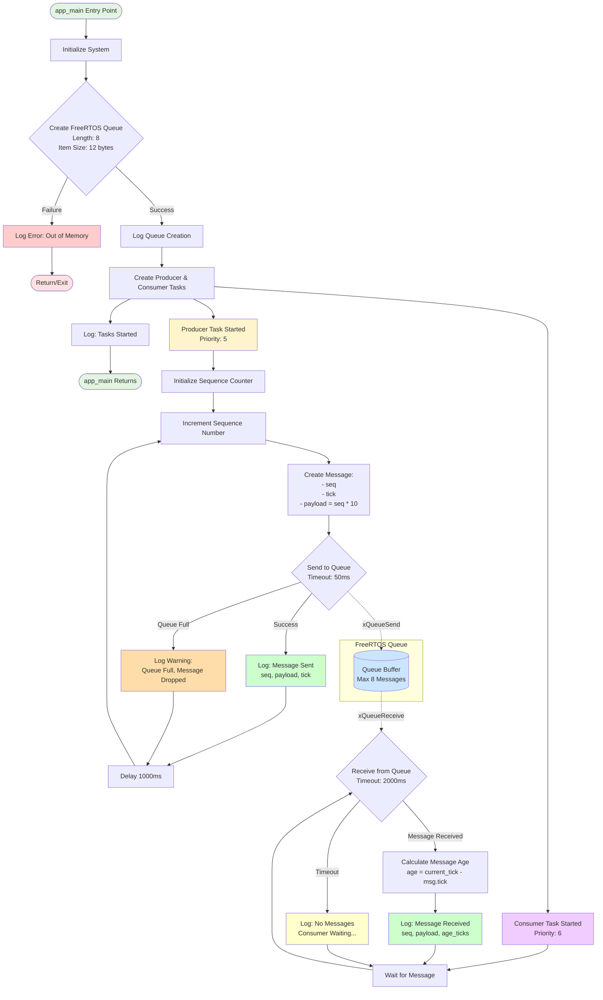

```mermaid
flowchart TD
    Start([app_main Entry Point]) --> Init[Initialize System]
    Init --> CreateQueue{Create FreeRTOS Queue<br/>Length: 8<br/>Item Size: 12 bytes}
    
    CreateQueue -->|Success| LogQueue[Log Queue Creation]
    CreateQueue -->|Failure| Error[Log Error: Out of Memory]
    Error --> End([Return/Exit])
    
    LogQueue --> CreateTasks[Create Producer & Consumer Tasks]
    CreateTasks --> ProducerStart[Producer Task Started<br/>Priority: 5]
    CreateTasks --> ConsumerStart[Consumer Task Started<br/>Priority: 6]
    CreateTasks --> LogStart[Log: Tasks Started]
    LogStart --> MainComplete([app_main Returns])
    
    ProducerStart --> P1[Initialize Sequence Counter]
    P1 --> P2[Increment Sequence Number]
    P2 --> P3[Create Message:<br/>- seq<br/>- tick<br/>- payload = seq * 10]
    P3 --> P4{Send to Queue<br/>Timeout: 50ms}
    
    P4 -->|Success| P5[Log: Message Sent<br/>seq, payload, tick]
    P4 -->|Queue Full| P6[Log Warning:<br/>Queue Full, Message Dropped]
    
    P5 --> P7[Delay 1000ms]
    P6 --> P7
    P7 --> P2
    
    ConsumerStart --> C1[Wait for Message]
    C1 --> C2{Receive from Queue<br/>Timeout: 2000ms}
    
    C2 -->|Message Received| C3[Calculate Message Age<br/>age = current_tick - msg.tick]
    C2 -->|Timeout| C4[Log: No Messages<br/>Consumer Waiting...]
    
    C3 --> C5[Log: Message Received<br/>seq, payload, age_ticks]
    C5 --> C1
    C4 --> C1
    
    subgraph "FreeRTOS Queue"
        Queue[(Queue Buffer<br/>Max 8 Messages)]
    end
    
    P4 -.->|xQueueSend| Queue
    Queue -.->|xQueueReceive| C2
    
    style Start fill:#e1f5e1
    style End fill:#ffe1e1
    style MainComplete fill:#e1f5e1
    style Error fill:#ffcccc
    style Queue fill:#cce5ff
    style ProducerStart fill:#fff4cc
    style ConsumerStart fill:#f0ccff
    style P5 fill:#ccffcc
    style P6 fill:#ffddaa
    style C5 fill:#ccffcc
    style C4 fill:#ffffcc
```
