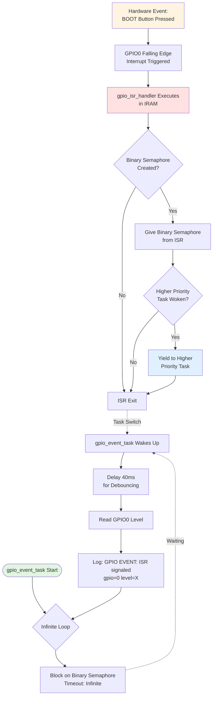

# Project Flowchart

This document contains a detailed flowchart of the ESP-IDF FreeRTOS Synchronization Demo using Mermaid syntax.

## Complete System Flow

## I2C Sensor Task Flow (Mutex Pattern)

## I2C EEPROM Task Flow (Mutex Pattern)

## GPIO Interrupt Flow (Binary Semaphore Pattern)

## Worker Task Flow (Counting Semaphore Pattern)

## Resource Pool State Diagram

## Synchronization Primitive Interaction Timeline

## Task State Transitions

## Priority and Scheduling

## Key Observations from Flowcharts

### Mutex Behavior
- **Only one task** can hold the I2C mutex at any time
- **Priority inheritance** prevents priority inversion
- **Timeout-based** acquisition prevents deadlock
- **Alternating access** between sensor and EEPROM tasks

### Binary Semaphore Behavior
- **ISR gives** semaphore (safe from interrupt context)
- **Task takes** semaphore (blocks until signaled)
- **Event-driven** processing (immediate response to button press)
- **Minimal ISR time** (processing deferred to task)

### Counting Semaphore Behavior
- **Initial count: 3** (three available resources)
- **Decrement on take**, **increment on give**
- **Maximum 3 concurrent** workers active
- **Workers 4-5 block or timeout** when pool is full
- **Fair scheduling** ensures all workers eventually get access

### System Design Patterns
1. **Mutex** → Resource protection (shared I2C bus)
2. **Binary Semaphore** → Event notification (ISR to task)
3. **Counting Semaphore** → Resource pooling (limited slots)
