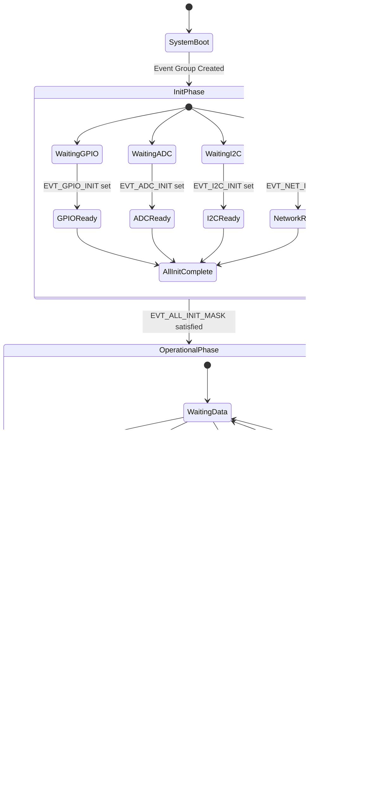

# System Flowchart

This document contains a comprehensive Mermaid flowchart illustrating the complete flow of the ESP32-S3 Event Groups demonstration project.

## Complete System Flow

## Task Interaction Diagram

## Event Bit State Machine

## Priority and Synchronization Overview

## Notes

### Symbol Legend

- **Rectangle**: Process or action
- **Diamond**: Decision point
- **Rounded Rectangle**: Start/End point
- **Arrows**: Flow direction

### Color Coding

- **Blue** (Light): Initialization processes
- **Orange** (Light): Task operations
- **Purple** (Light): Event setting operations
- **Yellow** (Light): Decision points
- **Green** (Light): Data storage operations

### Key Synchronization Points

1. **Startup Barrier**: All tasks wait for `EVT_ALL_INIT_MASK` before operational phase
2. **Producer Signaling**: Data tasks set individual ready bits periodically
3. **AND Aggregation**: Aggregator waits for ALL data bits (cleared after read)
4. **OR Monitoring**: Diagnostics wakes on ANY data bit (bits not cleared)

### Timing Characteristics

- **ADC Sampling**: 500ms period
- **Temperature Updates**: 1000ms period
- **GPIO Monitoring**: 100ms period
- **Aggregator Timeout**: 3000ms
- **Diagnostics Timeout**: 5000ms
- **I2C Init Simulation**: 150ms delay
- **Network Init Simulation**: 250ms delay
