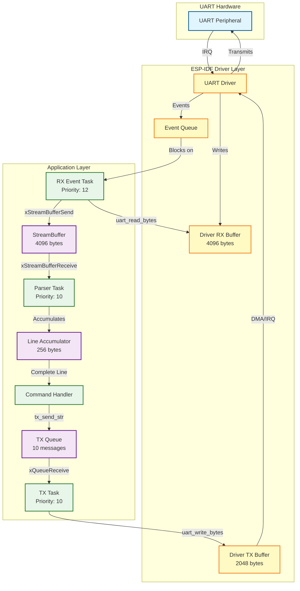
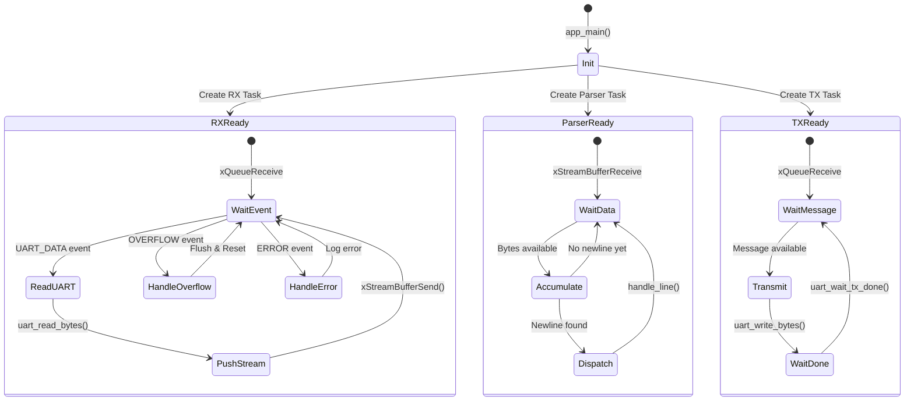
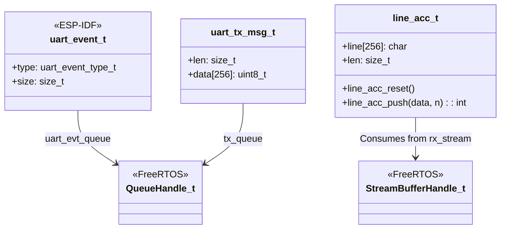
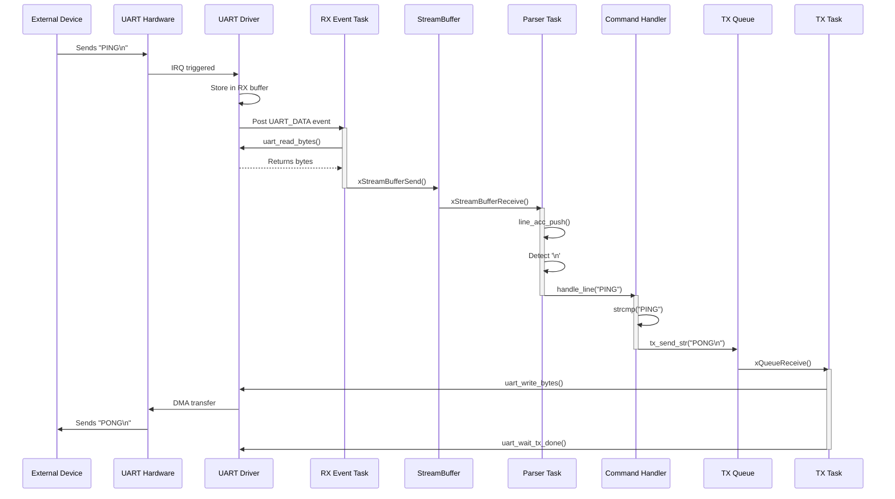
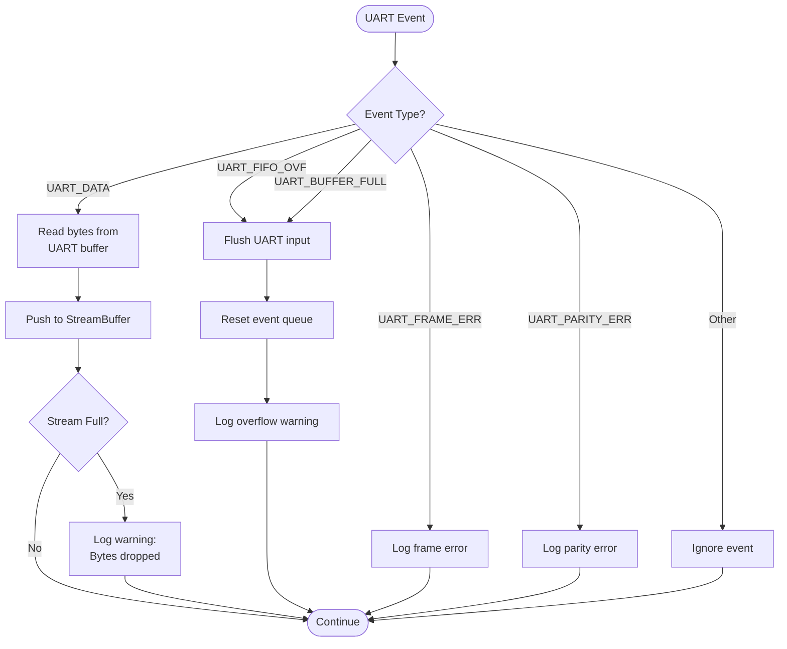
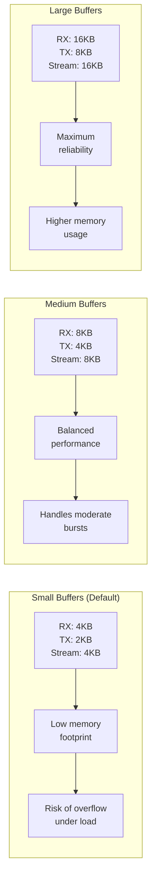

# UART Reference Architecture - System Flow Diagram

This document contains the detailed system architecture flowchart for the ESP32 UART Reference project.

## Complete System Flow

## Task State Diagram

## Data Structure Relationships

## Message Flow Sequence

## Error Handling Flow

## Buffer Size Optimization

## Notes

### Color Coding
- **Blue**: Hardware layer (UART peripheral)
- **Yellow**: Driver layer (ESP-IDF UART driver)
- **Green**: Application layer (FreeRTOS tasks)
- **Purple**: Buffer/queue abstractions

### Critical Paths
1. **RX Hot Path**: UART IRQ → Driver → RX Task → StreamBuffer (minimize latency)
2. **TX Serialization**: All writes through TX Task (prevent interleaving)
3. **Parser Decoupling**: StreamBuffer isolates I/O from protocol logic

### Performance Considerations
- RX Task priority (12) > Parser/TX (10) ensures interrupt servicing
- StreamBuffer acts as shock absorber for burst traffic
- TX queue depth (10) prevents blocking on output
- Line accumulator limits command length (256 bytes) for memory safety
