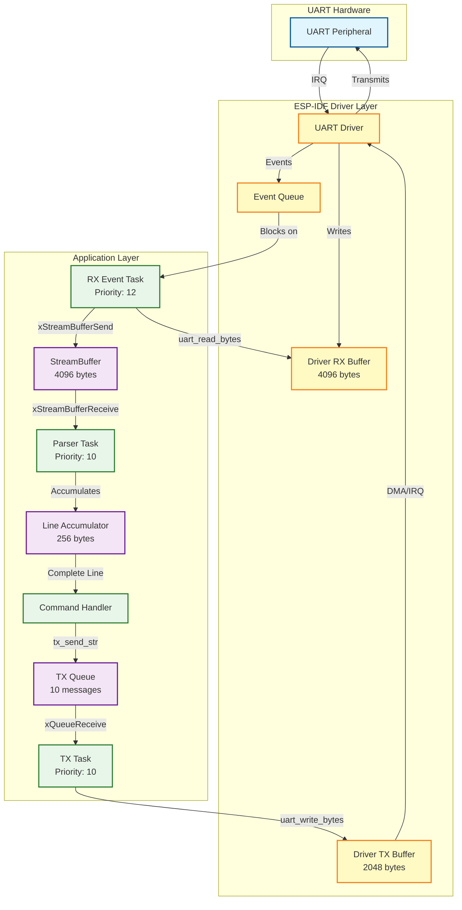

# ESP32 UART Reference Architecture

A production-ready, event-driven UART communication framework for ESP32 microcontrollers using ESP-IDF and FreeRTOS. This project demonstrates best practices for handling UART communication in IoT applications with proper buffering, parsing, and transmission management.

## 🎯 Features

- **Event-Driven Architecture**: Uses ESP-IDF UART driver event queue for efficient interrupt handling
- **Burst Absorption**: Fast RX task with StreamBuffer handles high-speed data bursts without loss
- **Decoupled Parsing**: Separate parser task converts byte stream to application commands
- **Serialized TX**: Single TX task prevents output interleaving and enables easy flow control
- **Overflow Protection**: Graceful handling of buffer overflows and UART errors
- **Production-Ready**: Demonstrates patterns suitable for real-world IoT deployments

## 📋 Table of Contents

- [Architecture Overview](#-architecture-overview)
- [System Flow](#-system-flow)
- [Hardware Setup](#-hardware-setup)
- [Software Requirements](#-software-requirements)
- [Installation](#-installation)
- [Configuration](#-configuration)
- [Usage](#-usage)
- [Testing](#-testing)
- [API Reference](#-api-reference)
- [Troubleshooting](#-troubleshooting)
- [License](#-license)

## 🏗️ Architecture Overview

The project implements a multi-task architecture with clear separation of concerns:

### Task Structure

1. **UART RX Event Task** (Priority 12)
   - Monitors the UART driver event queue
   - Reads incoming bytes from the UART hardware buffer
   - Forwards data to StreamBuffer for processing
   - Handles overflow and error conditions

2. **Parser Task** (Priority 10)
   - Consumes bytes from StreamBuffer
   - Assembles newline-delimited commands
   - Dispatches commands to handler functions
   - Maintains line accumulator state

3. **UART TX Task** (Priority 10)
   - Exclusive UART writer (prevents interleaving)
   - Processes messages from the TX queue
   - Ensures transmission completion
   - Enables centralized flow control

### Data Flow Components

- **UART Event Queue**: Signals from UART driver (data available, errors, etc.)
- **RX StreamBuffer**: High-performance FIFO for raw byte storage (4096 bytes)
- **TX Queue**: Message queue for outbound transmissions (10 messages)
- **Line Accumulator**: Stateful parser for newline-delimited protocols

## 🔄 System Flow



### Flow Description

**Reception Path:**
1. UART hardware receives data and triggers an interrupt
2. ESP-IDF driver stores data in the RX buffer and posts an event
3. RX Event Task wakes up and reads available bytes
4. Data pushed to StreamBuffer for decoupling
5. Parser Task pulls bytes and accumulates into lines
6. Complete commands dispatched to the handler

**Transmission Path:**
1. Application enqueues message via `tx_send_str()`
2. TX Task dequeues message (serialized access)
3. Data written to UART driver TX buffer
4. Hardware transmits bytes via DMA/interrupt
5. Task waits for transmission completion

## 🔌 Hardware Setup

### Pin Configuration (Default)

| Function | GPIO Pin | Notes |
|----------|----------|-------|
| TX (Output) | GPIO 17 | Connect to external RX |
| RX (Input) | GPIO 18 | Connect to external TX |
| GND | GND | Common ground required |

### Connection Example

```
ESP32-S3                USB-UART Adapter
┌──────────┐           ┌─────────────┐
│ GPIO 17  │─────TX────│ RX          │
│ GPIO 18  │─────RX────│ TX          │
│ GND      │───────────│ GND         │
└──────────┘           └─────────────┘
```

### Hardware Flow Control (Optional)

For high baud rates or bursty traffic, enable RTS/CTS:
- RTS: Request To Send (output)
- CTS: Clear To Send (input)

Update `uart_config_t.flow_ctrl` in code to `UART_HW_FLOWCTRL_CTS_RTS` and wire accordingly.

## 💻 Software Requirements

- **ESP-IDF**: v4.4 or later (tested with v5.x)
- **Python**: 3.8+ (for ESP-IDF tools)
- **CMake**: 3.5+ (included with ESP-IDF)
- **Toolchain**: Xtensa ESP32-S3 toolchain (installed via ESP-IDF)

### Supported Chips

- ESP32-S3 (primary target)
- ESP32-S2
- ESP32
- ESP32-C3 (with pin adjustments)

## 📦 Installation

### 1. Clone Repository

```bash
git clone https://github.com/god233012yamil/ESP32-IoT-Projects/tree/fdbe1418b4e006b121f21c976756555f468679f5/UART_Demo.git
cd esp32-uart-reference
```

### 2. Set Up ESP-IDF

If not already installed, follow the [official ESP-IDF installation guide](https://docs.espressif.com/projects/esp-idf/en/latest/esp32/get-started/):

```bash
# Linux/macOS
. $HOME/esp/esp-idf/export.sh

# Windows (Command Prompt)
%userprofile%\esp\esp-idf\export.bat
```

### 3. Build Project

```bash
idf.py set-target esp32s3  # or esp32, esp32s2, esp32c3
idf.py build
```

### 4. Flash to Device

```bash
idf.py -p /dev/ttyUSB0 flash  # Adjust port as needed
```

### 5. Monitor Output

```bash
idf.py -p /dev/ttyUSB0 monitor
```

Press `Ctrl+]` to exit monitor.

## ⚙️ Configuration

### UART Parameters

Edit `main/main.c` to adjust settings:

```c
// UART port and pins
#define UART_PORT              UART_NUM_1  // UART0 often used for console
#define UART_TX_PIN            GPIO_NUM_17
#define UART_RX_PIN            GPIO_NUM_18
#define UART_BAUD_RATE         115200      // Standard baud rate

// Buffer sizes
#define UART_RX_BUF_SIZE       4096        // Driver RX buffer
#define UART_TX_BUF_SIZE       2048        // Driver TX buffer
#define STREAM_BUF_SIZE        4096        // Application StreamBuffer
```

### Task Priorities

```c
// In app_main()
xTaskCreate(uart_rx_event_task, "uart_rx_evt", 4096, NULL, 12, NULL);  // High
xTaskCreate(uart_parser_task,   "uart_parser", 4096, NULL, 10, NULL);  // Medium
xTaskCreate(uart_tx_task,       "uart_tx",     3072, NULL, 10, NULL);  // Medium
```

**Priority Guidelines:**
- RX task highest (minimize latency)
- Parser and TX medium (balanced processing)
- Adjust based on application needs

### Protocol Customization

Replace the newline-delimited protocol in `uart_parser_task()` with your own:
- Binary protocols: Implement length-prefix or framing (SLIP, COBS)
- JSON/Protobuf: Integrate parsing libraries
- Custom: Define your state machine

## 🚀 Usage

### Command Protocol

The example implements a simple ASCII command protocol:

| Command | Response | Description |
|---------|----------|-------------|
| `PING` | `PONG` | Connectivity test |
| `VERSION` | `ESP32S3_UART_REF v1` | Firmware version |
| `UPTIME` | `UPTIME_MS <value>` | Milliseconds since boot |
| Unknown | `ERR UNKNOWN_CMD` | Error response |

Commands must be newline-terminated (`\n` or `\r\n`).

### Testing with Serial Terminal

**Using screen (Linux/macOS):**
```bash
screen /dev/ttyUSB0 115200
```

**Using minicom (Linux):**
```bash
minicom -D /dev/ttyUSB0 -b 115200
```

**Using PuTTY (Windows):**
1. Connection type: Serial
2. Serial line: COM3 (adjust)
3. Speed: 115200

### Example Session

```
READY
PING
PONG
VERSION
ESP32S3_UART_REF v1
UPTIME
UPTIME_MS 12543
INVALID
ERR UNKNOWN_CMD
```

### Programmatic Integration

Send commands from another device:

```python
import serial

ser = serial.Serial('/dev/ttyUSB0', 115200, timeout=1)

# Send command
ser.write(b'PING\n')

# Read response
response = ser.readline().decode('utf-8').strip()
print(f"Response: {response}")  # "PONG"

ser.close()
```

## 🧪 Testing

### Functional Tests

1. **Basic Connectivity**
   ```
   Send: PING
   Expected: PONG
   ```

2. **Command Processing**
   ```
   Send: VERSION
   Expected: ESP32S3_UART_REF v1
   ```

3. **Uptime Query**
   ```
   Send: UPTIME
   Expected: UPTIME_MS <number>
   ```

4. **Error Handling**
   ```
   Send: FOOBAR
   Expected: ERR UNKNOWN_CMD
   ```

### Stress Tests

1. **Burst Reception**
   - Send 1000+ bytes rapidly
   - Verify no data loss (check logs)

2. **Concurrent TX**
   - Queue multiple messages quickly
   - Verify order preserved, no interleaving

3. **Overflow Simulation**
   - Send data faster than parser can process
   - Verify graceful degradation (warnings, not crashes)

### Load Testing Script

```python
import serial
import time

ser = serial.Serial('/dev/ttyUSB0', 115200, timeout=0.1)

# Burst test
for i in range(100):
    ser.write(b'PING\n')
    time.sleep(0.01)

responses = []
while True:
    line = ser.readline()
    if not line:
        break
    responses.append(line.decode('utf-8').strip())

print(f"Sent: 100, Received: {len(responses)}")
assert len(responses) == 100, "Data loss detected!"
```

## 📚 API Reference

### Public Functions

#### `tx_send_str(const char *s)`

Enqueue a string for asynchronous UART transmission.

**Parameters:**
- `s`: NULL-terminated string to transmit

**Returns:**
- `true`: Message enqueued successfully
- `false`: Queue full or string too large (>256 bytes)

**Example:**
```c
if (tx_send_str("Hello\n")) {
    ESP_LOGI(TAG, "Message queued");
} else {
    ESP_LOGE(TAG, "Failed to queue message");
}
```

**Thread Safety:** Yes (uses queue)

### Command Handler

#### `handle_line(const char *line)`

Process a complete newline-delimited command.

**Parameters:**
- `line`: NULL-terminated command string (no trailing `\n`)

**Customization:**
Replace the `strcmp()` logic with your protocol implementation.

### Line Accumulator

#### `line_acc_reset(line_acc_t *a)`

Reset accumulator to empty state.

#### `line_acc_push(line_acc_t *a, const uint8_t *data, size_t n)`

Push bytes into accumulator until newline detected.

**Returns:**
- `1`: Complete line ready in `a->line`
- `0`: Accumulating (no newline yet)

**Overflow Policy:**
Lines exceeding 256 bytes are dropped and accumulator reset.

## 🔍 Troubleshooting

### No Data Received

**Symptoms:** ESP32 logs show no RX activity

**Solutions:**
1. Verify TX/RX pins are correctly cross-connected
2. Check baud rate matches on both sides (115200)
3. Ensure common ground connection
4. Use logic analyzer to verify signal levels
5. Try loopback test (connect TX directly to RX)

### Garbled Output

**Symptoms:** Random characters or corruption

**Solutions:**
1. Confirm baud rate configuration
2. Check data bits (8), parity (none), stop bits (1)
3. Verify stable power supply (3.3V)
4. Inspect for electrical noise on lines
5. Add pull-up resistors if using long cables

### Buffer Overflows

**Symptoms:** `UART overflow/buffer full` warnings in logs

**Solutions:**
1. Increase `UART_RX_BUF_SIZE` and `STREAM_BUF_SIZE`
2. Optimize parser task (reduce processing time)
3. Raise parser task priority
4. Enable hardware flow control (RTS/CTS)
5. Reduce incoming data rate

### Command Not Recognized

**Symptoms:** `ERR UNKNOWN_CMD` for valid commands

**Solutions:**
1. Ensure newline termination (`\n` or `\r\n`)
2. Check for case sensitivity (`PING` vs `ping`)
3. Verify no leading/trailing whitespace
4. Monitor parser logs to see exact received string
5. Use hex viewer to inspect raw bytes

### Build Errors

**Symptoms:** Compilation or linking failures

**Solutions:**
1. Update ESP-IDF to latest stable version
2. Clean build directory: `idf.py fullclean`
3. Verify target chip: `idf.py set-target esp32s3`
4. Check ESP-IDF environment is sourced
5. Review ESP-IDF documentation for API changes

### Task Watchdog Triggered

**Symptoms:** `Task watchdog got triggered` errors

**Solutions:**
1. Ensure tasks don't block indefinitely
2. Add `vTaskDelay()` if task runs continuously
3. Increase watchdog timeout in `sdkconfig`
4. Check for infinite loops without yield points

## 🎓 Design Rationale

### Why Event-Driven RX?

Traditional polling wastes CPU cycles. The UART driver event queue allows the RX task to sleep until data arrives, improving power efficiency and responsiveness.

### Why StreamBuffer?

StreamBuffers provide a lightweight, byte-oriented FIFO ideal for decoupling ISR-driven reception from application parsing. They're more efficient than queues for raw byte streams.

### Why Separate TX Task?

Direct `uart_write_bytes()` calls from multiple tasks can interleave output, corrupting messages. A dedicated TX task with a queue ensures serialized transmission and simplifies flow control logic.

### Why Line Accumulator?

Directly parsing byte-by-byte is inefficient. The accumulator batches bytes into complete lines, reducing context switches and simplifying command dispatch.

## 🛠️ Extending the Project

### Add Binary Protocol

Replace `line_acc_push()` with a state machine parser:

```c
typedef enum { IDLE, HEADER, LENGTH, PAYLOAD, CRC } parse_state_t;

// Implement state transitions based on byte values
```

### Add Hardware Flow Control

```c
uart_config_t cfg = {
    // ... other settings ...
    .flow_ctrl = UART_HW_FLOWCTRL_CTS_RTS,
};

uart_set_pin(UART_PORT, TX_PIN, RX_PIN, RTS_PIN, CTS_PIN);
```

### Add DMA Support

For very high baud rates (>115200), enable DMA:

```c
uart_driver_install(UART_PORT, RX_BUF_SIZE, TX_BUF_SIZE, 
                    QUEUE_LEN, &evt_queue, 
                    ESP_INTR_FLAG_IRAM); // Enable DMA
```

### Integrate with Other Systems

- **MQTT**: Parse incoming commands, publish responses
- **HTTP**: Use UART as debug interface or bridge
- **BLE**: Dual-interface control (UART + wireless)
- **CAN**: Gateway between protocols

## 📝 License

This project is provided as-is for educational and commercial use. Feel free to modify and integrate into your products.

## 🤝 Contributing

Contributions welcome! Please:
1. Fork the repository
2. Create a feature branch
3. Submit a pull request with clear description

## 📧 Support

- **Issues**: [GitHub Issues](https://github.com/yourusername/esp32-uart-reference/issues)
- **Discussions**: [GitHub Discussions](https://github.com/yourusername/esp32-uart-reference/discussions)
- **ESP-IDF Forums**: [esp32.com](https://esp32.com)

## 🙏 Acknowledgments

Built with:
- [ESP-IDF](https://github.com/espressif/esp-idf) by Espressif Systems
- [FreeRTOS](https://www.freertos.org/) kernel
- Community contributions and feedback

---

**Happy hacking! 🚀**
