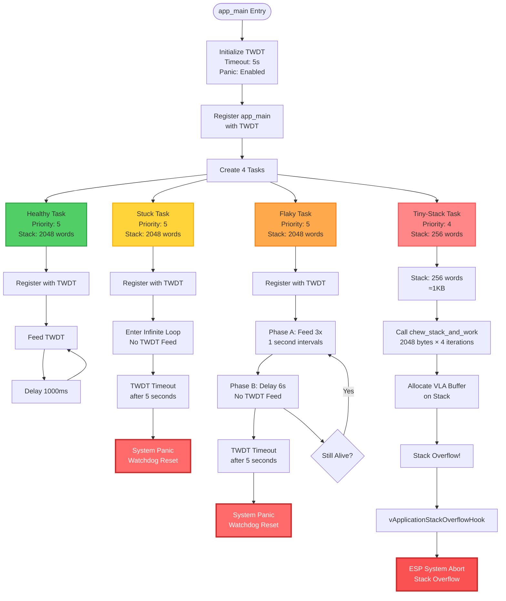

```mermaid
flowchart TD
    Start([app_main Entry]) --> Init[Initialize TWDT<br/>Timeout: 5s<br/>Panic: Enabled]
    Init --> AddMain[Register app_main<br/>with TWDT]
    AddMain --> CreateTasks[Create 4 Tasks]
    
    CreateTasks --> HealthyTask[Healthy Task<br/>Priority: 5<br/>Stack: 2048 words]
    CreateTasks --> StuckTask[Stuck Task<br/>Priority: 5<br/>Stack: 2048 words]
    CreateTasks --> FlakyTask[Flaky Task<br/>Priority: 5<br/>Stack: 2048 words]
    CreateTasks --> TinyTask[Tiny-Stack Task<br/>Priority: 4<br/>Stack: 256 words]
    
    HealthyTask --> H1[Register with TWDT]
    H1 --> H2[Feed TWDT]
    H2 --> H3[Delay 1000ms]
    H3 --> H2
    
    StuckTask --> S1[Register with TWDT]
    S1 --> S2[Enter Infinite Loop<br/>No TWDT Feed]
    S2 --> S3[TWDT Timeout<br/>after 5 seconds]
    S3 --> Panic1[System Panic<br/>Watchdog Reset]
    
    FlakyTask --> F1[Register with TWDT]
    F1 --> F2[Phase A: Feed 3x<br/>1 second intervals]
    F2 --> F3[Phase B: Delay 6s<br/>No TWDT Feed]
    F3 --> F4[TWDT Timeout<br/>after 5 seconds]
    F4 --> Panic2[System Panic<br/>Watchdog Reset]
    F3 --> F5{Still Alive?}
    F5 -->|Yes| F2
    
    TinyTask --> T1[Stack: 256 words<br/>≈1KB]
    T1 --> T2[Call chew_stack_and_work<br/>2048 bytes × 4 iterations]
    T2 --> T3[Allocate VLA Buffer<br/>on Stack]
    T3 --> T4[Stack Overflow!]
    T4 --> Hook[vApplicationStackOverflowHook]
    Hook --> Abort[ESP System Abort<br/>Stack Overflow]
    
    style Panic1 fill:#ff6b6b,stroke:#c92a2a,stroke-width:3px,color:#fff
    style Panic2 fill:#ff6b6b,stroke:#c92a2a,stroke-width:3px,color:#fff
    style Abort fill:#fa5252,stroke:#c92a2a,stroke-width:3px,color:#fff
    style HealthyTask fill:#51cf66,stroke:#2f9e44,stroke-width:2px
    style StuckTask fill:#ffd43b,stroke:#fab005,stroke-width:2px
    style FlakyTask fill:#ffa94d,stroke:#fd7e14,stroke-width:2px
    style TinyTask fill:#ff8787,stroke:#fa5252,stroke-width:2px
```
