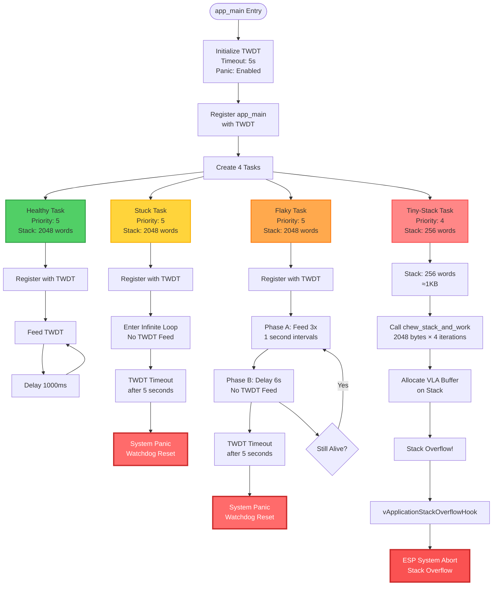

# ESP32 Task Watchdog Timer (TWDT) Demonstration

A comprehensive ESP-IDF project demonstrating the Task Watchdog Timer (TWDT) and FreeRTOS stack overflow detection mechanisms on ESP32 microcontrollers.

## Overview

This project showcases critical fault detection and monitoring capabilities in embedded systems by implementing four distinct task behaviors that demonstrate various failure scenarios and their detection mechanisms.

## Features

### Four Demonstration Tasks

1. **Healthy Task** - Properly feeds the TWDT every second, demonstrating correct watchdog usage
2. **Stuck Task** - Never feeds the TWDT, simulating a hard deadlock condition
3. **Flaky Task** - Intermittently feeds the TWDT, then deliberately stalls to trigger timeout
4. **Tiny-Stack Task** - Deliberately overflows its stack to demonstrate overflow detection

### System Configuration

- **TWDT Timeout:** 5 seconds
- **Panic Mode:** Enabled (system resets on watchdog trigger)
- **Idle Task Monitoring:** All processor cores
- **Stack Overflow Detection:** FreeRTOS Method B

## Project Flow Chart



## How It Works

### Task Watchdog Timer (TWDT)

The TWDT monitors registered tasks to ensure they remain responsive. Each monitored task must periodically "feed" the watchdog by calling `esp_task_wdt_reset()`. If a task fails to feed the watchdog within the timeout period (5 seconds), the system triggers a panic and resets.

**Configuration in `app_main()`:**
```c
static const esp_task_wdt_config_t twdt_cfg = {
    .timeout_ms = 5000,
    .trigger_panic = true,
    .idle_core_mask = (1 << portNUM_PROCESSORS) - 1,
};
esp_task_wdt_init(&twdt_cfg);
```

### Healthy Task - Normal Operation

Demonstrates proper watchdog usage with regular feeding:

```c
esp_task_wdt_add(NULL);  // Register with TWDT
while (1) {
    ESP_LOGI(TAG, "[Healthy] feeding TWDT");
    esp_task_wdt_reset();  // Feed watchdog
    vTaskDelay(pdMS_TO_TICKS(1000));
}
```

**Behavior:** Feeds TWDT every 1 second → No timeout → Runs indefinitely

### Stuck Task - Deadlock Simulation

Simulates a task that becomes completely unresponsive:

```c
esp_task_wdt_add(NULL);  // Register with TWDT
ESP_LOGW(TAG, "[Stuck] will block forever without feeding TWDT...");
while (1) {
    // Infinite busy loop - never feeds watchdog
}
```

**Behavior:** Never feeds TWDT → Timeout after 5 seconds → System panic/reset

### Flaky Task - Intermittent Failure

Simulates a task with intermittent responsiveness issues:

```c
esp_task_wdt_add(NULL);  // Register with TWDT
while (1) {
    // Phase A: Behave normally for 3 seconds
    for (int i = 0; i < 3; ++i) {
        ESP_LOGI(TAG, "[Flaky] cycle %d: feeding TWDT (%d/3)", cycle, i + 1);
        esp_task_wdt_reset();
        vTaskDelay(pdMS_TO_TICKS(1000));
    }
    
    // Phase B: Stall for 6 seconds (exceeds timeout)
    ESP_LOGW(TAG, "[Flaky] cycle %d: simulating stall (>5s)...", cycle);
    vTaskDelay(pdMS_TO_TICKS(6000));
}
```

**Behavior:** Feeds TWDT 3 times → Stalls for 6 seconds → Timeout after 5 seconds → System panic/reset

### Tiny-Stack Task - Stack Overflow Detection

Deliberately triggers stack overflow using aggressive stack consumption:

```c
// Created with minimal stack
xTaskCreate(tiny_stack_task, "TinyStackTask", 256, NULL, 4, NULL);

// Inside task: Allocate large buffers on stack
static void chew_stack_and_work(size_t bytes_to_burn, int iters) {
    for (int i = 0; i < iters; ++i) {
        uint8_t buf[bytes_to_burn];  // VLA on stack
        // Touch memory to prevent optimization
        for (size_t k = 0; k < bytes_to_burn; k += 64) {
            buf[k] = (uint8_t)(k & 0xFF);
        }
    }
}
```

**Behavior:** Allocates 2KB × 4 iterations on 1KB stack → Stack overflow → `vApplicationStackOverflowHook()` → System abort

### Stack Overflow Hook

FreeRTOS calls this hook when stack overflow is detected:

```c
void vApplicationStackOverflowHook(TaskHandle_t xTask, char *pcTaskName) {
    ESP_EARLY_LOGE(TAG, "Stack overflow detected in task: %s", 
                   pcTaskName ? pcTaskName : "(unknown)");
    esp_system_abort("Stack overflow");
}
```

## Requirements

### Hardware
- ESP32, ESP32-S2, ESP32-S3, ESP32-C3, or any ESP-IDF supported board
- USB cable for programming and serial communication

### Software
- ESP-IDF v4.4 or later (v5.x recommended)
- Python 3.7+
- Git

## Setup and Build

### 1. Install ESP-IDF

Follow the [official ESP-IDF installation guide](https://docs.espressif.com/projects/esp-idf/en/latest/esp32/get-started/).

### 2. Configure Stack Overflow Detection

```bash
idf.py menuconfig
```

Navigate to:
```
Component config → FreeRTOS → Kernel → Check for stack overflow
```

Select: **Method 2** (recommended)

### 3. Build the Project

```bash
idf.py build
```

### 4. Flash to Device

```bash
idf.py -p /dev/ttyUSB0 flash
```

*Replace `/dev/ttyUSB0` with your serial port*

### 5. Monitor Serial Output

```bash
idf.py -p /dev/ttyUSB0 monitor
```

Exit monitor: `Ctrl+]`

**Combined flash and monitor:**
```bash
idf.py -p /dev/ttyUSB0 flash monitor
```

## Expected Output

### Initial Startup (First Second)
```
I (xxx) DAY27_WDT: Tasks started. Expect TWDT events and a stack overflow demo soon.
I (xxx) DAY27_WDT: [Healthy] feeding TWDT
I (xxx) DAY27_WDT: [Flaky] cycle 0: feeding TWDT (1/3)
W (xxx) DAY27_WDT: [Stuck] will block forever without feeding TWDT...
I (xxx) DAY27_WDT: [TinyStack] starting with very small stack; will chew stack...
```

### Stack Overflow Detection (~1 second)
```
E (xxx) DAY27_WDT: Stack overflow detected in task: TinyStackTask
abort() was called at PC 0x400xxxxx on core 0

Backtrace: 0x400xxxxx:0x3ffxxxxx ...
```

**Result:** System resets due to stack overflow

### TWDT Timeout (~5 seconds, if stack overflow disabled)
```
E (5xxx) task_wdt: Task watchdog got triggered. The following tasks did not reset the watchdog in time:
E (5xxx) task_wdt:  - StuckTask (CPU 0)
E (5xxx) task_wdt: Tasks currently running:
E (5xxx) task_wdt: CPU 0: IDLE0
E (5xxx) task_wdt: Aborting.
```

**Result:** System resets due to watchdog timeout

## Project Structure

```
Watchdog_Example_2/
├── CMakeLists.txt           # Project configuration
├── README.md                # This file
├── main/
│   ├── CMakeLists.txt       # Main component configuration
│   └── main.c               # Application source code
└── sdkconfig                # ESP-IDF configuration (generated)
```

## Key Functions

| Function | Description |
|----------|-------------|
| `app_main()` | Application entry point; initializes TWDT and creates tasks |
| `healthy_task()` | Well-behaved task that feeds watchdog regularly |
| `stuck_task()` | Simulates deadlock by never feeding watchdog |
| `flaky_task()` | Alternates between feeding and stalling |
| `tiny_stack_task()` | Triggers stack overflow with small stack |
| `chew_stack_and_work()` | Helper function to consume stack space |
| `vApplicationStackOverflowHook()` | FreeRTOS hook called on stack overflow |

## Configuration Options

### Modify TWDT Timeout

Edit `main.c` (line ~216):
```c
.timeout_ms = 5000,  // Change timeout (milliseconds)
```

### Disable Specific Tasks

Comment out task creation in `app_main()` (lines 235-241):
```c
// xTaskCreate(stuck_task, "StuckTask", 2048, NULL, 5, NULL);
```

### Adjust Stack Sizes

Modify the fourth parameter in `xTaskCreate()`:
```c
xTaskCreate(task_func, "TaskName", 2048, NULL, 5, NULL);
//                                  ^^^^
//                                  Stack size in words (×4 bytes on ESP32)
```

## Troubleshooting

### Watchdog Doesn't Trigger
- Verify `trigger_panic = true` in TWDT config
- Ensure tasks are registered with `esp_task_wdt_add()`
- Check timeout is longer than feed interval

### Stack Overflow Not Detected
- Enable stack overflow checking in menuconfig (Method 1 or 2)
- Verify tiny task stack size is 256 words
- Ensure `chew_stack_and_work()` parameters consume enough stack

### Build Errors
- Source ESP-IDF environment: `. $HOME/esp/esp-idf/export.sh`
- Update ESP-IDF: `cd $IDF_PATH && git pull`
- Clean build: `idf.py fullclean && idf.py build`

### No Serial Output
- Check serial port: `ls /dev/tty*` (Linux/macOS)
- Verify baud rate: 115200 (default)
- Install USB drivers (CP210x or CH340)
- Press RESET button on board

## Learning Objectives

This project demonstrates:

1. **Watchdog Timer Configuration** - Setting up TWDT with timeout and panic behavior
2. **Task Monitoring** - Registering tasks with the watchdog
3. **Watchdog Feeding** - Proper use of `esp_task_wdt_reset()`
4. **Fault Detection** - Identifying unresponsive tasks
5. **Stack Management** - Understanding stack allocation and overflow
6. **FreeRTOS Hooks** - Implementing system callbacks for fault handling
7. **System Diagnostics** - Analyzing crash logs and debugging embedded faults

## Best Practices

### Production Guidelines
- Feed watchdog regularly in all critical tasks
- Set timeouts based on worst-case execution time
- Monitor all critical tasks with TWDT
- Allocate sufficient stack with safety margin
- Enable stack overflow checking during development
- Implement graceful recovery before panic when possible
- Log watchdog events for diagnostics

### Development Tips
- Use watchdog to detect infinite loops and deadlocks
- Test edge cases that might cause task stalling
- Profile task execution times to set realistic timeouts
- Monitor stack usage with `uxTaskGetStackHighWaterMark()`

## References

- [ESP-IDF Programming Guide](https://docs.espressif.com/projects/esp-idf/en/latest/esp32/)
- [ESP Task Watchdog Timer API](https://docs.espressif.com/projects/esp-idf/en/latest/esp32/api-reference/system/wdts.html)
- [FreeRTOS Documentation](https://www.freertos.org/Documentation/RTOS_book.html)
- [Stack Overflow Detection](https://www.freertos.org/Stacks-and-stack-overflow-checking.html)

## License

This project is provided for educational and demonstration purposes.

## Author

**Yamil Garcia**  
Version: 0.3  
Date: 2025-10-02

## Contributing

Contributions, issues, and feature requests are welcome! Feel free to open an issue or submit a pull request.
