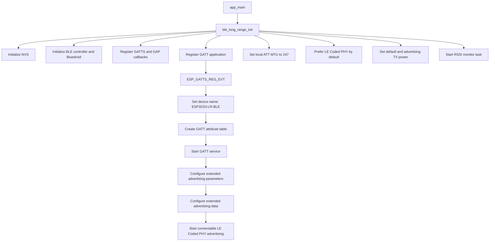
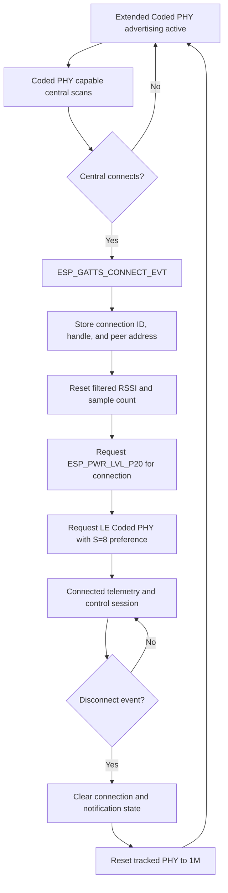
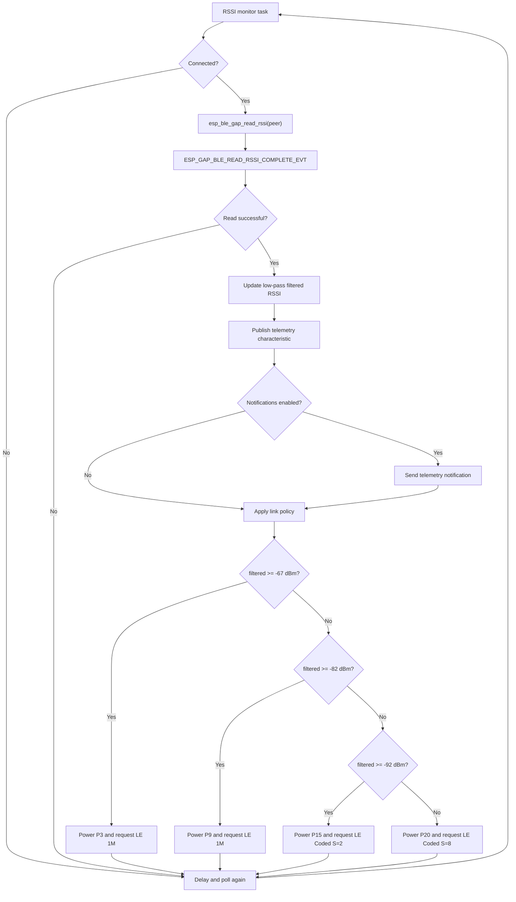
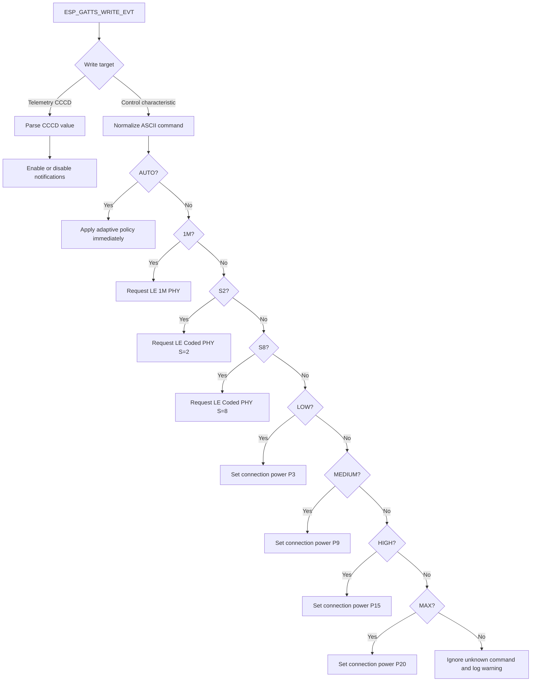
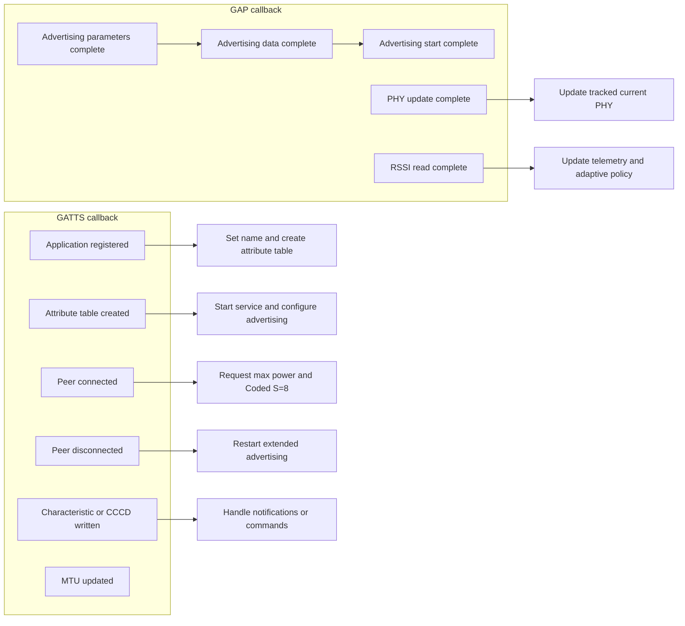

# Project Flowchart

This document describes the ESP32-S3 BLE long-range firmware flow using Mermaid diagrams.

## System Overview

## Advertising and Connection Flow

## RSSI Telemetry and Adaptive Policy

## Control Characteristic Flow

## GAP and GATTS Event Responsibilities

