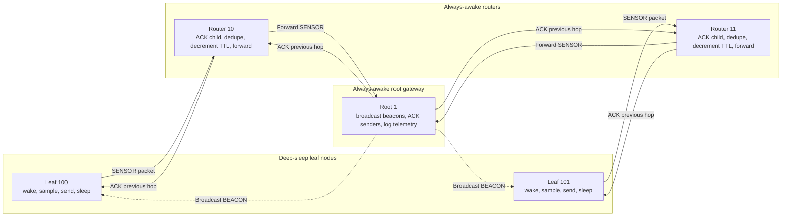
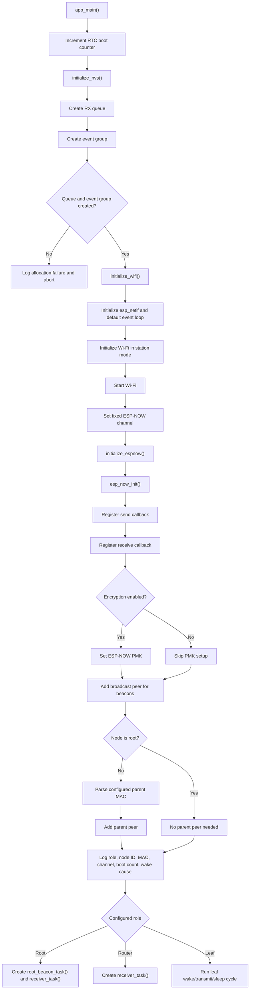
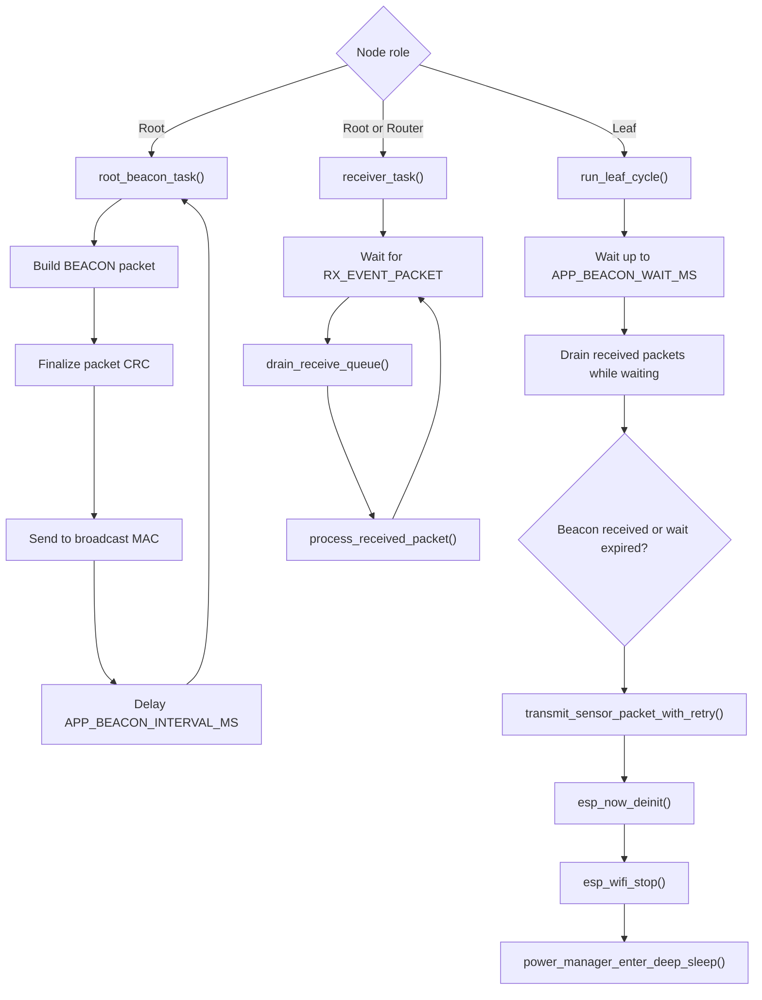
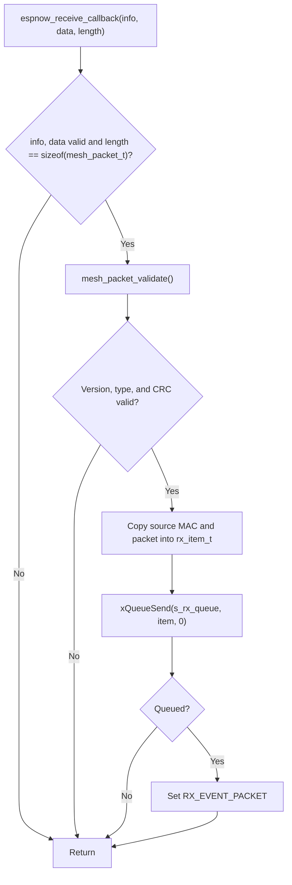
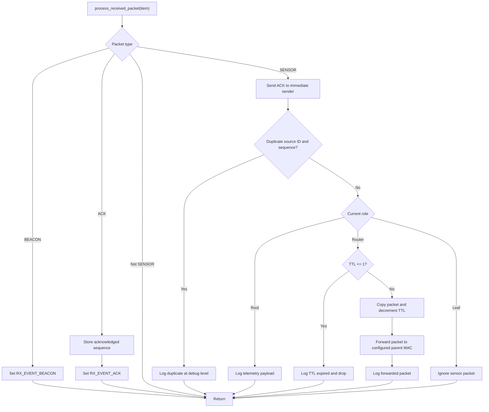
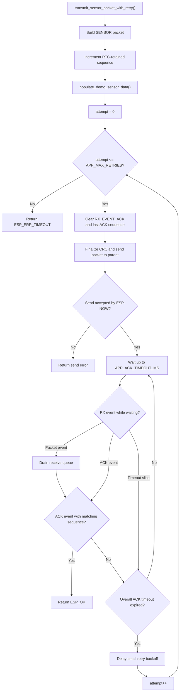
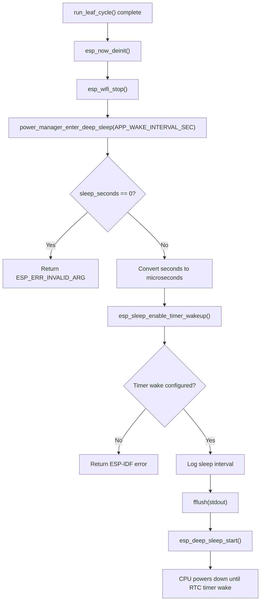
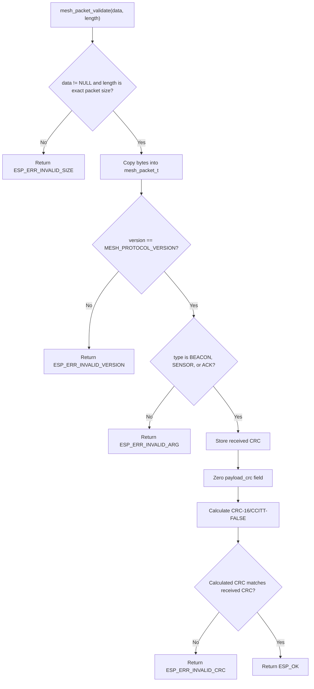

# Project Flowcharts

This document describes the firmware flow for the ESP-NOW low-power mesh project using Mermaid syntax. The diagrams mirror the implementation in `main/main.c`, `mesh_protocol.c`, and `power_manager.c`.

## System Topology

## Application Startup

## Role Runtime Flow

## ESP-NOW Receive Callback

## Packet Processing

## Leaf Transmit, Retry, and ACK Flow

## Deep-Sleep Entry Flow

## Protocol Validation Flow

