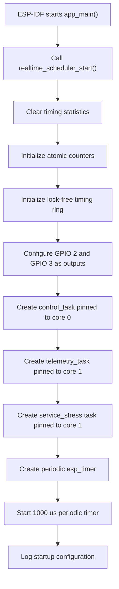
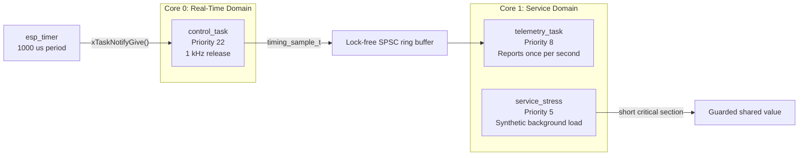
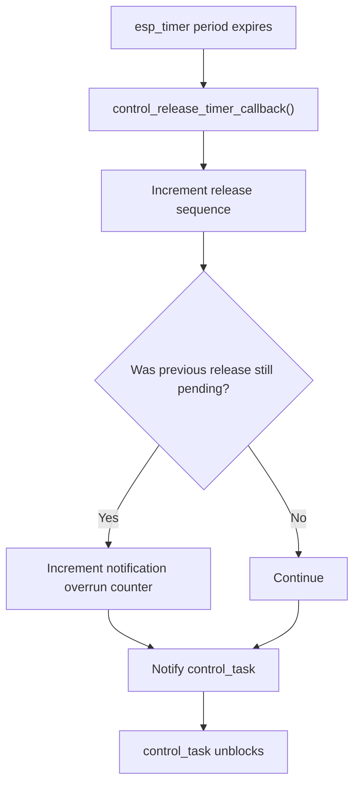
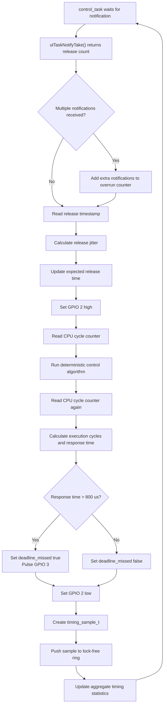
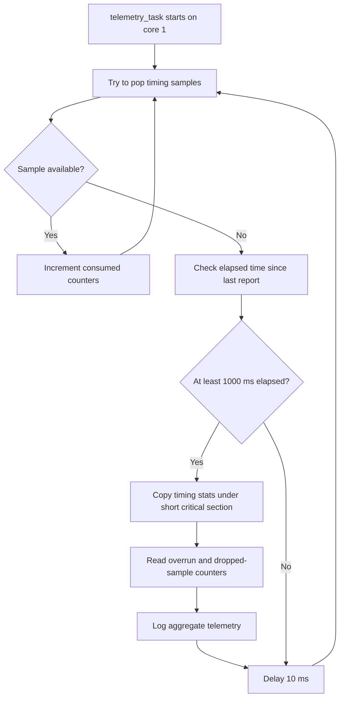
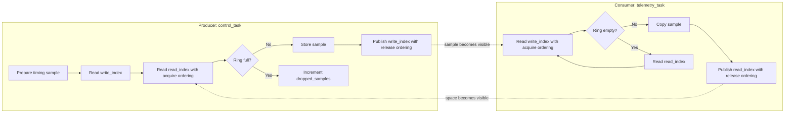
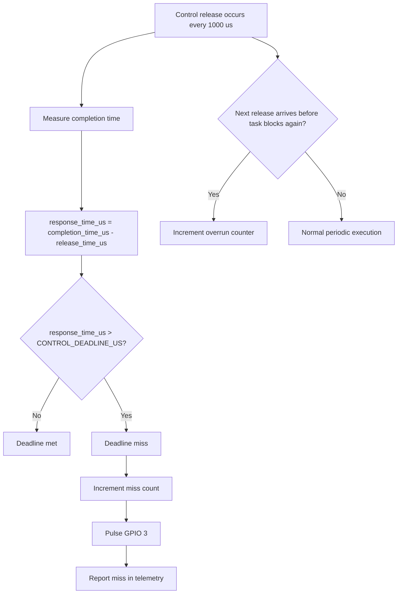
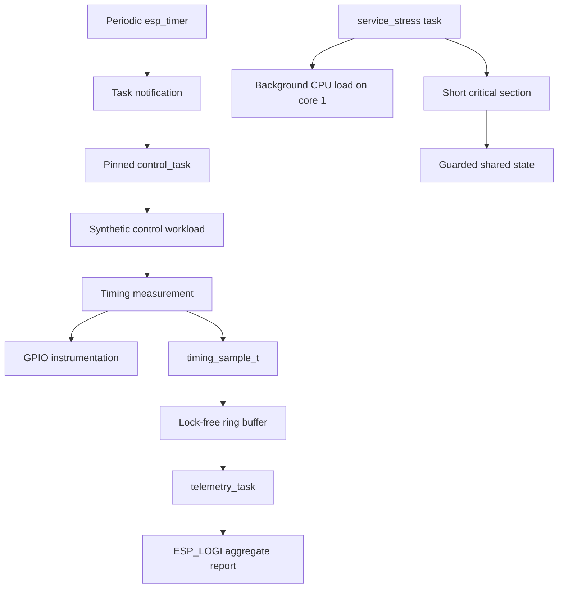

# Project Flowchart

This document shows the execution flow for the ESP32-S3 multicore real-time scheduler demo.

## System Startup

## Core Allocation

## Periodic Control Release

## Control Task Loop

## Telemetry Task Loop

## Lock-Free Ring Buffer

## Deadline and Overload Detection

## High-Level Data Path

