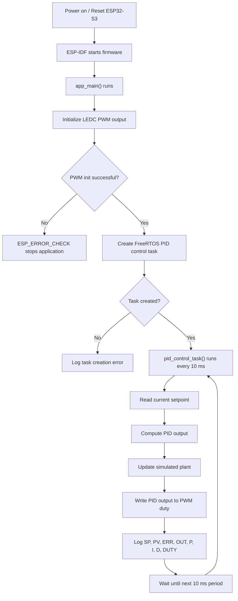
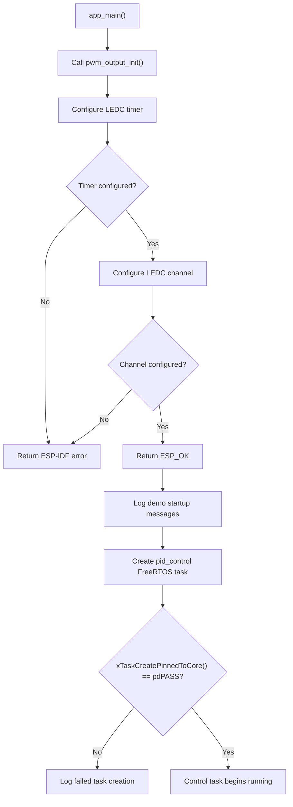
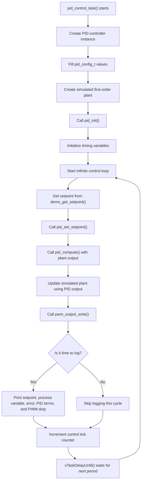
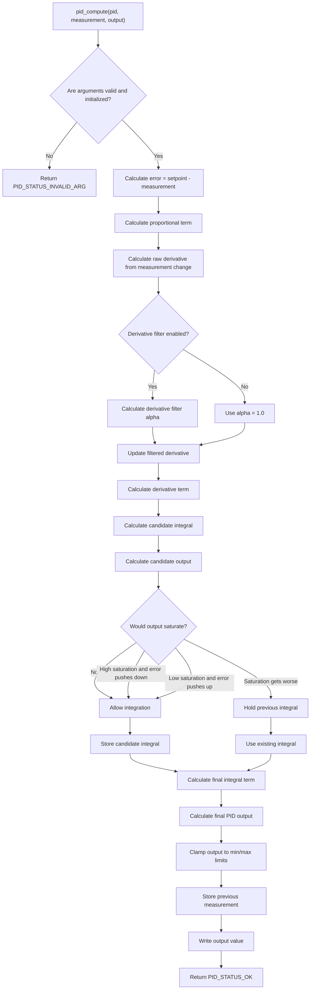
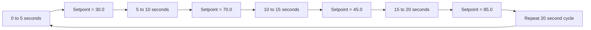
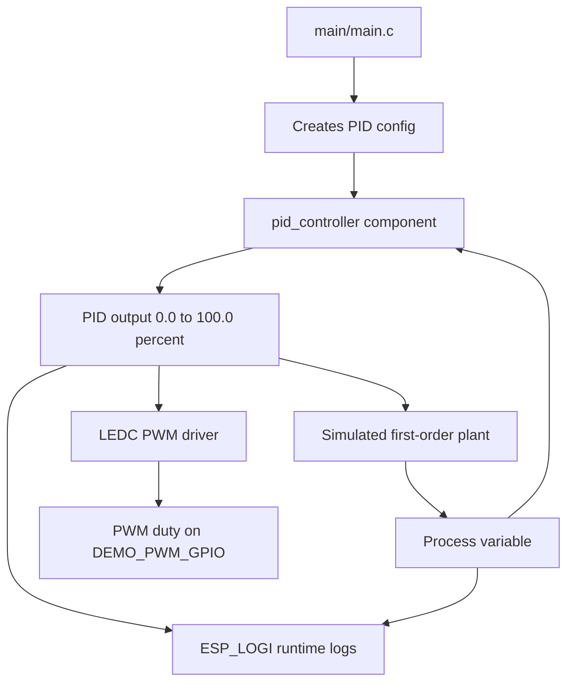
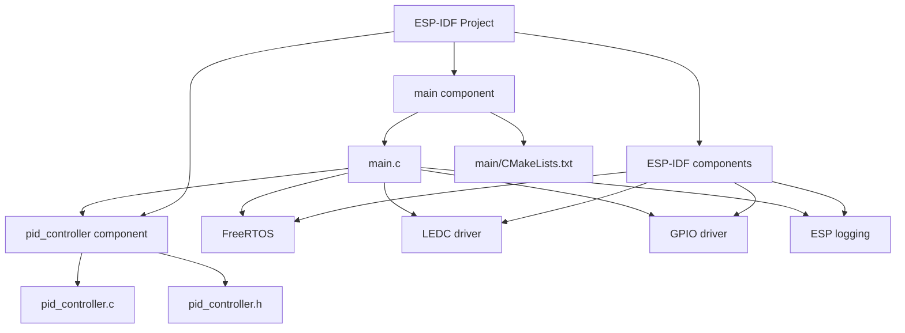
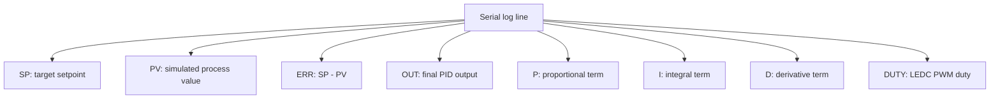

# ESP32-S3 PID Controller Demo Flowchart

This document describes the project flow using Mermaid diagrams. It is intended to help beginners understand how the ESP-IDF application, PID component, simulated plant, and PWM output work together.

## High-Level Project Flow

## Application Startup Flow

## Periodic Control Task Flow

## PID Compute Flow

## Setpoint Schedule

The demo changes the target setpoint every five seconds. This creates visible step responses in the serial monitor.

## Data Flow Between Modules

## Component Relationship

## What to Watch in the Serial Monitor

If the controller is behaving correctly, the `PV` value should move toward the `SP` value after each setpoint change.
