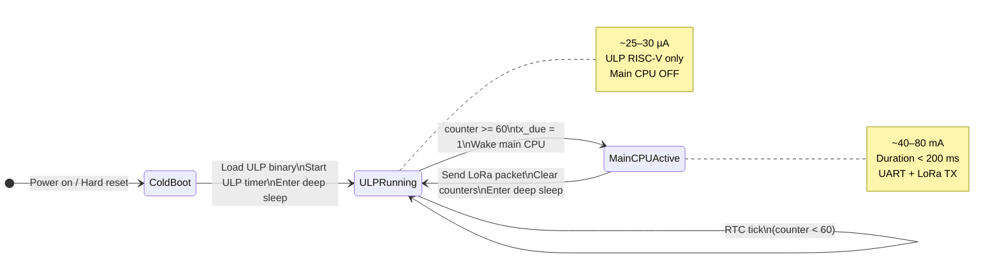
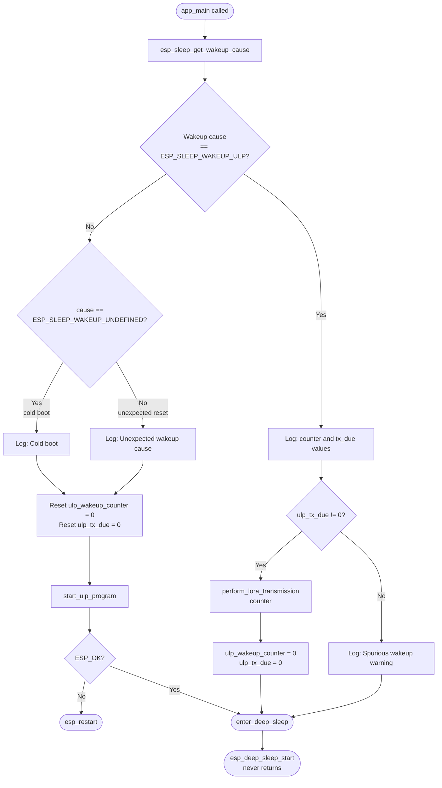
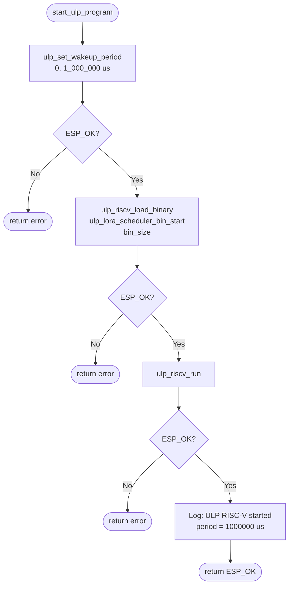
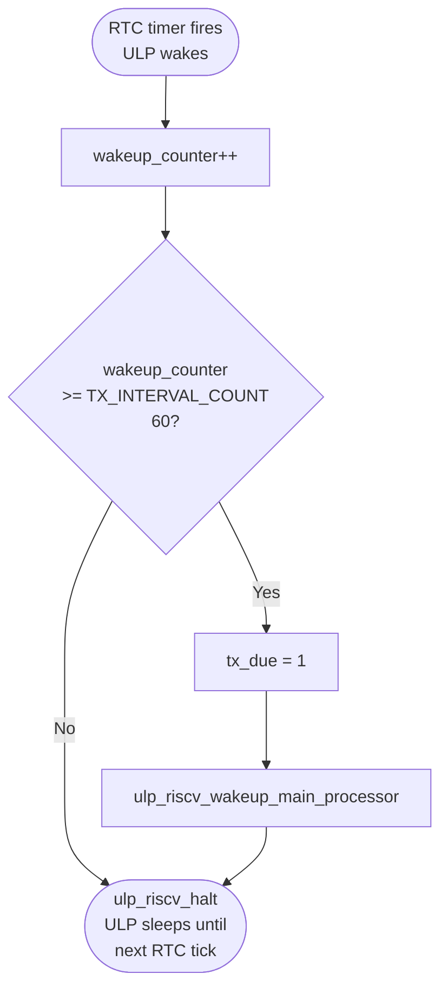
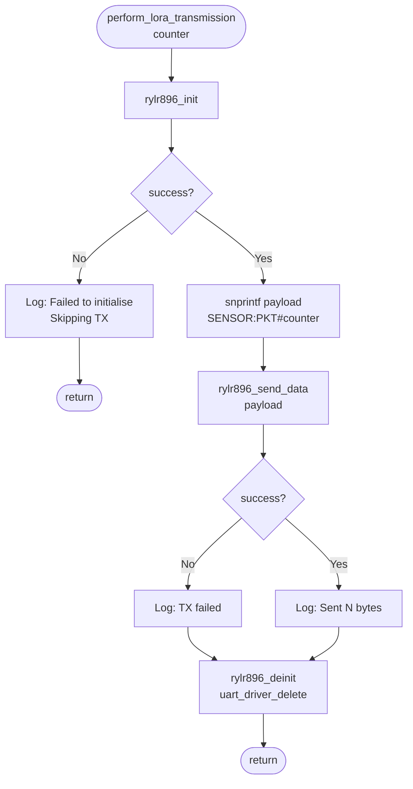
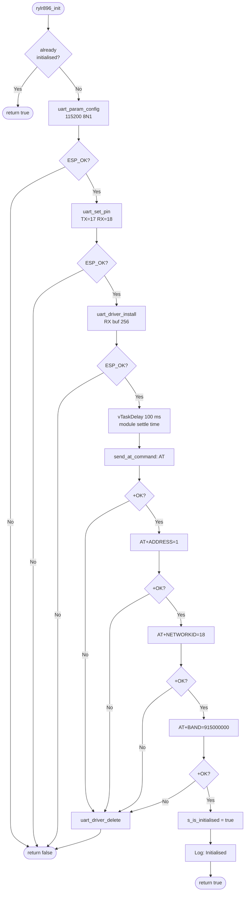
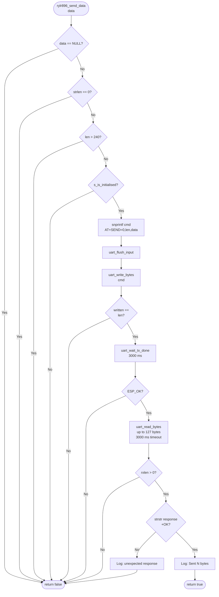
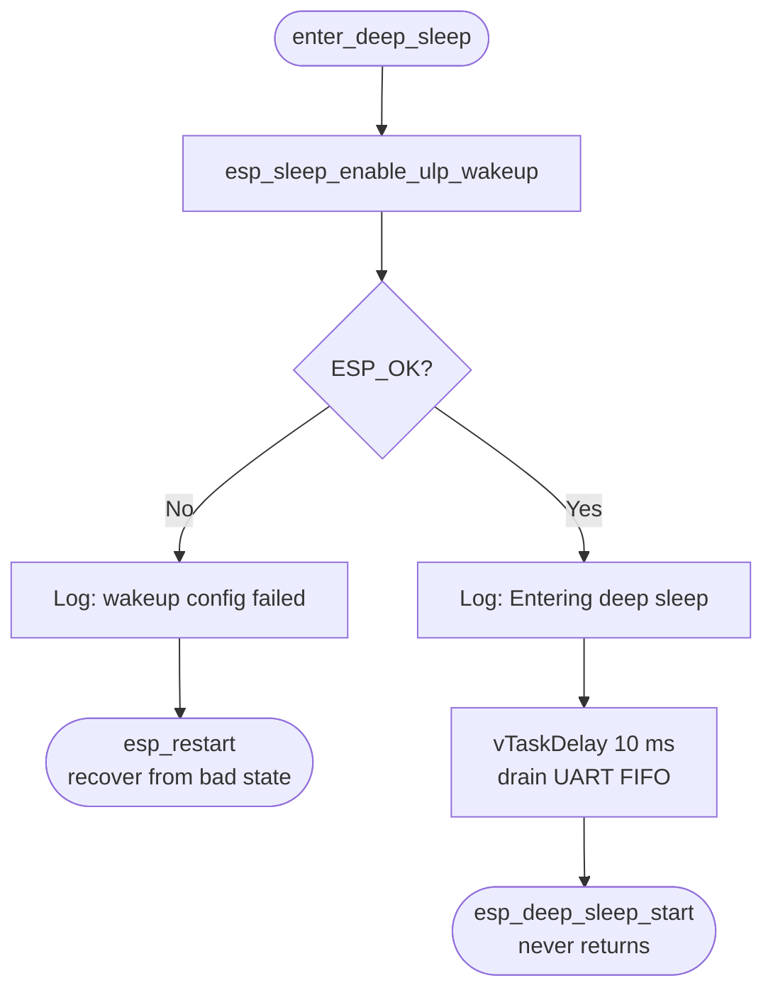
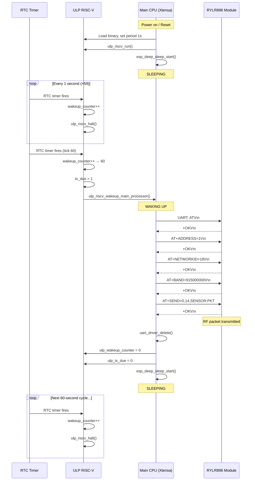
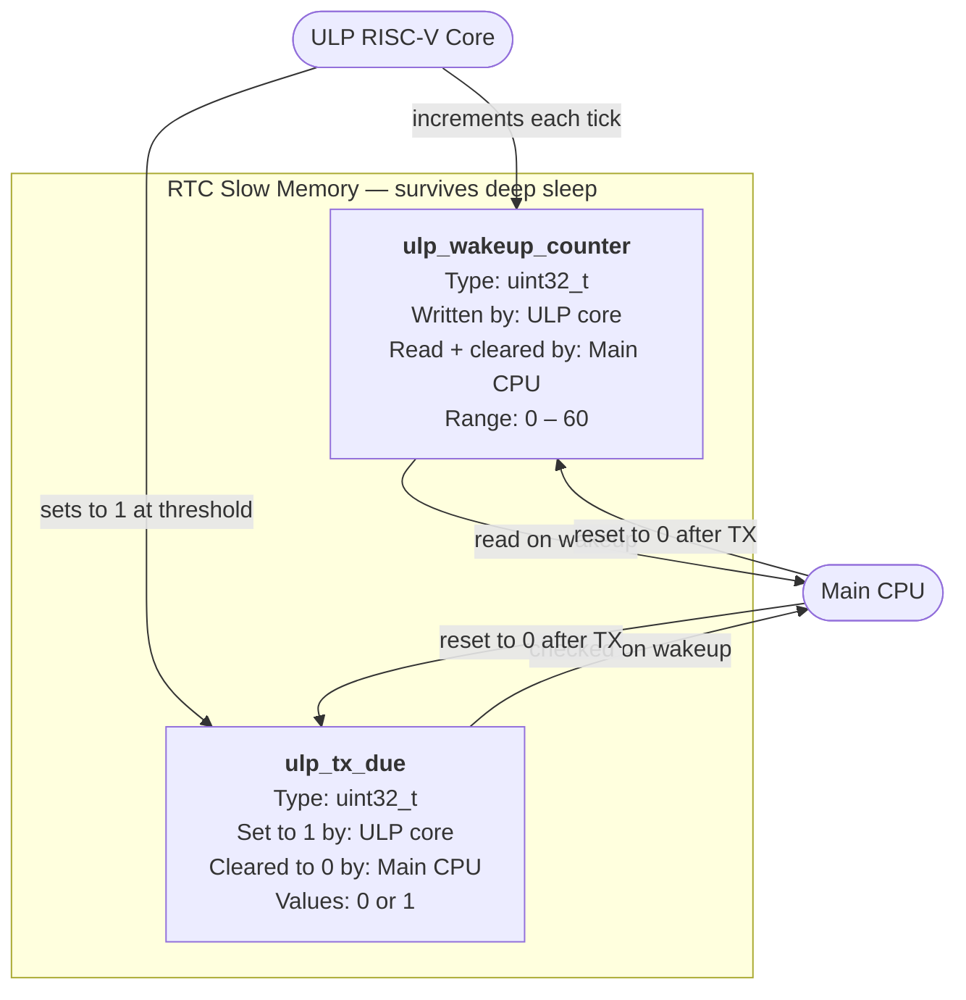

# Program Flow — ESP32-S3 ULP LoRa Sensor

This document describes the complete program flow using Mermaid diagrams.

---

## 1. Top-Level System Flow

The system alternates between two states: the main CPU handling a transmission
and the ULP coprocessor counting sleep ticks. The main CPU is active for less
than 200 ms out of every 60 seconds.

---

## 2. app_main() — Boot and Wakeup Dispatch

Every time the ESP32-S3 starts (cold boot or deep-sleep wakeup), execution
enters `app_main()`. The wakeup cause determines which path is taken.

---

## 3. start_ulp_program() — ULP Initialisation

Called once on cold boot. Loads the compiled ULP RISC-V binary from flash into
RTC memory and starts the RTC timer that will tick every 1 second.

---

## 4. ULP RISC-V Scheduler — ulp_lora_scheduler.c

This program executes on the ULP RISC-V core. It is invoked by the RTC timer
every 1 second. The main CPU is completely powered off during this time.

---

## 5. perform_lora_transmission() — LoRa TX Cycle

Called by `app_main()` when the ULP has signalled a transmission is due.
The entire UART driver lifecycle is contained within this function.

---

## 6. rylr896_init() — UART and Module Setup

Installs the ESP-IDF UART driver and configures the RYLR896 module with the
address, network ID, and radio frequency required for the network.

---

## 7. rylr896_send_data() — AT+SEND Command

Validates the payload, formats the AT+SEND command, transmits it over UART,
and waits for the `+OK` acknowledgement from the module.

---

## 8. enter_deep_sleep() — Sleep Entry

Final function called on every execution path. Configures the ULP as the wakeup
source and powers down the main CPU. Never returns.

---

## 9. Complete Sequence Diagram

End-to-end timing across two full transmission cycles, showing the interaction
between hardware layers.

---

## 10. RTC Shared Memory Layout

Two 32-bit variables in RTC slow memory are the only communication channel
between the ULP and the main CPU.

> **Naming note:** In the ULP source these variables are named `wakeup_counter` and `tx_due`. The ESP-IDF v5.4.1 ULP build system automatically prepends `ulp_` when generating the exported header, so the main CPU accesses them as `ulp_wakeup_counter` and `ulp_tx_due`.
